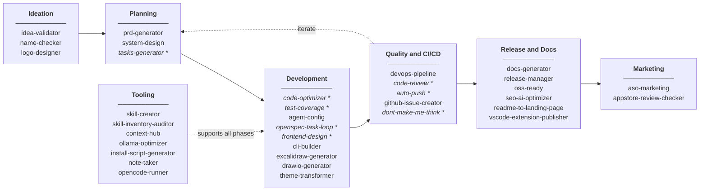
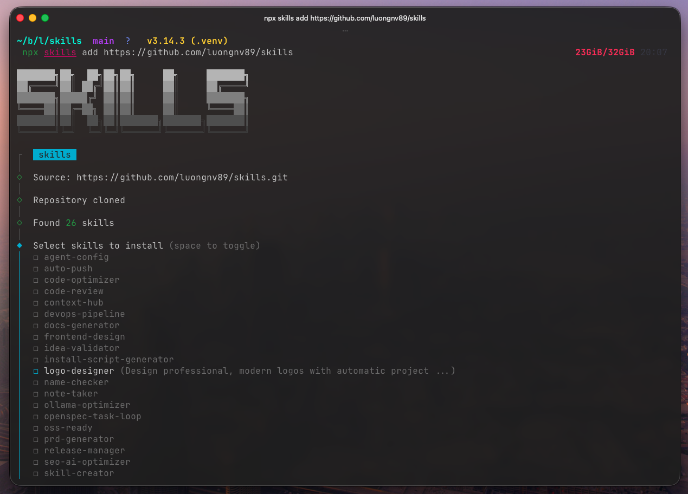

<p align="center">
  
</p>

<p align="center">
  <a href="https://opensource.org/licenses/MIT"></a>
  <a href="CONTRIBUTING.md"></a>
  <a href="https://github.com/luongnv89/skills/releases"></a>
  <a href="https://github.com/luongnv89/skills"></a>
</p>

<h1 align="center">Ship Software 10x Faster with AI Agent Skills</h1>

<p align="center">
  35 plug-and-play skills that turn your AI coding agent into a full product team — from idea validation to App Store launch. Works with Claude Code, Cursor, Windsurf, GitHub Copilot, OpenAI Codex, and OpenCode.
</p>

<p align="center">
  <a href="#get-started-in-30-seconds"><b>Get Started in 30 Seconds →</b></a>
</p>

---

## You Keep Telling Your AI Agent the Same Things

You're using Claude Code, Cursor, or Copilot. The AI is smart — but it doesn't know *your* workflow.

- **You repeat yourself constantly.** Every time you want a code review, you paste the same detailed prompt. Every release, you walk the agent through the same 10 steps. Every new project, you explain your conventions from scratch.
- **Results are inconsistent.** Monday's code review catches different things than Friday's. The release process misses a step. The PRD format changes every time because there's no standard.
- **You're stuck in the generic zone.** Your agent can write code, but it can't validate your startup idea, optimize your App Store listing, generate a technical architecture document, or design a logo. You end up doing those manually — or not at all.

The AI is capable. It just doesn't have the playbook.

## Agent Skills Gives Your AI the Playbook

**Agent Skills** is a collection of 35 reusable, battle-tested skills that plug directly into your AI coding agent. Each skill is a structured prompt with references, templates, and scripts — turning a generic AI into a specialist.

- **Every skill works the same way, every time.** Code reviews follow the same checklist. Releases hit every step. PRDs match a proven template. No more "I forgot to mention…"
- **Cover the full product lifecycle.** Validate an idea → generate a PRD → design the architecture → write code → review → test → release → optimize your App Store listing. One toolkit, zero context-switching.
- **Zero config, instant setup.** One command installs skills into Claude Code, Cursor, Windsurf, Copilot, Codex, or OpenCode. Skills trigger automatically from natural language — just say "review this code" or "prepare a release."

<p align="center">
  <a href="#get-started-in-30-seconds"><b>Start Building Faster →</b></a>
</p>

## How It Works

1. **Install** — Run one command to add skills to your AI agent (global or per-project).
2. **Talk naturally** — Say "optimize this code" or "create a PRD" and the right skill activates automatically.
3. **Get consistent results** — Every skill follows a structured workflow with quality checks built in.
4. **Ship** — From idea to production with a toolkit that covers every phase.



_* Skills marked with * can be used repeatedly during development iterations._

<p align="center">
  <a href="#get-started-in-30-seconds"><b>See All 35 Skills →</b></a>
</p>

## Get Started in 30 Seconds

### Method 1: npx (recommended)

```bash
npx skills add https://github.com/luongnv89/skills
```

<p align="center">
  
</p>

Install specific skills:

```bash
npx skills add https://github.com/luongnv89/skills --skill auto-push
npx skills add https://github.com/luongnv89/skills --skill code-optimizer
```

### Method 2: One-liner remote install (no clone needed)

Interactive mode — select skills, tools, and scope from a TUI menu:

```bash
curl -sSL https://raw.githubusercontent.com/luongnv89/skills/main/remote-install.sh | bash
```

Non-interactive mode — specify everything via flags:

```bash
# Install specific skills for Claude Code globally
curl -sSL https://raw.githubusercontent.com/luongnv89/skills/main/remote-install.sh | bash -s -- \
  --skills "code-review,auto-push" --tools "Claude Code" --scope global

# Install all skills for multiple tools in current project
curl -sSL https://raw.githubusercontent.com/luongnv89/skills/main/remote-install.sh | bash -s -- \
  --all --tools "Claude Code,Cursor" --scope project

# List available skills
curl -sSL https://raw.githubusercontent.com/luongnv89/skills/main/remote-install.sh | bash -s -- --list
```

### Method 3: Clone and run locally

```bash
git clone https://github.com/luongnv89/skills.git
cd skills
bash install.sh
```

### Manage with agent-skill-manager

Use [**agent-skill-manager**](https://github.com/luongnv89/agent-skill-manager) (`asm`) to manage skills across all your AI coding agents from a single TUI/CLI:

```bash
npm install -g agent-skill-manager
asm list          # List all installed skills
asm search        # Search skills by name or description
asm install github:luongnv89/skills   # Install skills from this repo
```

## 35 Skills Across 6 Categories

### Development Workflow

| Skill | Version | What You Get |
|-------|---------|--------------|
| [**auto-push**](skills/auto-push/) | 1.0.0 | Stage, commit, and push with built-in security checks for secrets and large files |
| [**cli-builder**](skills/cli-builder/) | 1.0.0 | Build production CLI tools with a 5-step approval-gated workflow |
| [**test-coverage**](skills/test-coverage/) | 1.2.0 | Find and fill untested branches and edge cases automatically |
| [**code-optimizer**](skills/code-optimizer/) | 1.2.0 | Spot performance bottlenecks, memory leaks, and algorithmic improvements |
| [**code-review**](skills/code-review/) | 1.0.1 | Consistent reviews based on Code Smells and The Pragmatic Programmer |
| [**devops-pipeline**](skills/devops-pipeline/) | 1.0.0 | Pre-commit hooks and GitHub Actions configured in minutes, not hours |
| [**openspec-task-loop**](skills/openspec-task-loop/) | 1.0.0 | Execute work in strict one-task-per-change loops with archive/verify gates |
| [**ollama-optimizer**](skills/ollama-optimizer/) | 1.0.1 | Maximize local LLM performance based on your actual hardware |
| [**install-script-generator**](skills/install-script-generator/) | 2.0.0 | Cross-platform installers that detect the environment automatically |
| [**note-taker**](skills/note-taker/) | 1.4.1 | Capture notes (text, voice, images) into a git-backed repo with task extraction |
| [**vscode-extension-publisher**](skills/vscode-extension-publisher/) | 1.0.0 | Publish VS Code extensions to the Marketplace without the ceremony |
| [**github-issue-creator**](skills/github-issue-creator/) | 1.0.0 | Create or update GitHub issues from screenshots, emails, and bug reports with PII redaction |
| [**opencode-runner**](skills/opencode-runner/) | 1.2.0 | Delegate coding tasks to opencode with free cloud models — automatic model selection and process cleanup |

### Product Development

| Skill | Version | What You Get |
|-------|---------|--------------|
| [**idea-validator**](skills/idea-validator/) | 1.2.2 | Honest feasibility and market viability feedback before you build |
| [**name-checker**](skills/name-checker/) | 1.1.0 | Trademark, domain, social media, and package registry (npm, PyPI, Homebrew, apt) conflict checks in one pass |
| [**prd-generator**](skills/prd-generator/) | 1.2.2 | Structured Product Requirements Documents from a description |
| [**tasks-generator**](skills/tasks-generator/) | 1.2.2 | Sprint-ready task breakdowns generated from your PRD |
| [**system-design**](skills/system-design/) | 1.2.3 | Technical Architecture Documents with data flow and component diagrams |

### Marketing & ASO

| Skill | Version | What You Get |
|-------|---------|--------------|
| [**aso-marketing**](skills/aso-marketing/) | 1.1.0 | Full-lifecycle App Store Optimization for iOS and Google Play — keywords, metadata, conversion, and store policy compliance |
| [**appstore-review-checker**](skills/appstore-review-checker/) | 1.0.0 | Audit apps against Apple's App Store Review Guidelines before submission |

### Content & Documentation

| Skill | Version | What You Get |
|-------|---------|--------------|
| [**docs-generator**](skills/docs-generator/) | 1.2.0 | Restructure scattered docs into a coherent hierarchy |
| [**release-manager**](skills/release-manager/) | 2.2.0 | Version bumps, changelog, README sync, git tags, GitHub releases, and publishing to PyPI/npm — in one command |
| [**oss-ready**](skills/oss-ready/) | 1.1.0 | LICENSE, CONTRIBUTING, CODE_OF_CONDUCT, and GitHub templates — done |
| [**agent-config**](skills/agent-config/) | 1.1.0 | CLAUDE.md and AGENTS.md files that follow best practices |
| [**seo-ai-optimizer**](skills/seo-ai-optimizer/) | 1.0.1 | Technical SEO, structured data, and AI bot accessibility in one audit |
| [**readme-to-landing-page**](skills/readme-to-landing-page/) | 2.0.0 | Turn any README into a persuasive landing page using PAS, AIDA, or StoryBrand frameworks |

### Design & Branding

| Skill | Version | What You Get |
|-------|---------|--------------|
| [**logo-designer**](skills/logo-designer/) | 1.2.0 | Professional logos with automatic project context detection |
| [**frontend-design**](skills/frontend-design/) | 1.2.0 | Distinctive, usability-focused UIs — not generic AI slop |
| [**theme-transformer**](skills/theme-transformer/) | 1.0.0 | Transform any UI into a cyberpunk neon-dark theme with branch-safe workflow |
| [**excalidraw-generator**](skills/excalidraw-generator/) | 1.2.0 | 25+ diagram types as Excalidraw JSON with 10 automated quality checks |
| [**drawio-generator**](skills/drawio-generator/) | 1.0.1 | Draw.io diagrams with multi-page support, C4 models, and 9 quality checks |
| [**dont-make-me-think**](skills/dont-make-me-think/) | 1.1.0 | Usability reviews using Krug's principles — visual scorecard, issue maps, and prioritized fixes |

### Skill Development

| Skill | Version | What You Get |
|-------|---------|--------------|
| [**skill-creator**](skills/skill-creator/) | 1.1.0 | Create new skills with templates, validation, and packaging |
| [**skill-inventory-auditor**](skills/skill-inventory-auditor/) | 1.0.0 | Find and remove duplicate skill installations |
| [**context-hub**](skills/context-hub/) | 1.0.0 | Fetch current API/SDK docs before writing integration code |

## Just Say What You Need

Skills trigger from natural language. No commands to memorize.

| What you say | Skill that activates |
|--------------|----------------------|
| "push my changes" | auto-push |
| "optimize this code" | code-optimizer |
| "setup CI/CD" | devops-pipeline |
| "evaluate my idea" | idea-validator |
| "create a PRD" | prd-generator |
| "design the architecture" | system-design |
| "review this code" | code-review |
| "improve test coverage" | test-coverage |
| "prepare a release" | release-manager |
| "make this open source" | oss-ready |
| "design a logo" | logo-designer |
| "build a landing page" | frontend-design |
| "optimize for SEO" | seo-ai-optimizer |
| "optimize my app store listing" | aso-marketing |
| "draw a flowchart" | excalidraw-generator |
| "create a draw.io diagram" | drawio-generator |
| "turn my README into a landing page" | readme-to-landing-page |
| "create an issue from this screenshot" | github-issue-creator |
| "run this with opencode" | opencode-runner |
| "check App Store review guidelines" | appstore-review-checker |
| "review my UI for usability" | dont-make-me-think |
| "build a CLI for this" | cli-builder |
| "check if this name is available" | name-checker |
| "generate project docs" | docs-generator |
| "reskin the UI" | theme-transformer |
| "configure CLAUDE.md" | agent-config |

## FAQ

**Is this free?**
Yes. Agent Skills is MIT licensed — use it in personal projects, commercial products, whatever you want. Free forever.

**Which AI tools are supported?**
Claude Code, Cursor, Windsurf, GitHub Copilot, OpenAI Codex, and OpenCode. The installer handles the different file locations and formats for each tool automatically.

**Do I need all 35 skills?**
No. Install only what you need — each skill is independent. Start with `code-review` and `auto-push`, add more as your workflow grows.

**Is this actively maintained?**
Yes. The project ships regular updates — 6 releases in the last week alone, with quality audits across all skills. Check the [CHANGELOG](CHANGELOG.md) for details.

**Can I create my own skills?**
Absolutely. Use the `skill-creator` skill to scaffold, validate, and package new skills. See the [Contributing Guide](CONTRIBUTING.md) for details.

**How does this compare to custom prompts?**
Skills are structured prompts with references, templates, scripts, and quality checks. A custom prompt tells the AI what to do; a skill gives it a complete playbook with guardrails. Skills are also version-controlled, shareable, and consistent across team members.

**Can I use this in production?**
Yes. Skills don't modify your runtime code — they guide your AI agent during development. There's nothing to deploy, no dependencies to manage, no runtime overhead.

## Start Shipping

You have a capable AI agent. Give it the skills to actually run your workflow end-to-end — from validating an idea to pushing a release.

MIT licensed. Zero runtime dependencies. Installs in 30 seconds. Uninstall by deleting a folder.

<p align="center">
  <a href="#get-started-in-30-seconds"><b>Install Agent Skills Now →</b></a>
</p>

---

<details>
<summary><b>Supported Tool Paths (Manual Installation)</b></summary>

| Tool | Global path | Project path |
|------|-------------|--------------|
| **Claude Code** | `~/.claude/skills/<skill>/` | `.claude/skills/<skill>/` |
| **Cursor** | `~/.agents/skills/<skill>/` + `.cursor/rules/<skill>.mdc` | same, relative |
| **Windsurf** | `~/.agents/skills/<skill>/` + `.windsurf/rules/<skill>.md` | same, relative |
| **GitHub Copilot** | `~/.agents/skills/<skill>/` + `.github/instructions/<skill>.instructions.md` | same, relative |
| **OpenAI Codex** | `~/.agents/skills/<skill>/` + `~/.codex/AGENTS.md` | same, relative |
| **OpenCode** | `~/.agents/skills/<skill>/` | same, relative |

</details>

<details>
<summary><b>Project Structure</b></summary>

```
.
├── skills/              # Skill source files
│   └── skill-name/
│       ├── SKILL.md     # Skill definition
│       ├── scripts/     # Optional scripts
│       ├── references/  # Optional docs
│       └── assets/      # Optional templates
└── .claude/             # Claude-specific config
```

</details>

<details>
<summary><b>Creating New Skills</b></summary>

Use the **skill-creator** skill or create manually:

```markdown
---
name: my-skill
version: 1.0.0
description: What it does and when to use it
---

# Instructions for the AI agent...
```

See [CONTRIBUTING.md](CONTRIBUTING.md) for detailed guidelines.

</details>

<details>
<summary><b>Contributing</b></summary>

Contributions are welcome! Please read our [Contributing Guide](CONTRIBUTING.md) and [Code of Conduct](CODE_OF_CONDUCT.md).

</details>

<details>
<summary><b>Security</b></summary>

See [SECURITY.md](SECURITY.md) for reporting vulnerabilities.

</details>

<details>
<summary><b>Acknowledgements</b></summary>

- [**frontend-design**](skills/frontend-design/) — inspired by Anthropic's official [frontend-design](https://github.com/anthropics/claude-code/tree/main/plugins/frontend-design) plugin. This is an independent implementation with a default style guide and usability principles.
- [**skill-creator**](skills/skill-creator/) — customized from Anthropic's official [skill-creator](https://github.com/anthropics/skills/tree/main/skills/skill-creator) (Apache 2.0). Added README.md generation step.

</details>

---

<p align="center">
  <a href="https://luongnv.com">Website</a> •
  <a href="https://github.com/luongnv89/claude-howto">Claude How-To</a> •
  <a href="https://medium.com/@luongnv89">Blog</a>
</p>
