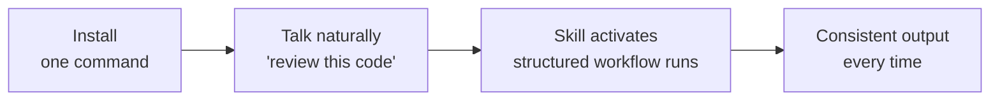
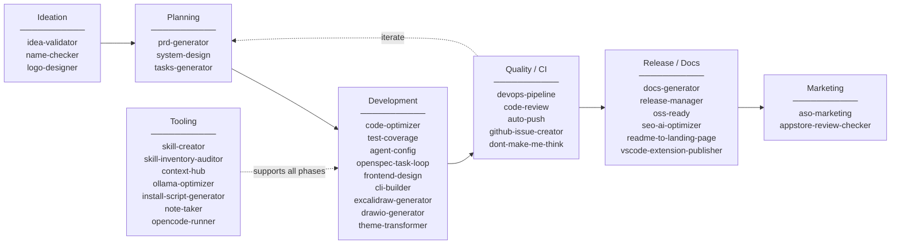

<p align="center">
  
</p>

<p align="center">
  <a href="https://opensource.org/licenses/MIT"></a>
  <a href="CONTRIBUTING.md"></a>
  <a href="https://github.com/luongnv89/skills/releases"></a>
  <a href="https://github.com/luongnv89/skills"></a>
</p>

# 35 Plug-and-Play Skills for Your AI Coding Agent

One command installs structured, versioned skills into Claude Code, Cursor, Windsurf, GitHub Copilot, OpenAI Codex, or OpenCode. Each skill replaces a vague prompt with a tested playbook -- from idea validation to App Store launch.

[**Get Started**](#get-started)

---

## The Problem With Prompting From Scratch

You paste the same "review my code" prompt every Monday. Sometimes the agent catches security issues; sometimes it misses obvious bugs. Your release process depends on whoever remembers the steps. Your PRD format changes every time because there's no template.

The agent is capable. It just has no memory of how *you* work.

Skills fix that. Each one is a structured workflow with quality checks, references, and templates -- version-controlled and consistent across your team.

## How It Works



1. **Install** -- run one command (global or per-project)
2. **Talk naturally** -- say "optimize this code" or "prepare a release"
3. **The right skill activates** -- structured workflow with built-in quality checks
4. **Ship** -- from idea to production, covered

## Full Lifecycle Coverage



## Get Started

### npx (recommended)

Install all skills:

```bash
npx skills add https://github.com/luongnv89/skills
```

Install specific skills:

```bash
npx skills add https://github.com/luongnv89/skills --skill code-review
```

```bash
npx skills add https://github.com/luongnv89/skills --skill auto-push
```

### Remote install (no clone needed)

Interactive mode -- select skills, tools, and scope from a TUI menu:

```bash
curl -sSL https://raw.githubusercontent.com/luongnv89/skills/main/remote-install.sh | bash
```

Non-interactive mode:

```bash
curl -sSL https://raw.githubusercontent.com/luongnv89/skills/main/remote-install.sh | bash -s -- \
  --skills "code-review,auto-push" --tools "Claude Code" --scope global
```

```bash
curl -sSL https://raw.githubusercontent.com/luongnv89/skills/main/remote-install.sh | bash -s -- \
  --all --tools "Claude Code,Cursor" --scope project
```

List available skills:

```bash
curl -sSL https://raw.githubusercontent.com/luongnv89/skills/main/remote-install.sh | bash -s -- --list
```

### Clone and run locally

```bash
git clone https://github.com/luongnv89/skills.git
```

```bash
cd skills && bash install.sh
```

### Manage with agent-skill-manager

Use [**agent-skill-manager**](https://github.com/luongnv89/agent-skill-manager) (`asm`) to manage skills across all your AI coding agents from a single TUI/CLI:

```bash
npm install -g agent-skill-manager
```

```bash
asm list          # List all installed skills
```

```bash
asm search        # Search skills by name or description
```

```bash
asm install github:luongnv89/skills   # Install skills from this repo
```

## All 35 Skills

### Development Workflow

| Skill | Version | What you get |
|---|---|---|
| [**auto-push**](skills/auto-push/) | 1.0.0 | Stage, commit, push with secret/large-file detection |
| [**cli-builder**](skills/cli-builder/) | 1.0.0 | Production CLI tools via 5-step approval-gated workflow |
| [**test-coverage**](skills/test-coverage/) | 1.2.0 | Find and fill untested branches and edge cases |
| [**code-optimizer**](skills/code-optimizer/) | 1.2.0 | Performance bottlenecks, memory leaks, algorithmic fixes |
| [**code-review**](skills/code-review/) | 1.0.1 | Reviews based on Code Smells and The Pragmatic Programmer |
| [**devops-pipeline**](skills/devops-pipeline/) | 1.0.0 | Pre-commit hooks + GitHub Actions in minutes |
| [**openspec-task-loop**](skills/openspec-task-loop/) | 1.0.0 | One-task-per-change loops with archive/verify gates |
| [**ollama-optimizer**](skills/ollama-optimizer/) | 1.0.1 | Maximize local LLM speed based on your hardware |
| [**install-script-generator**](skills/install-script-generator/) | 2.0.0 | Cross-platform installers with environment detection |
| [**note-taker**](skills/note-taker/) | 1.4.1 | Git-backed notes (text, voice, images) with task extraction |
| [**vscode-extension-publisher**](skills/vscode-extension-publisher/) | 1.0.0 | Publish VS Code extensions without the ceremony |
| [**github-issue-creator**](skills/github-issue-creator/) | 1.0.0 | Issues from screenshots, emails, bug reports -- with PII redaction |
| [**opencode-runner**](skills/opencode-runner/) | 1.2.0 | Delegate tasks to opencode with free cloud models |

### Product Development

| Skill | Version | What you get |
|---|---|---|
| [**idea-validator**](skills/idea-validator/) | 1.2.2 | Feasibility and market viability feedback before you build |
| [**name-checker**](skills/name-checker/) | 1.1.0 | Trademark, domain, social, npm, PyPI, Homebrew, apt -- one pass |
| [**prd-generator**](skills/prd-generator/) | 1.2.2 | Structured PRDs from a description |
| [**tasks-generator**](skills/tasks-generator/) | 1.2.2 | Sprint-ready task breakdowns from your PRD |
| [**system-design**](skills/system-design/) | 1.2.3 | Technical architecture docs with data flow diagrams |

### Marketing and ASO

| Skill | Version | What you get |
|---|---|---|
| [**aso-marketing**](skills/aso-marketing/) | 1.1.0 | Full-lifecycle App Store Optimization for iOS and Google Play |
| [**appstore-review-checker**](skills/appstore-review-checker/) | 1.0.0 | Audit against Apple's App Store Review Guidelines pre-submission |

### Content and Documentation

| Skill | Version | What you get |
|---|---|---|
| [**docs-generator**](skills/docs-generator/) | 1.2.0 | Restructure scattered docs into a coherent hierarchy |
| [**release-manager**](skills/release-manager/) | 2.2.0 | Version bump, changelog, tags, GitHub release, PyPI/npm publish |
| [**oss-ready**](skills/oss-ready/) | 1.1.0 | LICENSE, CONTRIBUTING, CODE_OF_CONDUCT, GitHub templates |
| [**agent-config**](skills/agent-config/) | 1.1.0 | CLAUDE.md and AGENTS.md following best practices |
| [**seo-ai-optimizer**](skills/seo-ai-optimizer/) | 1.0.1 | Technical SEO, structured data, AI bot accessibility audit |
| [**readme-to-landing-page**](skills/readme-to-landing-page/) | 2.0.0 | README to landing page using PAS, AIDA, or StoryBrand |

### Design and Branding

| Skill | Version | What you get |
|---|---|---|
| [**logo-designer**](skills/logo-designer/) | 1.2.0 | Professional logos with project context detection |
| [**frontend-design**](skills/frontend-design/) | 1.2.0 | Distinctive, usability-focused UIs |
| [**theme-transformer**](skills/theme-transformer/) | 1.0.0 | Transform any UI into cyberpunk neon-dark theme |
| [**excalidraw-generator**](skills/excalidraw-generator/) | 1.2.0 | 25+ diagram types as Excalidraw JSON with 10 quality checks |
| [**drawio-generator**](skills/drawio-generator/) | 1.0.1 | Draw.io diagrams with multi-page and C4 support |
| [**dont-make-me-think**](skills/dont-make-me-think/) | 1.1.0 | Usability reviews using Krug's principles with visual scorecards |

### Skill Development

| Skill | Version | What you get |
|---|---|---|
| [**skill-creator**](skills/skill-creator/) | 1.1.0 | Create, validate, and package new skills |
| [**skill-inventory-auditor**](skills/skill-inventory-auditor/) | 1.0.0 | Find and remove duplicate skill installations |
| [**context-hub**](skills/context-hub/) | 1.0.0 | Fetch current API/SDK docs before writing integration code |

## Natural Language Triggers

No commands to memorize. Say what you need.

| What you say | Skill that activates |
|---|---|
| "push my changes" | auto-push |
| "optimize this code" | code-optimizer |
| "setup CI/CD" | devops-pipeline |
| "evaluate my idea" | idea-validator |
| "create a PRD" | prd-generator |
| "design the architecture" | system-design |
| "review this code" | code-review |
| "improve test coverage" | test-coverage |
| "prepare a release" | release-manager |
| "make this open source" | oss-ready |
| "design a logo" | logo-designer |
| "build a landing page" | frontend-design |
| "optimize for SEO" | seo-ai-optimizer |
| "optimize my app store listing" | aso-marketing |
| "draw a flowchart" | excalidraw-generator |
| "create a draw.io diagram" | drawio-generator |
| "turn my README into a landing page" | readme-to-landing-page |
| "create an issue from this screenshot" | github-issue-creator |
| "run this with opencode" | opencode-runner |
| "check App Store review guidelines" | appstore-review-checker |
| "review my UI for usability" | dont-make-me-think |
| "build a CLI for this" | cli-builder |
| "check if this name is available" | name-checker |
| "generate project docs" | docs-generator |
| "reskin the UI" | theme-transformer |
| "configure CLAUDE.md" | agent-config |

## FAQ

**Which AI tools are supported?**
Claude Code, Cursor, Windsurf, GitHub Copilot, OpenAI Codex, and OpenCode. The installer handles each tool's file locations and formats automatically.

**Do I need all 35 skills?**
No. Each skill is independent. Start with `code-review` and `auto-push`, add more as needed.

**Can I create my own skills?**
Yes. Use the `skill-creator` skill to scaffold, validate, and package new skills. See [CONTRIBUTING.md](CONTRIBUTING.md).

**How is this different from custom prompts?**
A skill is a structured workflow with references, templates, scripts, and quality checks -- version-controlled and shareable. A prompt is a one-off instruction.

**Does this affect my runtime code?**
No. Skills guide your AI agent during development. Nothing to deploy, no runtime dependencies.

## Get Started Now

```bash
npx skills add https://github.com/luongnv89/skills
```

[**Read the docs**](./docs) -- [**View all skills**](./skills) -- [**Contribute**](CONTRIBUTING.md) -- MIT Licensed

---

<details>
<summary><b>Supported Tool Paths (Manual Installation)</b></summary>

| Tool | Global path | Project path |
|---|---|---|
| **Claude Code** | `~/.claude/skills/<skill>/` | `.claude/skills/<skill>/` |
| **Cursor** | `~/.agents/skills/<skill>/` + `.cursor/rules/<skill>.mdc` | same, relative |
| **Windsurf** | `~/.agents/skills/<skill>/` + `.windsurf/rules/<skill>.md` | same, relative |
| **GitHub Copilot** | `~/.agents/skills/<skill>/` + `.github/instructions/<skill>.instructions.md` | same, relative |
| **OpenAI Codex** | `~/.agents/skills/<skill>/` + `~/.codex/AGENTS.md` | same, relative |
| **OpenCode** | `~/.agents/skills/<skill>/` | same, relative |

</details>

<details>
<summary><b>Project Structure</b></summary>

```
.
├── skills/              # Skill source files
│   └── skill-name/
│       ├── SKILL.md     # Skill definition
│       ├── scripts/     # Optional scripts
│       ├── references/  # Optional docs
│       └── assets/      # Optional templates
└── .claude/             # Claude-specific config
```

</details>

<details>
<summary><b>Creating New Skills</b></summary>

Use the **skill-creator** skill or create manually:

```markdown
---
name: my-skill
version: 1.0.0
description: What it does and when to use it
---

# Instructions for the AI agent...
```

See [CONTRIBUTING.md](CONTRIBUTING.md) for detailed guidelines.

</details>

<details>
<summary><b>Contributing</b></summary>

Contributions are welcome. Read the [Contributing Guide](CONTRIBUTING.md) and [Code of Conduct](CODE_OF_CONDUCT.md).

</details>

<details>
<summary><b>Security</b></summary>

See [SECURITY.md](SECURITY.md) for reporting vulnerabilities.

</details>

<details>
<summary><b>Acknowledgements</b></summary>

- [**frontend-design**](skills/frontend-design/) -- inspired by Anthropic's official [frontend-design](https://github.com/anthropics/claude-code/tree/main/plugins/frontend-design) plugin. Independent implementation with a default style guide and usability principles.
- [**skill-creator**](skills/skill-creator/) -- customized from Anthropic's official [skill-creator](https://github.com/anthropics/skills/tree/main/skills/skill-creator) (Apache 2.0). Added README.md generation step.

</details>

---

<p align="center">
  <a href="https://luongnv.com">Website</a> --
  <a href="https://github.com/luongnv89/claude-howto">Claude How-To</a> --
  <a href="https://medium.com/@luongnv89">Blog</a>
</p>
