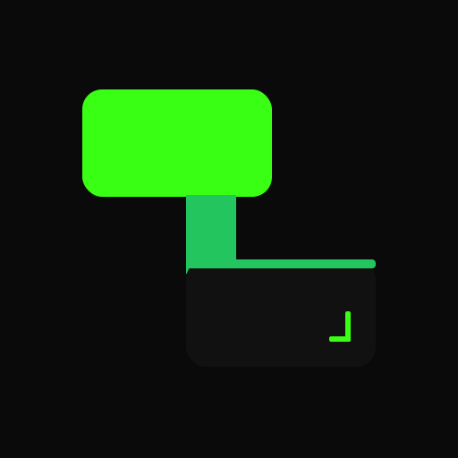

<p align="center">
  
</p>

<p align="center">
  <a href="https://opensource.org/licenses/MIT"></a>
  <a href="CONTRIBUTING.md"></a>
  <a href="https://github.com/luongnv89/skills/releases"></a>
  <a href="https://github.com/luongnv89/skills"></a>
</p>

# Ready-Made Skills for AI Coding Agents

Browse the catalog. Pick what you need. Install with one command. Each skill is independent -- no bundle, no framework, no lock-in.

Works with any AI coding tool that supports agent skills -- Claude Code, Cursor, Windsurf, GitHub Copilot, OpenAI Codex, OpenCode, and more.

[**Browse the catalog**](#skill-catalog) | [**Install a skill**](#install)

---

## Install

Pick one skill:

```bash
npx skills add https://github.com/luongnv89/skills --skill code-review
```

Pick several:

```bash
npx skills add https://github.com/luongnv89/skills --skill code-review --skill auto-push --skill test-coverage
```

Or grab everything:

```bash
npx skills add https://github.com/luongnv89/skills
```

### agent-skill-manager

Use [**agent-skill-manager**](https://github.com/luongnv89/agent-skill-manager) (`asm`) to manage skills across all your AI coding agents from a single TUI/CLI:

```bash
npm install -g agent-skill-manager
```

```bash
asm install github:luongnv89/skills
```

```bash
asm search        # Search skills by name or description
```

```bash
asm list          # List all installed skills
```

<details>
<summary>Other install methods</summary>

**Remote install (no clone)**

Interactive TUI to pick skills, tools, and scope:

```bash
curl -sSL https://raw.githubusercontent.com/luongnv89/skills/main/remote-install.sh | bash
```

Non-interactive:

```bash
curl -sSL https://raw.githubusercontent.com/luongnv89/skills/main/remote-install.sh | bash -s -- \
  --skills "code-review,auto-push" --tools "Claude Code" --scope global
```

**Clone and run locally**

```bash
git clone https://github.com/luongnv89/skills.git
```

```bash
cd skills && bash install.sh
```

</details>

---

## Skill Catalog

Every skill is standalone. Install one, install ten -- they don't depend on each other.

To install any skill, copy the command below and replace `<skill-name>` with the skill name from the catalog:

```bash
npx skills add https://github.com/luongnv89/skills --skill <skill-name>
```

### Find by Category

| Category | What it covers |
|---|---|
| [Code Quality](#code-quality) | Reviews, optimization, testing, usability |
| [Shipping](#shipping) | Git push, CI/CD, releases, VS Code publishing |
| [Product Planning](#product-planning) | Ideas, naming, PRDs, architecture, task breakdown |
| [Frontend and Design](#frontend-and-design) | UIs, logos, themes, diagrams |
| [Documentation](#documentation) | Docs, README, SEO, open source, agent config |
| [App Store](#app-store) | ASO, review guideline compliance |
| [Tooling](#tooling) | CLI builder, local LLMs, scripts, skill management |

---

### Code Quality

| Skill | Version | Effort | What it does |
|---|---|---|---|
| <a id="code-review"></a>[**code-review**](skills/code-review/) | 1.0.1 |  | Reviews based on Code Smells + The Pragmatic Programmer. Structured reports by severity |
| <a id="code-optimizer"></a>[**code-optimizer**](skills/code-optimizer/) | 1.2.0 |  | Finds bottlenecks, memory leaks, caching gaps, concurrency issues |
| <a id="test-coverage"></a>[**test-coverage**](skills/test-coverage/) | 1.2.0 |  | Targets untested branches and edge cases in your existing test suite |
| <a id="dont-make-me-think"></a>[**dont-make-me-think**](skills/dont-make-me-think/) | 1.1.0 |  | Usability reviews using Krug's principles with visual scorecards |

### Shipping

| Skill | Version | Effort | What it does |
|---|---|---|---|
| <a id="auto-push"></a>[**auto-push**](skills/auto-push/) | 1.0.0 |  | Stage, commit, push with secret and large-file detection |
| <a id="devops-pipeline"></a>[**devops-pipeline**](skills/devops-pipeline/) | 1.0.0 |  | Pre-commit hooks + GitHub Actions for quality gates |
| <a id="release-manager"></a>[**release-manager**](skills/release-manager/) | 2.4.0 |  | Version bump, changelog, tags, GitHub release, PyPI/npm publish |
| <a id="vscode-extension-publisher"></a>[**vscode-extension-publisher**](skills/vscode-extension-publisher/) | 1.0.0 |  | Publish VS Code extensions to the marketplace with CI setup |

### Product Planning

| Skill | Version | Effort | What it does |
|---|---|---|---|
| <a id="idea-validator"></a>[**idea-validator**](skills/idea-validator/) | 1.2.2 |  | Feasibility and market viability feedback before you build |
| <a id="name-checker"></a>[**name-checker**](skills/name-checker/) | 1.1.0 |  | Trademark, domain, social, npm, PyPI, Homebrew, apt -- one pass |
| <a id="prd-generator"></a>[**prd-generator**](skills/prd-generator/) | 1.2.2 |  | Structured PRDs from a description or validated idea |
| <a id="system-design"></a>[**system-design**](skills/system-design/) | 1.2.3 |  | Technical architecture docs with data flow diagrams |
| <a id="tasks-generator"></a>[**tasks-generator**](skills/tasks-generator/) | 1.2.2 |  | Sprint-ready task breakdowns from your PRD |

### Frontend and Design

| Skill | Version | Effort | What it does |
|---|---|---|---|
| <a id="frontend-design"></a>[**frontend-design**](skills/frontend-design/) | 1.2.0 |  | Production-grade UIs with usability-first design |
| <a id="logo-designer"></a>[**logo-designer**](skills/logo-designer/) | 1.2.0 |  | Professional logos with automatic project context detection |
| <a id="theme-transformer"></a>[**theme-transformer**](skills/theme-transformer/) | 1.0.0 |  | Reskin any UI into cyberpunk, neon, or digital-dark themes |
| <a id="excalidraw-generator"></a>[**excalidraw-generator**](skills/excalidraw-generator/) | 1.2.0 |  | 25+ diagram types as Excalidraw JSON |
| <a id="drawio-generator"></a>[**drawio-generator**](skills/drawio-generator/) | 1.0.1 |  | Draw.io diagrams with multi-page and C4 support |
| <a id="openspec-task-loop"></a>[**openspec-task-loop**](skills/openspec-task-loop/) | 1.0.0 |  | Spec-first, one-task-at-a-time implementation loop |

### Documentation

| Skill | Version | Effort | What it does |
|---|---|---|---|
| <a id="docs-generator"></a>[**docs-generator**](skills/docs-generator/) | 1.2.0 |  | Restructure scattered docs into a coherent hierarchy |
| <a id="readme-to-landing-page"></a>[**readme-to-landing-page**](skills/readme-to-landing-page/) | 2.0.0 |  | Transform any README into a landing page (PAS, AIDA, StoryBrand) |
| <a id="seo-ai-optimizer"></a>[**seo-ai-optimizer**](skills/seo-ai-optimizer/) | 1.0.1 |  | Technical SEO, structured data, and AI bot accessibility |
| <a id="oss-ready"></a>[**oss-ready**](skills/oss-ready/) | 1.1.0 |  | LICENSE, CONTRIBUTING, CODE_OF_CONDUCT, GitHub templates |
| <a id="agent-config"></a>[**agent-config**](skills/agent-config/) | 1.1.0 |  | CLAUDE.md and AGENTS.md following best practices |

### App Store

| Skill | Version | Effort | What it does |
|---|---|---|---|
| <a id="aso-marketing"></a>[**aso-marketing**](skills/aso-marketing/) | 1.1.0 |  | Full-lifecycle ASO for Apple App Store and Google Play |
| <a id="appstore-review-checker"></a>[**appstore-review-checker**](skills/appstore-review-checker/) | 1.0.0 |  | Pre-submission audit against 150+ Apple review guidelines |

### Tooling

| Skill | Version | Effort | What it does |
|---|---|---|---|
| <a id="cli-builder"></a>[**cli-builder**](skills/cli-builder/) | 1.0.0 |  | Build production CLI tools via 5-step approval-gated workflow |
| <a id="ollama-optimizer"></a>[**ollama-optimizer**](skills/ollama-optimizer/) | 1.0.1 |  | Tune Ollama for max speed based on your GPU/RAM/CPU |
| <a id="install-script-generator"></a>[**install-script-generator**](skills/install-script-generator/) | 2.0.0 |  | Cross-platform installers with environment detection |
| <a id="github-issue-creator"></a>[**github-issue-creator**](skills/github-issue-creator/) | 1.0.0 |  | Issues from screenshots, emails, bug reports -- with PII redaction |
| <a id="opencode-runner"></a>[**opencode-runner**](skills/opencode-runner/) | 1.2.0 |  | Delegate tasks to opencode with free cloud models |
| <a id="context-hub"></a>[**context-hub**](skills/context-hub/) | 1.0.0 |  | Fetch current API/SDK docs before writing integration code |
| <a id="skill-creator"></a>[**skill-creator**](skills/skill-creator/) | 1.1.0 |  | Create, validate, and package your own skills |
| <a id="skill-inventory-auditor"></a>[**skill-inventory-auditor**](skills/skill-inventory-auditor/) | 1.0.0 |  | Find and remove duplicate skill installations |

---

## FAQ

**Do I need all the skills?**
No. Each skill is independent. Install only what you need.

**Which AI tools are supported?**
Any AI coding tool that supports agent skills. Tested with Claude Code, Cursor, Windsurf, GitHub Copilot, OpenAI Codex, and OpenCode. The installer handles file locations and formats automatically.

**Can I create my own skills?**
Yes. Use the [skill-creator](skills/skill-creator/) skill or follow the [Contributing Guide](CONTRIBUTING.md).

**How is this different from custom prompts?**
A skill is a structured workflow with references, templates, and quality checks -- version-controlled and shareable. A prompt is a one-off instruction.

**Does this affect my runtime code?**
No. Skills guide your AI agent during development. Nothing to deploy, no runtime dependencies.

---

## Get Started

```bash
npx skills add https://github.com/luongnv89/skills --skill code-review
```

[**View all skills**](./skills) | [**Contribute**](CONTRIBUTING.md) | MIT Licensed

---

<details>
<summary><b>Supported Tool Paths (Manual Installation)</b></summary>

| Tool | Global path | Project path |
|---|---|---|
| **Claude Code** | `~/.claude/skills/<skill>/` | `.claude/skills/<skill>/` |
| **Cursor** | `~/.agents/skills/<skill>/` + `.cursor/rules/<skill>.mdc` | same, relative |
| **Windsurf** | `~/.agents/skills/<skill>/` + `.windsurf/rules/<skill>.md` | same, relative |
| **GitHub Copilot** | `~/.agents/skills/<skill>/` + `.github/instructions/<skill>.instructions.md` | same, relative |
| **OpenAI Codex** | `~/.agents/skills/<skill>/` + `~/.codex/AGENTS.md` | same, relative |
| **OpenCode** | `~/.agents/skills/<skill>/` | same, relative |

</details>

<details>
<summary><b>Project Structure</b></summary>

```
.
├── skills/              # Skill source files
│   └── skill-name/
│       ├── SKILL.md     # Skill definition
│       ├── scripts/     # Optional scripts
│       ├── references/  # Optional docs
│       └── assets/      # Optional templates
└── .claude/             # Claude-specific config
```

</details>

<details>
<summary><b>Creating New Skills</b></summary>

Use the **skill-creator** skill or create manually:

```markdown
---
name: my-skill
version: 1.0.0
description: What it does and when to use it
---

# Instructions for the AI agent...
```

See [CONTRIBUTING.md](CONTRIBUTING.md) for detailed guidelines.

</details>

<details>
<summary><b>Contributing</b></summary>

Contributions are welcome. Read the [Contributing Guide](CONTRIBUTING.md) and [Code of Conduct](CODE_OF_CONDUCT.md).

</details>

<details>
<summary><b>Security</b></summary>

See [SECURITY.md](SECURITY.md) for reporting vulnerabilities.

</details>

<details>
<summary><b>Acknowledgements</b></summary>

- [**frontend-design**](skills/frontend-design/) -- inspired by Anthropic's official [frontend-design](https://github.com/anthropics/claude-code/tree/main/plugins/frontend-design) plugin. Independent implementation with a default style guide and usability principles.
- [**skill-creator**](skills/skill-creator/) -- customized from Anthropic's official [skill-creator](https://github.com/anthropics/skills/tree/main/skills/skill-creator) (Apache 2.0). Added README.md generation step.

</details>

---

<p align="center">
  <a href="https://luongnv.com">Website</a> --
  <a href="https://github.com/luongnv89/claude-howto">Claude How-To</a> --
  <a href="https://medium.com/@luongnv89">Blog</a>
</p>
