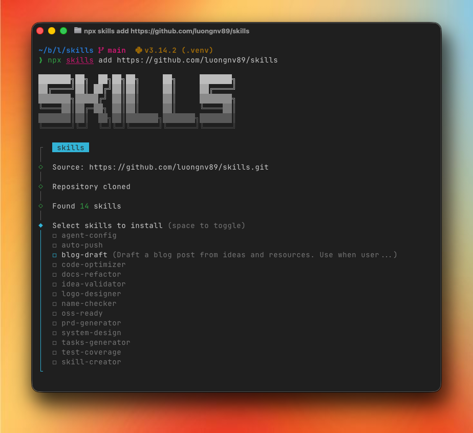
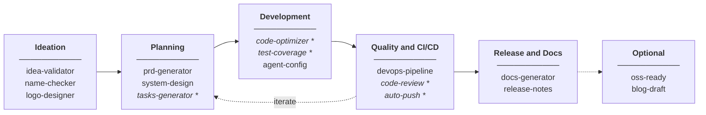

<p align="center">
  
</p>

<p align="center">
  <a href="https://opensource.org/licenses/MIT"></a>
  <a href="CONTRIBUTING.md"></a>
</p>

# Agent Skills

> Supercharge your AI agents/bots with reusable skills

A collection of skills for AI agents, bots, and coding assistants. Works with Claude Code, Cursor, Windsurf, Codex, OpenCode, and other AI tools that support skill-based workflows.

## Installation

```bash
npx skills add https://github.com/luongnv89/skills
```

<p align="center">
  
</p>

To install a specific skill:

```bash
npx skills add https://github.com/luongnv89/skills --skill auto-push
npx skills add https://github.com/luongnv89/skills --skill code-optimizer
```

## Example: Skill-First Development Workflow

Each skill is independent and can be used separately for various tasks. The diagram below shows one example of how skills can be combined for a complete software development workflow:



_* Skills marked with * can be used repeatedly during development iterations._

| Phase | Skills | Purpose |
|-------|--------|---------|
| **Ideation** | idea-validator → name-checker → logo-designer | Validate concept, check name, design logo |
| **Planning** | prd-generator → system-design → tasks-generator | Create PRD, architecture, sprint tasks |
| **Development** | code-optimizer, test-coverage, agent-config | Write quality code with tests |
| **Quality & CI/CD** | devops-pipeline, code-review → auto-push | Setup CI/CD, review code, commit and push |
| **Release & Docs** | docs-generator, release-notes | Generate documentation and changelogs |
| **Optional** | oss-ready, blog-draft | Open source setup, announcements |

## Available Skills

### Development Workflow

| Skill | Description |
|-------|-------------|
| **auto-push** | Stage, commit, and push changes with security checks |
| **test-coverage** | Expand unit test coverage targeting untested branches |
| **code-optimizer** | Analyze code for performance issues and optimizations |
| **code-review** | Review code for smells and pragmatic programming violations |
| **devops-pipeline** | Setup pre-commit hooks and GitHub Actions for CI/CD |

### Product Development

| Skill | Description |
|-------|-------------|
| **idea-validator** | Critically evaluate app ideas and startup concepts |
| **name-checker** | Check product names for trademark and domain conflicts |
| **prd-generator** | Generate Product Requirements Documents |
| **tasks-generator** | Generate sprint tasks from PRD |
| **system-design** | Generate Technical Architecture Documents |

### Content & Documentation

| Skill | Description |
|-------|-------------|
| **blog-draft** | Draft SEO-optimized blog posts with research, title optimization, and content SEO |
| **docs-generator** | Restructure project documentation |
| **release-notes** | Generate release notes from git commits and GitHub PRs/issues |
| **oss-ready** | Setup open-source project standards |
| **agent-config** | Create or update CLAUDE.md and AGENTS.md files |

### Design & Branding

| Skill | Description |
|-------|-------------|
| **logo-designer** | Design professional logos with automatic project context detection |

## Usage

Skills trigger automatically based on your requests:

| What you say | Skill triggered |
|--------------|-----------------|
| "push my changes" | auto-push |
| "optimize this code" | code-optimizer |
| "setup CI/CD" | devops-pipeline |
| "evaluate my idea" | idea-validator |
| "create a PRD" | prd-generator |
| "make this open source" | oss-ready |
| "improve test coverage" | test-coverage |
| "update CLAUDE.md" | agent-config |
| "design a logo" | logo-designer |
| "generate release notes" | release-notes |
| "review this code" | code-review |

## Project Structure

```
.
├── skills/              # Skill source files
│   └── skill-name/
│       ├── SKILL.md     # Skill definition
│       ├── scripts/     # Optional scripts
│       ├── references/  # Optional docs
│       └── assets/      # Optional templates
├── .agents/             # Agent configuration
└── .claude/             # Claude-specific skills
```

## Creating New Skills

Use the **skill-creator** skill or create manually:

```markdown
---
name: my-skill
description: What it does and when to use it
---

# Instructions for the AI agent...
```

See [CONTRIBUTING.md](CONTRIBUTING.md) for detailed guidelines.

## Contributing

Contributions are welcome! Please read our [Contributing Guide](CONTRIBUTING.md) and [Code of Conduct](CODE_OF_CONDUCT.md).

## Security

See [SECURITY.md](SECURITY.md) for reporting vulnerabilities.

## License

[MIT](LICENSE)

---

<p align="center">
  <a href="https://luongnv.com">Website</a> •
  <a href="https://github.com/luongnv89/claude-howto">Claude How-To</a> •
  <a href="https://medium.com/@luongnv89">Blog</a>
</p>
