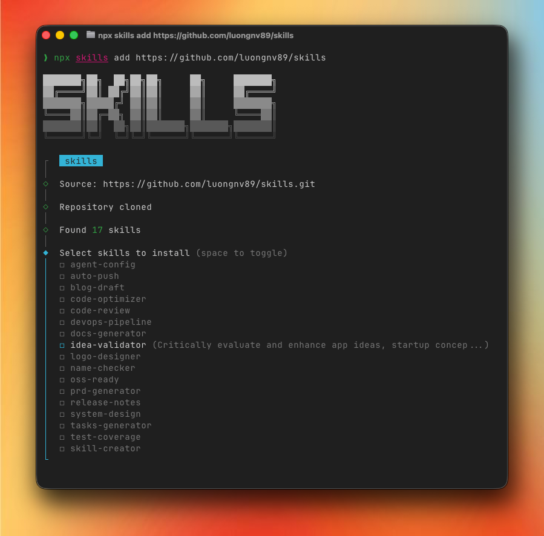
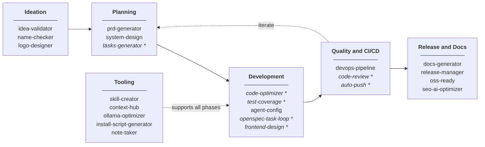

<p align="center">
  
</p>

<p align="center">
  <a href="https://opensource.org/licenses/MIT"></a>
  <a href="CONTRIBUTING.md"></a>
</p>

# Agent Skills

> Supercharge your AI agents/bots with reusable skills

A collection of skills for AI agents, bots, and coding assistants. Works with Claude Code, Cursor, Windsurf, Codex, OpenCode, and other AI tools that support skill-based workflows.

## Installation

```bash
npx skills add https://github.com/luongnv89/skills
```

<p align="center">
  
</p>

To install a specific skill:

```bash
npx skills add https://github.com/luongnv89/skills --skill auto-push
npx skills add https://github.com/luongnv89/skills --skill code-optimizer
```

## Example: Skill-First Development Workflow

Each skill is independent and can be used separately for various tasks. The diagram below shows one example of how skills can be combined for a complete software development workflow:



_* Skills marked with * can be used repeatedly during development iterations._

| Phase | Skills | Purpose |
|-------|--------|---------|
| **Ideation** | idea-validator → name-checker → logo-designer | Validate concept, check name, design logo |
| **Planning** | prd-generator → system-design → tasks-generator | Create PRD, architecture, sprint tasks |
| **Development** | code-optimizer, test-coverage, agent-config, openspec-task-loop, frontend-design | Write quality code with tests, structured task loops, and distinctive UIs |
| **Quality & CI/CD** | devops-pipeline, code-review → auto-push | Setup CI/CD, review code, commit and push |
| **Release & Docs** | docs-generator, release-manager, oss-ready, seo-ai-optimizer | Generate documentation, manage releases, open source setup, and SEO/AI optimization |
| **Tooling** | skill-creator, context-hub, ollama-optimizer, install-script-generator, note-taker | Create skills, fetch current API docs, optimize local LLMs, generate installers, capture notes |

## Available Skills

### Development Workflow

| Skill | Version | Description |
|-------|---------|-------------|
| [**auto-push**](skills/auto-push/) | 1.0.0 | Stage, commit, and push changes with security checks |
| [**cli-builder**](skills/cli-builder/) | 1.0.0 | Build production-quality CLI tools with a 5-step approval-gated workflow |
| [**test-coverage**](skills/test-coverage/) | 1.2.0 | Expand unit test coverage targeting untested branches |
| [**code-optimizer**](skills/code-optimizer/) | 1.2.0 | Analyze code for performance issues and optimizations |
| [**code-review**](skills/code-review/) | 1.0.1 | Review code for smells and pragmatic programming violations |
| [**devops-pipeline**](skills/devops-pipeline/) | 1.0.0 | Setup pre-commit hooks and GitHub Actions for CI/CD |
| [**openspec-task-loop**](skills/openspec-task-loop/) | 1.0.0 | Execute OpenSpec in strict one-task-per-change loops with archive/verify gates |
| [**ollama-optimizer**](skills/ollama-optimizer/) | 1.0.1 | Optimize Ollama configuration for maximum local LLM performance |
| [**install-script-generator**](skills/install-script-generator/) | 2.0.0 | Generate cross-platform installation scripts with environment detection |
| [**note-taker**](skills/note-taker/) | 1.4.1 | Capture notes (text, voice, image/video/files) into a git-backed repo with task extraction, inline media previews, and GitHub link reporting |
| [**vscode-extension-publisher**](skills/vscode-extension-publisher/) | 1.0.0 | Publish VS Code extensions to the Visual Studio Marketplace |

### Product Development

| Skill | Version | Description |
|-------|---------|-------------|
| [**idea-validator**](skills/idea-validator/) | 1.2.2 | Critically evaluate app ideas and startup concepts with GitHub link reporting |
| [**name-checker**](skills/name-checker/) | 1.0.1 | Check product names for trademark and domain conflicts |
| [**prd-generator**](skills/prd-generator/) | 1.2.2 | Generate Product Requirements Documents with GitHub link reporting |
| [**tasks-generator**](skills/tasks-generator/) | 1.2.2 | Generate sprint tasks from PRD with GitHub link reporting |
| [**system-design**](skills/system-design/) | 1.2.3 | Generate Technical Architecture Documents with GitHub link reporting |

### Content & Documentation

| Skill | Version | Description |
|-------|---------|-------------|
| [**docs-generator**](skills/docs-generator/) | 1.2.0 | Restructure project documentation |
| [**release-manager**](skills/release-manager/) | 2.1.0 | Complete release automation — version bumps, changelog, README updates, builds, git tags, and GitHub releases |
| [**oss-ready**](skills/oss-ready/) | 1.1.0 | Setup open-source project standards |
| [**agent-config**](skills/agent-config/) | 1.1.0 | Create or update CLAUDE.md and AGENTS.md files |
| [**seo-ai-optimizer**](skills/seo-ai-optimizer/) | 1.0.1 | Audit and optimize website codebases for SEO and AI bot scanning |

### Design & Branding

| Skill | Version | Description |
|-------|---------|-------------|
| [**logo-designer**](skills/logo-designer/) | 1.1.0 | Design professional logos with automatic project context detection |
| [**frontend-design**](skills/frontend-design/) | 1.2.0 | Create distinctive, usability-focused frontend interfaces with default style guide |
| [**theme-transformer**](skills/theme-transformer/) | 1.0.0 | Transform existing UIs into futuristic cyberpunk neon-dark themes with branch-safe iterative redesign workflow |

### Skill Development

| Skill | Version | Description |
|-------|---------|-------------|
| [**skill-creator**](skills/skill-creator/) | 1.0.1 | Guide for creating effective skills with templates and packaging tools |
| [**skill-inventory-auditor**](skills/skill-inventory-auditor/) | 1.0.0 | Audit installed skills to find and remove duplicates |
| [**context-hub**](skills/context-hub/) | 1.0.0 | Fetch current API/SDK docs via Context Hub (`chub`) before implementing integrations |

## Usage

Skills trigger automatically based on your requests:

| What you say | Skill triggered |
|--------------|-----------------|
| "push my changes" | auto-push |
| "optimize this code" | code-optimizer |
| "setup CI/CD" | devops-pipeline |
| "run one OpenSpec task at a time" | openspec-task-loop |
| "evaluate my idea" | idea-validator |
| "create a PRD" | prd-generator |
| "make this open source" | oss-ready |
| "improve test coverage" | test-coverage |
| "update CLAUDE.md" | agent-config |
| "design a logo" | logo-designer |
| "prepare a release" | release-manager |
| "review this code" | code-review |
| "optimize Ollama" | ollama-optimizer |
| "create an installer for X" | install-script-generator |
| "take a note" | note-taker |
| "use latest Stripe/OpenAI API docs" | context-hub |
| "optimize for SEO" | seo-ai-optimizer |
| "build a landing page" | frontend-design |
| "transform this app into futuristic cyberpunk theme" | theme-transformer |

## Project Structure

```
.
├── skills/              # Skill source files
│   └── skill-name/
│       ├── SKILL.md     # Skill definition
│       ├── scripts/     # Optional scripts
│       ├── references/  # Optional docs
│       └── assets/      # Optional templates
└── .claude/             # Claude-specific config
```

## Creating New Skills

Use the **skill-creator** skill or create manually:

```markdown
---
name: my-skill
version: 1.0.0
description: What it does and when to use it
---

# Instructions for the AI agent...
```

See [CONTRIBUTING.md](CONTRIBUTING.md) for detailed guidelines.

## Contributing

Contributions are welcome! Please read our [Contributing Guide](CONTRIBUTING.md) and [Code of Conduct](CODE_OF_CONDUCT.md).

## Security

See [SECURITY.md](SECURITY.md) for reporting vulnerabilities.

## Acknowledgements

- [**frontend-design**](skills/frontend-design/) — inspired by Anthropic's official [frontend-design](https://github.com/anthropics/claude-code/tree/main/plugins/frontend-design) plugin. This is an independent implementation with a default style guide and usability principles.
- [**skill-creator**](skills/skill-creator/) — customized from Anthropic's official [skill-creator](https://github.com/anthropics/skills/tree/main/skills/skill-creator) (Apache 2.0). Added README.md generation step.

## License

[MIT](LICENSE)

---

<p align="center">
  <a href="https://luongnv.com">Website</a> •
  <a href="https://github.com/luongnv89/claude-howto">Claude How-To</a> •
  <a href="https://medium.com/@luongnv89">Blog</a>
</p>
