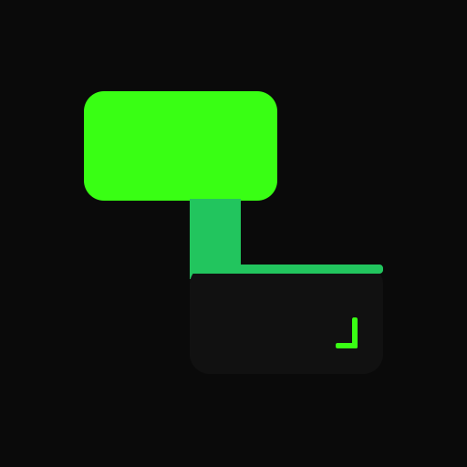
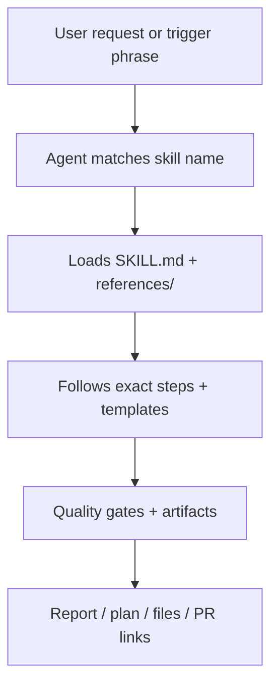

<p align="center">
  
</p>

<p align="center">
  <a href="https://opensource.org/licenses/MIT"></a>
  <a href="CONTRIBUTING.md"></a>
  <a href="https://github.com/luongnv89/skills/releases"></a>
  <a href="https://github.com/luongnv89/skills"></a>
</p>

# Install expert workflows for AI coding agents

One command drops a tested, versioned skill into your agent. No more ad-hoc prompts. The same rigorous steps run every time.

Skills are independent files. Works with Claude Code, Cursor, Windsurf, GitHub Copilot, OpenAI Codex, OpenCode, Google Antigravity (`install.sh:23`).

[**Browse catalog**](#skill-catalog) | [**Install**](#install)

---

## Install

> Validate this runbook: `./scripts/validate-install.sh --check`

Pick one:

```bash
npx skills add https://github.com/luongnv89/skills --skill code-review
```

Pick several:

```bash
npx skills add https://github.com/luongnv89/skills --skill code-review --skill auto-push --skill test-coverage
```

All of them:

```bash
npx skills add https://github.com/luongnv89/skills
```

### agent-skill-manager

Use [agent-skill-manager](https://github.com/luongnv89/agent-skill-manager) (`asm`) for a single TUI/CLI across agents:

```bash
npm install -g agent-skill-manager
asm install github:luongnv89/skills
```

```bash
asm search   # find by name or description
asm list     # show installed skills
```

<details>
<summary>Other install methods</summary>

**Remote (no clone)**

```bash
curl -sSL https://raw.githubusercontent.com/luongnv89/skills/main/remote-install.sh | bash
```

Non-interactive:

```bash
curl -sSL https://raw.githubusercontent.com/luongnv89/skills/main/remote-install.sh | bash -s -- \
  --skills "code-review,auto-push" --tools "Claude Code" --scope global
```

**Clone + local**

```bash
git clone https://github.com/luongnv89/skills.git
cd skills && bash install.sh
```

</details>

---

## How It Works


```mermaid
graph TD
    A[User request or trigger phrase] --> B[Agent matches skill name]
    B --> C[Loads SKILL.md + references/]
    C --> D[Follows exact steps + templates]
    D --> E[Quality gates + artifacts]
    E --> F[Report / plan / files / PR links]
```

A skill is a self-contained playbook: frontmatter metadata, instructions, optional scripts, and reference docs. The installer copies it to the right path for your agent.

---

## Key Features

| Feature | What you get |
|---|---|
| Standalone | Any mix installs cleanly; zero shared runtime |
| Versioned | Semver + per-skill changelogs |
| Structured | Steps, templates, checklists, self-validation |
| Tool-agnostic | Same skill works in Claude Code, Cursor, Windsurf, Codex, Copilot |
| Scannable | Tables, diagrams, short outputs |
| Suite support | Multi-phase products (e.g. website-cloner) with independent phases |

---

## Quick Start

```bash
npx skills add https://github.com/luongnv89/skills --skill landing-page-generator
```

```bash
npx skills add https://github.com/luongnv89/skills --skill code-review --skill auto-push
```

After install, call skills by name in your agent prompts (see catalog for each skill's trigger guidance).

See [skills/](skills/) for full SKILL.md files.

---

## Skill Catalog

Every skill is standalone. Install one or many.

Use:

```bash
npx skills add https://github.com/luongnv89/skills --skill <name>
```

### Find by Category

| Category | What it covers |
|---|---|
| [Code Quality](#code-quality) | Reviews, cleanup, testing, optimization, usability |
| [Shipping](#shipping) | Auto push, pipelines, releases, security hardening |
| [Product Planning](#product-planning) | Validation, PRDs, architecture, tasks, naming |
| [Frontend & Design](#frontend--design) | UIs, logos, diagrams, site clones |
| [Documentation](#documentation) | Docs gen, READMEs, SEO, OSS prep, agent config |
| [App Store](#app-store) | ASO, review compliance |
| [Tooling](#tooling) | CLIs, installers, local models, agent comms |

### Code Quality

| Skill | Version | Effort | What it does |
|---|---|---|---|
| [**code-review**](skills/code-review/) | 2.1.0 | high | Review or improve code — 4 modes: bugs/security, performance, clean-code audit, slop cleanup |
| [**codebase-modernizer**](skills/codebase-modernizer/) | 1.2.2 | max | Whole-repo audit + phased, testable plan to modernize a stale or messy codebase |
| [**test-coverage**](skills/test-coverage/) | 1.3.1 | low | Target untested branches and edge cases |
| [**dont-make-me-think**](skills/dont-make-me-think/) | 1.4.1 | medium | Usability review using Krug's principles |

**`code-review` has four modes** — pick by intent or pass `mode:<name>`:

| I want to... | Mode | It... |
|---|---|---|
| Find bugs, security, or quality issues in a diff | `review` (default) | reads + reports prioritized findings |
| Make code faster / fix perf bottlenecks | `perf` | reads + reports performance fixes |
| Audit readability/standards vs the Clean Code cheat sheet | `clean` | writes an audit report (`CLEAN_CODE_AUDIT.md`) |
| Actually apply cleanup / refactor out AI slop & cruft | `cleanup` | **writes code** (8-subagent refactor) |

**`code-review` or `codebase-modernizer`?** Scope decides. `code-review` inspects a diff, a PR, or a
file set and reports findings. `codebase-modernizer` audits the *whole repo* across all ten
dimensions — including dependency and runtime currency, which nothing else here covers — and converts
the findings into a phased sprint plan with milestones. It is read-only: dependency upgrades become
planned tasks with migration steps, never a bulk `npm update`. Reach for it when returning to a
neglected project or untangling one that has drifted.

Adjacent skills: **test-coverage** (generate tests for untested branches) · **dont-make-me-think** (usability/UX review).

### Shipping

| Skill | Version | Effort | What it does |
|---|---|---|---|
| [**auto-push**](skills/auto-push/) | 1.0.4 | low | Commit message + stage + push with secret and size checks |
| [**devops-pipeline**](skills/devops-pipeline/) | 2.0.3 | medium | Pre-commit + GitHub Actions quality gates |
| [**security-setup**](skills/security-setup/) | 1.4.0 | high | Local pre-commit secret scans, dep checks, static analysis, gated CI |
| [**fork-upstream-sync**](skills/fork-upstream-sync/) | 1.3.3 | medium | Sync a fork with upstream while keeping feature branches and open PRs mergeable |
| [**release-manager**](skills/release-manager/) | 2.6.0 | max | Bump, changelog, tag, GitHub release, publish |

### Product Planning

| Skill | Version | Effort | What it does |
|---|---|---|---|
| [**idea-validator**](skills/idea-validator/) | 1.5.0 | max | Market, feasibility, competitor checks for ideas |
| [**viral-product-evaluator**](skills/viral-product-evaluator/) | 1.3.0 | high | Score codebase + landing page vs 32 viral principles |
| [**brand-name-checker**](skills/brand-name-checker/) | 1.4.0 | max | Trademark, domain, social, registry conflicts |
| [**prd-generator**](skills/prd-generator/) | 1.4.0 | max | Structured PRD from idea or validate notes |
| [**tad-generator**](skills/tad-generator/) | 1.5.0 | max | Technical architecture document from PRD |
| [**tasks-generator**](skills/tasks-generator/) | 1.3.2 | max | Sprint tasks and plan from PRD |
| [**plan-to-issues**](skills/plan-to-issues/) | 2.0.4 | high | File any plan file — or a conversation, with no file at all — as labelled GitHub issues under one epic whose body maps each issue to its source task |

### Frontend & Design

| Skill | Version | Effort | What it does |
|---|---|---|---|
| [**frontend-design**](skills/frontend-design/) | 1.2.5 | high | Production UIs with usability-first approach |
| [**logo-designer**](skills/logo-designer/) | 1.2.3 | medium | 7 SVG logo variants from project context |
| [**diagram-generator**](skills/diagram-generator/) | 1.1.2 | high | One entry point for diagrams — routes to draw.io XML or Excalidraw JSON |
| [**website-cloner**](skills/website-cloner/) | 1.2.1 | high | 6-phase URL to improved Vite/React/Tailwind site |

**Website cloner phases** (install individually or as suite):

| Phase | Version | What it does |
|---|---|---|
| website-analyzer | 1.3.0 | 6-dimension analysis → JSON |
| website-clone-report | 1.2.2 | Stakeholder report from analysis |
| website-improvement-prd | 1.3.0 | Improvement PRD |
| website-implementation-plan | 1.3.2 | tasks.md from PRD |
| website-builder | 1.3.1 | Build improved site |
| website-clone-final-report | 1.3.0 | Before/after summary |

**Diagram generator engines** (install the umbrella or a single engine):

| Engine | Version | What it does |
|---|---|---|
| drawio-generator | 1.2.3 | draw.io XML — precise, editable, C4, swimlanes |
| excalidraw-generator | 1.3.3 | Excalidraw JSON — hand-drawn, sketch, wireframes |

### Documentation

| Skill | Version | Effort | What it does |
|---|---|---|---|
| [**doc-manager**](skills/doc-manager/) | 2.0.3 | medium | Generate/update docs to match code, cited to path:line, never invented |
| [**landing-page-generator**](skills/landing-page-generator/) | 1.2.1 | high | Landing pages: marketing copy from a brief, or a README-to-landing rewrite |
| [**seo-ai-optimizer**](skills/seo-ai-optimizer/) | 1.3.1 | high | Technical SEO + AI-bot directives |
| [**website-agent-readiness**](skills/website-agent-readiness/) | 1.1.0 | high | Scan a live site for agent readiness, plan the gaps, file them as issues |
| [**oss-ready**](skills/oss-ready/) | 1.3.0 | low | Add OSS files and templates |
| [**agent-config**](skills/agent-config/) | 1.4.1 | medium | CLAUDE.md + AGENTS.md per best practices |
| [**subagent-creator**](skills/subagent-creator/) | 1.1.2 | high | Create, evaluate, improve Claude Code subagent files (.claude/agents/*.md) |

### App Store

| Skill | Version | Effort | What it does |
|---|---|---|---|
| [**aso-marketing**](skills/aso-marketing/) | 1.3.0 | max | App Store + Google Play keyword and metadata optimization |
| [**appstore-review-checker**](skills/appstore-review-checker/) | 1.2.2 | high | Pre-submission audit vs Apple guidelines |

### Tooling

| Skill | Version | Effort | What it does |
|---|---|---|---|
| [**cli-builder**](skills/cli-builder/) | 1.1.0 | high | 5-step CLI tool builder with approval gates |
| [**ollama-optimizer**](skills/ollama-optimizer/) | 1.2.0 | medium | Hardware-aware Ollama tuning |
| [**install-script-generator**](skills/install-script-generator/) | 2.2.3 | high | Cross-platform install.sh with env detection |
| [**opencode-handoff**](skills/opencode-handoff/) | 1.0.1 | medium | Resume a limit-blocked OpenCode session in a fresh sandbox |
| [**opencode-runner**](skills/opencode-runner/) | 1.5.0 | medium | Delegate work to opencode free cloud models |
| [**opencode-sandbox**](skills/opencode-sandbox/) | 2.1.1 | medium | Run OpenCode in a kept sandbox (SSH/gh on by default) |
| [**herdr-agent-comms**](skills/herdr-agent-comms/) | 1.23.0 | medium | Manage Herdr agent fleets: tile panes, message/wait/read, steer |
| [**issue-work-loop**](skills/issue-work-loop/) | 1.4.0 | max | Resolve one GitHub issue via a Herdr implementer→reviewer loop until CLEAN |
| [**tmux-agent-comms**](skills/tmux-agent-comms/) | 2.3.0 | medium | Spawn, message, read CLI agents in tmux |

---

## Suite Folders

Most skills are `skills/<name>/`. Multi-phase products live under a suite folder: umbrella at `skills/<umbrella>/` + phases at `skills/<umbrella>/<phase>/`.

Current suites: [website-cloner](skills/website-cloner/) (6 sequential phases) and [diagram-generator](skills/diagram-generator/) (draw.io + Excalidraw engines behind one router). Install an umbrella or any child. Installers discover both levels.

Mirror the layout for your own multi-skill products.

---

## Project docs

| Doc | Purpose |
|---|---|
| [CONTRIBUTING.md](CONTRIBUTING.md) | Contribute skills; structure and versioning |
| [docs/guide-building-agent-skills.md](docs/guide-building-agent-skills.md) | Authoring guide (plan → write → validate → distribute) |
| [docs/brand_kit.md](docs/brand_kit.md) | Logo files, colors, typography |
| [docs/DECISIONS.md](docs/DECISIONS.md) | Doc ambiguity resolutions |
| [docs/troubleshooting.md](docs/troubleshooting.md) | Install/setup validation fixes |
| [docs/archive/](docs/archive/) | Historical work notes (not current product docs) |
| [CHANGELOG.md](CHANGELOG.md) | Release history |
| [SECURITY.md](SECURITY.md) | Vulnerability reporting |

## FAQ

**Do I need every skill?**  
No. Pick only what you need. All are independent.

**Which agents work?**  
Any that load external skill files. Installer tools (`install.sh:23`): Claude Code, Cursor, Windsurf, GitHub Copilot, OpenAI Codex, OpenCode, Google Antigravity.

**How do I make my own?**  
Follow [CONTRIBUTING.md](CONTRIBUTING.md), [docs/guide-building-agent-skills.md](docs/guide-building-agent-skills.md), or patterns from existing skills.

**Do skills change my runtime code?**  
No. They only guide the agent during development.

---

## Get Started

```bash
npx skills add https://github.com/luongnv89/skills --skill code-review
```

[**All skills**](./skills) · [**Contribute**](CONTRIBUTING.md) · MIT

---

<details>
<summary><b>Supported Tool Paths</b> (`install.sh:218-321`)</summary>

| Tool | Global | Project |
|---|---|---|
| Claude Code | `~/.claude/skills/<skill>/` | `.claude/skills/<skill>/` |
| Cursor | `~/.agents/skills/<skill>/` + `.cursor/rules/<skill>.mdc` | same |
| Windsurf | `~/.agents/skills/<skill>/` + `.windsurf/rules/<skill>.md` | same |
| GitHub Copilot | `~/.agents/skills/<skill>/` + `.github/instructions/<skill>.instructions.md` | same |
| OpenAI Codex | `~/.agents/skills/<skill>/` + `~/.codex/AGENTS.md` | same |
| OpenCode | `~/.agents/skills/<skill>/` | same |
| Google Antigravity | `~/.agents/skills/<skill>/` | same |

</details>

<details>
<summary><b>Project Structure</b></summary>

```
.
├── skills/
│   └── <name>/
│       ├── SKILL.md
│       ├── scripts/
│       ├── references/
│       └── docs/
└── install.sh / remote-install.sh

# Suite umbrellas also hold child skills:
# skills/<umbrella>/<child>/SKILL.md  (install.sh:44-46)
```
</details>

<details>
<summary><b>Creating Skills</b></summary>

See [CONTRIBUTING.md](CONTRIBUTING.md).

Minimal:

```yaml
---
name: my-skill
description: "When to use and what it produces. Don't use for X."
license: MIT
effort: medium
metadata:
  version: 1.0.0
  author: "Your Name"
---
# Agent instructions here. Keep SKILL.md under 500 lines.
```

</details>

<details>
<summary><b>Contributing</b></summary>

Read [CONTRIBUTING.md](CONTRIBUTING.md) and [CODE_OF_CONDUCT.md](CODE_OF_CONDUCT.md).
</details>

<details>
<summary><b>Security</b></summary>

See [SECURITY.md](SECURITY.md).
</details>

<details>
<summary><b>Acknowledgements</b></summary>

- frontend-design draws from Anthropic's patterns.
- Many skills follow the conventions established in the skill-creator lineage.
</details>

---

<p align="center">
  <a href="https://luongnv.com">Website</a> ·
  <a href="https://github.com/luongnv89/claude-howto">Claude How-To</a> ·
  <a href="https://medium.com/@luongnv89">Blog</a>
</p>
