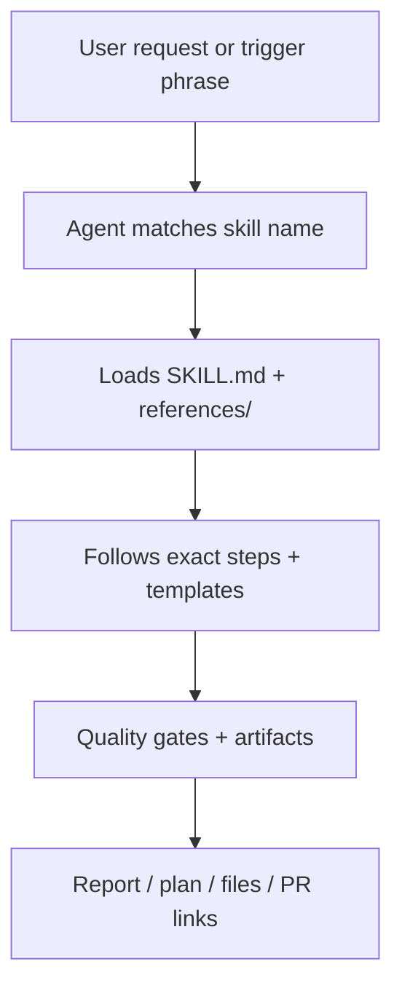

<p align="center">
  
</p>

<p align="center">
  <a href="https://opensource.org/licenses/MIT"></a>
  <a href="CONTRIBUTING.md"></a>
  <a href="https://github.com/luongnv89/skills/releases"></a>
  <a href="https://github.com/luongnv89/skills"></a>
</p>

# Install expert workflows for AI coding agents

One command drops a tested, versioned skill into your agent. No more ad-hoc prompts. The same rigorous steps run every time.

Skills are independent files. Works with Claude Code, Cursor, Windsurf, GitHub Copilot, OpenAI Codex, OpenCode.

[**Browse catalog**](#skill-catalog) | [**Install**](#install)

---

## Install

Pick one:

```bash
npx skills add https://github.com/luongnv89/skills --skill code-review
```

Pick several:

```bash
npx skills add https://github.com/luongnv89/skills --skill code-review --skill auto-push --skill test-coverage
```

All of them:

```bash
npx skills add https://github.com/luongnv89/skills
```

### agent-skill-manager

Use [agent-skill-manager](https://github.com/luongnv89/agent-skill-manager) (`asm`) for a single TUI/CLI across agents:

```bash
npm install -g agent-skill-manager
asm install github:luongnv89/skills
```

```bash
asm search   # find by name or description
asm list     # show installed skills
```

<details>
<summary>Other install methods</summary>

**Remote (no clone)**

```bash
curl -sSL https://raw.githubusercontent.com/luongnv89/skills/main/remote-install.sh | bash
```

Non-interactive:

```bash
curl -sSL https://raw.githubusercontent.com/luongnv89/skills/main/remote-install.sh | bash -s -- \
  --skills "code-review,auto-push" --tools "Claude Code" --scope global
```

**Clone + local**

```bash
git clone https://github.com/luongnv89/skills.git
cd skills && bash install.sh
```

</details>

---

## How It Works


```mermaid
graph TD
    A[User request or trigger phrase] --> B[Agent matches skill name]
    B --> C[Loads SKILL.md + references/]
    C --> D[Follows exact steps + templates]
    D --> E[Quality gates + artifacts]
    E --> F[Report / plan / files / PR links]
```

A skill is a self-contained playbook: frontmatter metadata, instructions, optional scripts, and reference docs. The installer copies it to the right path for your agent.

---

## Key Features

| Feature | What you get |
|---|---|
| Standalone | Any mix installs cleanly; zero shared runtime |
| Versioned | Semver + per-skill changelogs |
| Structured | Steps, templates, checklists, self-validation |
| Tool-agnostic | Same skill works in Claude Code, Cursor, Windsurf, Codex, Copilot |
| Scannable | Tables, diagrams, short outputs |
| Suite support | Multi-phase products (e.g. website-cloner) with independent phases |

---

## Quick Start

```bash
npx skills add https://github.com/luongnv89/skills --skill readme-to-landing-page
```

```bash
npx skills add https://github.com/luongnv89/skills --skill code-review --skill auto-push
```

After install, call skills by name in your agent prompts (see catalog for each skill's trigger guidance).

See [skills/](skills/) for full SKILL.md files.

---

## Skill Catalog

Every skill is standalone. Install one or many.

Use:

```bash
npx skills add https://github.com/luongnv89/skills --skill <name>
```

### Find by Category

| Category | What it covers |
|---|---|
| [Code Quality](#code-quality) | Reviews, cleanup, testing, optimization, usability |
| [Shipping](#shipping) | Auto push, pipelines, releases, security hardening |
| [Product Planning](#product-planning) | Validation, PRDs, architecture, tasks, naming |
| [Frontend & Design](#frontend--design) | UIs, logos, diagrams, site clones |
| [Documentation](#documentation) | Docs gen, READMEs, SEO, OSS prep, agent config |
| [App Store](#app-store) | ASO, review compliance |
| [Tooling](#tooling) | CLIs, installers, local models, agent comms |

### Code Quality

| Skill | Version | Effort | What it does |
|---|---|---|---|
| [**code-review**](skills/code-review/) | 1.1.4 | medium | Review diffs for bugs, vulns, and quality with prioritized fixes |
| [**code-optimizer**](skills/code-optimizer/) | 1.3.1 | medium | Find perf bottlenecks, leaks, and inefficiency |
| [**test-coverage**](skills/test-coverage/) | 1.2.3 | low | Target untested branches and edge cases |
| [**dont-make-me-think**](skills/dont-make-me-think/) | 1.2.1 | medium | Usability review using Krug's principles |
| [**slop-cleanup**](skills/slop-cleanup/) | 1.1.1 | high | Remove AI slop, duplication, weak types, and legacy cruft |
| [**clean-code**](skills/clean-code/) | 1.2.0 | high | Audit against Clean Code + ATDD/TDD checklists |

### Shipping

| Skill | Version | Effort | What it does |
|---|---|---|---|
| [**auto-push**](skills/auto-push/) | 1.0.2 | low | Commit message + stage + push with secret and size checks |
| [**devops-pipeline**](skills/devops-pipeline/) | 2.0.1 | medium | Pre-commit + GitHub Actions quality gates |
| [**security-setup**](skills/security-setup/) | 1.3.2 | high | Local pre-commit secret scans, dep checks, static analysis, gated CI |
| [**release-manager**](skills/release-manager/) | 2.5.0 | max | Bump, changelog, tag, GitHub release, publish |

### Product Planning

| Skill | Version | Effort | What it does |
|---|---|---|---|
| [**idea-validator**](skills/idea-validator/) | 1.4.0 | max | Market, feasibility, competitor checks for ideas |
| [**viral-product-evaluator**](skills/viral-product-evaluator/) | 1.1.0 | high | Score codebase + landing page vs 32 viral principles |
| [**brand-name-checker**](skills/brand-name-checker/) | 1.3.0 | max | Trademark, domain, social, registry conflicts |
| [**prd-generator**](skills/prd-generator/) | 1.3.1 | max | Structured PRD from idea or validate notes |
| [**tad-generator**](skills/tad-generator/) | 1.3.0 | max | Technical architecture document from PRD |
| [**tasks-generator**](skills/tasks-generator/) | 1.2.1 | max | Sprint tasks and plan from PRD |

### Frontend & Design

| Skill | Version | Effort | What it does |
|---|---|---|---|
| [**frontend-design**](skills/frontend-design/) | 1.2.2 | high | Production UIs with usability-first approach |
| [**logo-designer**](skills/logo-designer/) | 1.2.1 | medium | 7 SVG logo variants from project context |
| [**excalidraw-generator**](skills/excalidraw-generator/) | 1.3.0 | high | Diagrams as Excalidraw JSON (flow, C4, ER, etc.) |
| [**drawio-generator**](skills/drawio-generator/) | 1.2.0 | high | Diagrams as draw.io XML with C4 support |
| [**website-cloner**](skills/website-cloner/) | 1.1.1 | high | 6-phase URL to improved Vite/React/Tailwind site |

**Website cloner phases** (install individually or as suite):

| Phase | Version | What it does |
|---|---|---|
| website-analyzer | 1.0.2 | 6-dimension analysis → JSON |
| website-clone-report | 1.0.2 | Stakeholder report from analysis |
| website-improvement-prd | 1.1.1 | Improvement PRD |
| website-implementation-plan | 1.1.0 | tasks.md from PRD |
| website-builder | 1.0.2 | Build improved site |
| website-clone-final-report | 1.0.1 | Before/after summary |

### Documentation

| Skill | Version | Effort | What it does |
|---|---|---|---|
| [**docs-generator**](skills/docs-generator/) | 1.2.3 | low | Restructure docs into clear hierarchy |
| [**readme-to-landing-page**](skills/readme-to-landing-page/) | 2.1.0 | high | Turn README into scannable landing page (PAS/AIDA/StoryBrand) |
| [**seo-ai-optimizer**](skills/seo-ai-optimizer/) | 1.2.0 | high | Technical SEO + AI-bot directives |
| [**oss-ready**](skills/oss-ready/) | 1.2.0 | low | Add OSS files and templates |
| [**agent-config**](skills/agent-config/) | 1.3.0 | medium | CLAUDE.md + AGENTS.md per best practices |
| [**subagent-creator**](skills/subagent-creator/) | 1.0.1 | high | Create, evaluate, improve Claude Code subagent files (.claude/agents/*.md) |

### App Store

| Skill | Version | Effort | What it does |
|---|---|---|---|
| [**aso-marketing**](skills/aso-marketing/) | 1.2.0 | max | App Store + Google Play keyword and metadata optimization |
| [**appstore-review-checker**](skills/appstore-review-checker/) | 1.2.0 | high | Pre-submission audit vs Apple guidelines |

### Tooling

| Skill | Version | Effort | What it does |
|---|---|---|---|
| [**cli-builder**](skills/cli-builder/) | 1.0.3 | high | 5-step CLI tool builder with approval gates |
| [**ollama-optimizer**](skills/ollama-optimizer/) | 1.0.4 | medium | Hardware-aware Ollama tuning |
| [**install-script-generator**](skills/install-script-generator/) | 2.1.0 | high | Cross-platform install.sh with env detection |
| [**opencode-runner**](skills/opencode-runner/) | 1.4.0 | medium | Delegate work to opencode free cloud models |
| [**tmux-agent-comms**](skills/tmux-agent-comms/) | 1.3.0 | medium | Spawn, message, read CLI agents in tmux |

---

## Suite Folders

Most skills are `skills/<name>/`. Multi-phase products live under a suite folder: umbrella at `skills/<umbrella>/` + phases at `skills/<umbrella>/<phase>/`.

Current suite: [website-cloner](skills/website-cloner/). Install the umbrella or any phase. Installers discover both levels.

Mirror the layout for your own multi-skill products.

---

## FAQ

**Do I need every skill?**  
No. Pick only what you need. All are independent.

**Which agents work?**  
Any that load external skill files. Tested with Claude Code, Cursor, Windsurf, GitHub Copilot, OpenAI Codex, OpenCode.

**How do I make my own?**  
Follow [CONTRIBUTING.md](CONTRIBUTING.md) or use patterns from existing skills.

**Do skills change my runtime code?**  
No. They only guide the agent during development.

---

## Get Started

```bash
npx skills add https://github.com/luongnv89/skills --skill code-review
```

[**All skills**](./skills) · [**Contribute**](CONTRIBUTING.md) · MIT

---

<details>
<summary><b>Supported Tool Paths</b></summary>

| Tool | Global | Project |
|---|---|---|
| Claude Code | `~/.claude/skills/<skill>/` | `.claude/skills/<skill>/` |
| Cursor | `~/.agents/skills/<skill>/` + `.cursor/rules/<skill>.mdc` | same |
| Windsurf | `~/.agents/skills/<skill>/` + `.windsurf/rules/<skill>.md` | same |
| GitHub Copilot | `~/.agents/skills/<skill>/` + `.github/instructions/<skill>.instructions.md` | same |
| OpenAI Codex | `~/.agents/skills/<skill>/` + `~/.codex/AGENTS.md` | same |
| OpenCode | `~/.agents/skills/<skill>/` | same |

</details>

<details>
<summary><b>Project Structure</b></summary>

```
.
├── skills/
│   └── <name>/
│       ├── SKILL.md
│       ├── scripts/
│       ├── references/
│       └── docs/
└── install.sh / remote-install.sh
```
</details>

<details>
<summary><b>Creating Skills</b></summary>

See [CONTRIBUTING.md](CONTRIBUTING.md).

Minimal:

```yaml
---
name: my-skill
description: "When to use and what it produces"
metadata:
  version: 1.0.0
  author: "Your Name"
---
# Agent instructions here. Keep SKILL.md under 500 lines.
```

</details>

<details>
<summary><b>Contributing</b></summary>

Read [CONTRIBUTING.md](CONTRIBUTING.md) and [CODE_OF_CONDUCT.md](CODE_OF_CONDUCT.md).
</details>

<details>
<summary><b>Security</b></summary>

See [SECURITY.md](SECURITY.md).
</details>

<details>
<summary><b>Acknowledgements</b></summary>

- frontend-design draws from Anthropic's patterns.
- Many skills follow the conventions established in the skill-creator lineage.
</details>

---

<p align="center">
  <a href="https://luongnv.com">Website</a> ·
  <a href="https://github.com/luongnv89/claude-howto">Claude How-To</a> ·
  <a href="https://medium.com/@luongnv89">Blog</a>
</p>
