# logo-designer case study: the Agent Skills logo

This folder holds a complete, real run of the [`logo-designer`](../../skills/logo-designer/) skill on this repository, kept as a worked example. Everything from the run is here: the brief, the project analysis, every concept sketch and test render, the concept board the user chose from, the decisions, the final files, and the validation report.

<p align="center">
  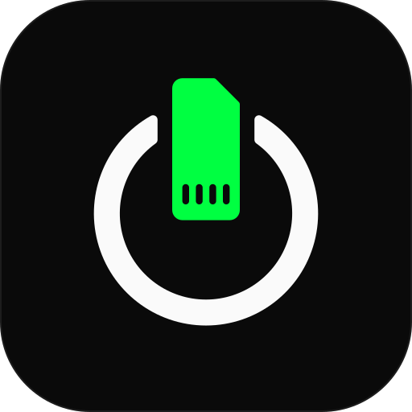
  &nbsp;&nbsp;&nbsp;
  <picture>
    <source media="(prefers-color-scheme: dark)" srcset="final/logo-white.svg">
    
  </picture>
</p>

## The brief

> "lets do a fresh logo design for this repo, professional, elegant, premium look and feel. Stick with the idea of plug and play usable skill (inspired from the event in The Matrix movie where Neo stick a memory card in his system and immediately he knows kungfu)."

The result is **Keyed Slot**: a skill card seated in the agent ring. Together the two shapes form the power-on symbol. Plug in, power up.

## The run at a glance

| Phase | What the skill does | What happened in this run | Artifacts |
|---|---|---|---|
| 0. Repo sync | Sync the branch before writing anything | Tree clean, `main` level with `origin/main`, so no pull was needed | none |
| 1. Analysis | Read the project, find existing brand assets | Found the old "Neural Plug" hexagon logo, its brand kit, and the docs-site palette and fonts | [Analysis](#phase-1-analysis) |
| 2. Design | Explore concepts, confirm style and casing with the user | 26 sketches over four rounds, then a concept board with four questions | [`concepts/`](concepts/), [`renders/`](renders/), [`board/`](board/) |
| 3. Deliverables | Canonical mark first, then derive six variants from its exact paths | 7 SVGs; the wordmark was converted to outlines with a script | [`final/`](final/), [`tools/`](tools/) |
| 4. Validation | Fresh-context review of structure and cross-file consistency | Consistency script (55/55 checks pass) plus the `svg-reviewer` checklist (PASS) | [`validation-report.md`](validation-report.md) |
| 5. Documentation | Rationale, color spec, Tailwind snippet, brand showcase page | Showcase page, brand kit rewrite, GitHub Pages copies synced | [`final/brand-showcase.html`](final/brand-showcase.html) |

## Phase 1: Analysis

```
Product:         Agent Skills (luongnv89/skills)
Type:            Developer tool / open-source catalog
Purpose:         Installable, versioned expert workflows ("skills") for AI coding agents
Audience:        Developers using Claude Code, Cursor, Windsurf, Copilot, Codex, OpenCode, Antigravity
Existing colors: #000000 / #0A0A0A base, #22C55E green accent (docs/brand_kit.md, docs/index.html)
Assets found:    assets/logo/ (7 SVGs, hexagon "Neural Plug" mark)
                 docs/assets/logo/ (3 copies used by the GitHub Pages site)
                 docs/brand_kit.md
```

Two findings shaped the scope. The README shows `assets/logo/logo-icon.svg`, so replacing that file updates it automatically. The GitHub Pages site serves its own copies from `docs/assets/logo/`, so those have to be replaced too or the site keeps the old logo.

## Phase 2: Design

The brief already fixed the idea, a card being plugged in. The work was finding a way to draw that which doesn't read as something else. Every sketch was drawn on a 64-unit grid and rendered with [`concepts/render.sh`](concepts/render.sh). Each row of a sheet shows the mark on light at 256px, on dark at 256px, at 32px (enlarged), and at 16px on light and dark (enlarged). Most ideas failed at small sizes or because they looked like an everyday object.

### Round 1: first sketches

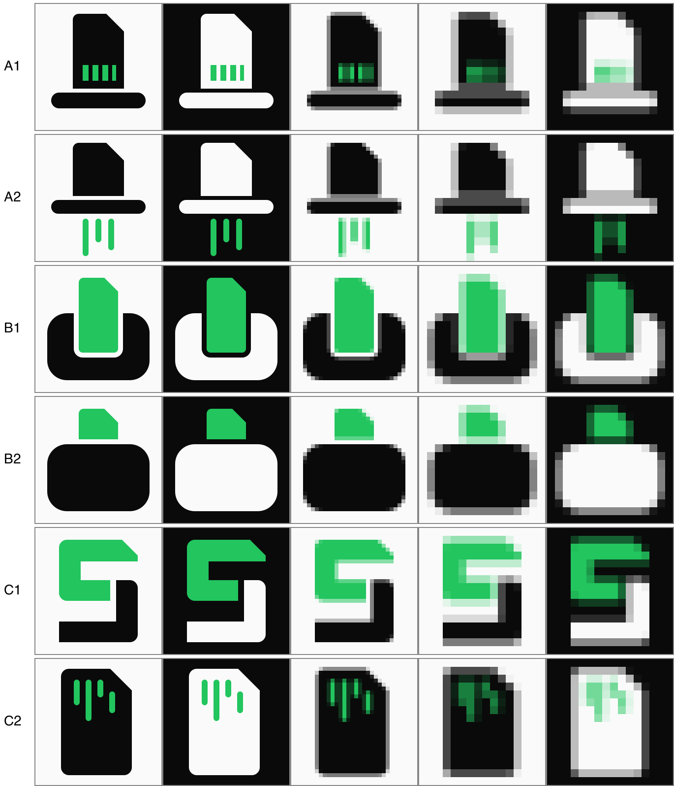

| Sketch | Idea | Verdict |
|---|---|---|
| A1 | Card dropping into a slot bar | Reads as a top hat |
| A2 | Card, slot, and code rain falling out below | Reads as a paper shredder |
| B1 | Card in a U-shaped body | Chunky, and reads like a toaster. But the U with a vertical bar also looks like a power symbol |
| B2 | Card on top of a body | Reads as a jar or battery |
| C1 | "S" monogram built from a card and a socket | Generic, and the card is lost |
| C2 | Memory card with Matrix code rain | Close to a text-document icon |

B1's accidental power symbol became the concept: plug a skill in and the agent powers on.

### Round 2: the power-on idea

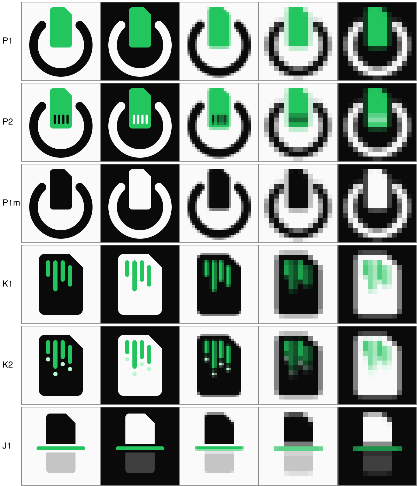

P1 (ring + card) read instantly at every size. P2 added contacts. P1m showed the mark still works in one color, because the gap separates card and ring. The cartridge alternatives (K1, K2) and the slot-plane idea (J1) kept reading as a document or a scanner.

### Round 3: refinement

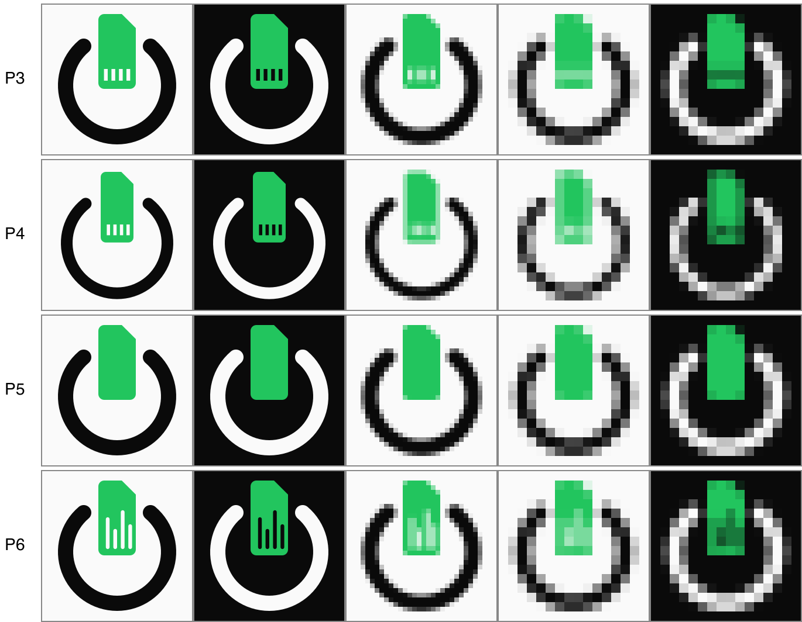
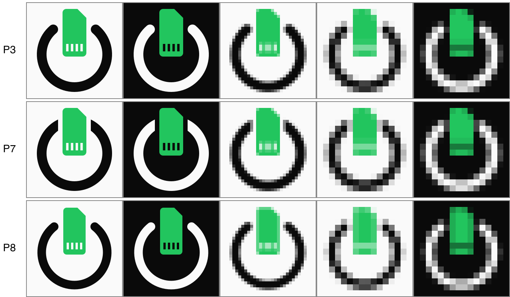

- The contacts stay. Without them (P5), a chamfered rectangle reads as a file icon.
- Contacts drawn as staggered code-rain bars (P6) turn the card into a bar chart.
- P7 cuts the ring flat, parallel to the card, instead of using round caps. That turns a stock power glyph into an engineered keyed slot.
- P8 lightens the weights: a 5.75-unit ring and a 15-unit card.

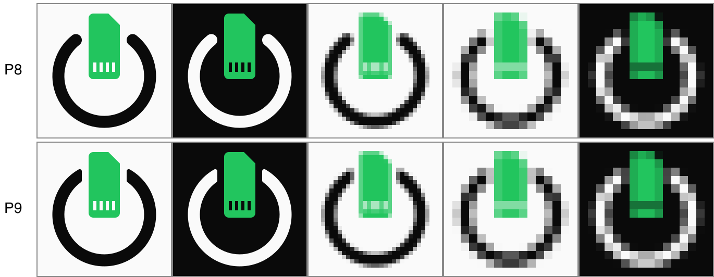

P9 combines the P7 cut with the P8 weights and fillets the cut corners (r = 1). The zoom below checks the fillet:

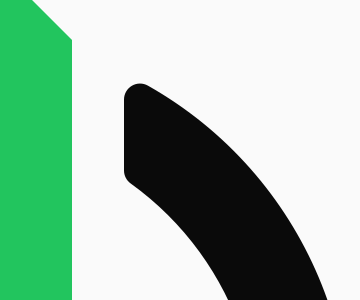

### Round 4: finishing

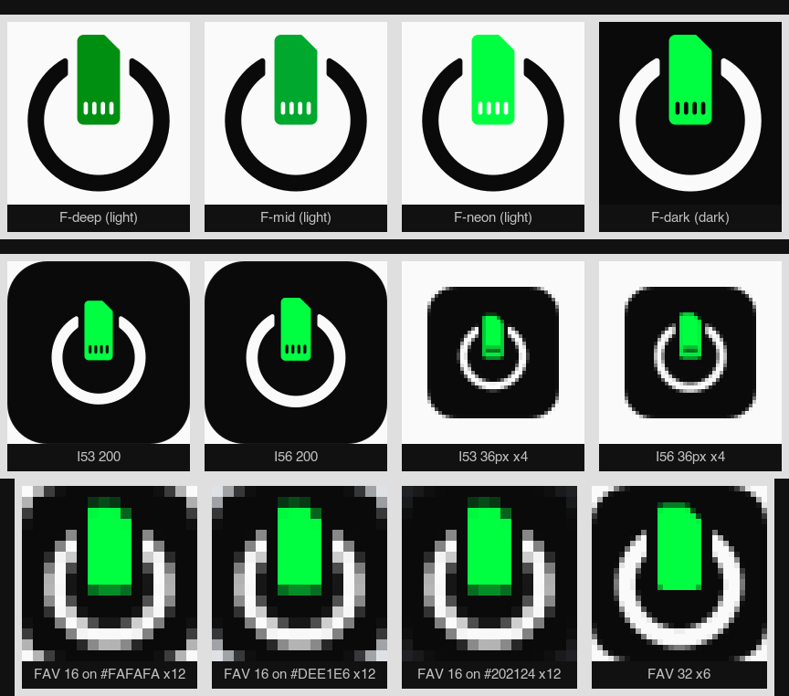

- **Light-background green.** Phosphor Deep `#008F11` was picked over `#00A82D` and neon-on-white.
- **Icon scale.** 5.6 was picked over 5.3, because the mark needs presence at 36px in the docs nav.
- **Favicon.** A 16px redraw on a dark tile, checked against light, gray, and dark browser-tab colors.

### The concept board and the user's choices

The user saw [`board/board.html`](board/board.html) (screenshot: [`renders/board.png`](renders/board.png)) and answered four questions:

| Question | Options offered | Choice |
|---|---|---|
| Mark | A · Power-On (round caps), **B · Keyed Slot** (recommended) | B · Keyed Slot |
| Wordmark casing | **AGENT SKILLS** (recommended), Agent Skills, agent skills | AGENT SKILLS |
| Accent | **#22C55E** (recommended, matches the site), #00FF41 Matrix phosphor, #10B981 emerald | #00FF41 Matrix phosphor |
| Scope | **Logo + site + brand kit** (recommended), logo files only | Logo + site + brand kit |

The user overrode the recommended accent, so the palette was adapted to fit. `#00FF41` is 14.50:1 on `#0A0A0A` but only 1.31:1 on `#FAFAFA`. It is therefore used on dark surfaces only, and a companion **Phosphor Deep `#008F11`** (4.08:1 on `#FAFAFA`) colors the card whenever the mark sits on a light background. Both are colors from the Matrix code rain.

## Phase 3: Deliverables

`logo-mark.svg` was written first as the single source of truth. Its two path strings (the ring, and the card with four contact cut-outs) are copied verbatim into every other mark-bearing file, and only transforms and fills change:

| File | viewBox | Treatment |
|---|---|---|
| `logo-mark.svg` | 64×64 | Canonical: Ink ring, Phosphor Deep card |
| `logo-full.svg` | 320×72 | Mark at `translate(4 4)` + outlined wordmark |
| `logo-wordmark.svg` | 180×40 | The same wordmark path, scaled |
| `logo-icon.svg` | 512×512 | Ink tile, Paper ring, Phosphor card at `translate(76.8 72) scale(5.6)` |
| `favicon.svg` | 16×16 | Redrawn for 16px: tile + ring + card, contacts dropped |
| `logo-white.svg` | 320×72 | Same as full, all `#FFFFFF` |
| `logo-black.svg` | 320×72 | Same as full, all `#000000` |

**Wordmark.** An SVG shown through `` (as on GitHub) can't load web fonts, so live `<text>` would fall back to whatever font the viewer has. [`tools/outline_wordmark.py`](tools/outline_wordmark.py) converts "AGENT SKILLS" to one outlined path. It uses Instrument Sans (SIL OFL), instanced at weight 500 and width 100, shaped with HarfBuzz with kerning on, and tracked +0.16em. The result is a 26.67-unit font size and a 19.20-unit cap height, with the ink running from x = 76.88 to 308.88 so both side paddings match.

The run hit one gate. The script's cap-height sanity check allowed at most 19, and the result was 19.20. The designer accepted it because the preview the user approved had an even larger cap-to-mark ratio.

## Phase 4: Validation

[`tools/check_consistency.py`](tools/check_consistency.py) checks the following:

- Ring and card `d` strings are byte-identical across mark, full, icon, white, and black.
- The wordmark path is identical across full, white, black, and wordmark.
- Every viewBox is exact.
- No file has `<image>`, `data:` URIs, `<text>`, or root width/height.
- The white and black variants differ from full only in fill values.
- The Pages copies are byte-identical.

A fresh pass through the skill's `svg-reviewer` checklist is recorded in [`validation-report.md`](validation-report.md).

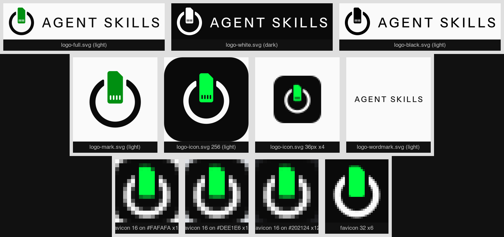

## Phase 5: Documentation and showcase

**Design rationale**

- **Symbol:** a memory card (chamfer + contacts) seated in the agent ring. Card and ring form the power-on symbol, echoing the Matrix moment of "I know kung fu".
- **Keyed cut:** the ring is cut parallel to the card with a uniform 3.25-unit clearance, which reads as an engineered, plug-and-play fit.
- **Color:** green appears only on the card. It is the powered-on LED and the Matrix code color. Everything else is Ink or Paper.
- **Typography:** tracked caps in Instrument Sans Medium are a calm counterweight to the bold mark, and use the same typeface as the docs site.

**Colors**

```
Ink            #0A0A0A   ring and wordmark on light, icon tile, dark backgrounds
Surface        #111111   elevated panels on dark
Border         #262626   hairlines on dark
Muted          #A3A3A3   secondary text on dark
Paper          #FAFAFA   light backgrounds, ring on dark
Phosphor       #00FF41   card on dark (icon, favicon), highlights on dark only
Phosphor Deep  #008F11   card on light (logo-mark, logo-full)
```

```js
colors: {
  brand: {
    ink: '#0A0A0A', surface: '#111111', border: '#262626', muted: '#A3A3A3',
    paper: '#FAFAFA', phosphor: '#00FF41', 'phosphor-deep': '#008F11',
  },
}
```

The brand page [`final/brand-showcase.html`](final/brand-showcase.html) presents the whole identity:

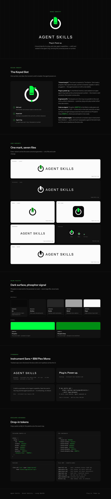 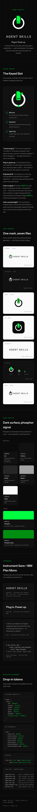

In the repo, the files went to `assets/logo/`, the three Pages copies in `docs/assets/logo/` were replaced, and [`docs/brand_kit.md`](../../docs/brand_kit.md) was rewritten.

## Folder map

```
examples/logo-designer/
├── README.md                  # this case study
├── concepts/
│   ├── 01-first-sketches/     # A1 A2 B1 B2 C1 C2
│   ├── 02-power-on/           # P1 P1m P2 K1 K2 J1
│   ├── 03-refinement/         # P3 to P9
│   ├── 04-finishing/          # green, icon-scale, and favicon checks
│   └── render.sh              # contact-sheet renderer (rsvg-convert + ImageMagick)
├── renders/                   # contact sheets, finishing checks, variant sheet, board and showcase screenshots
├── board/board.html           # the concept board exactly as the user saw it
├── final/                     # snapshot of the 7 SVGs + brand-showcase.html
├── tools/
│   ├── outline_wordmark.py    # text-to-outline for the wordmark
│   └── check_consistency.py   # cross-file geometry and structure checks
└── validation-report.md       # svg-reviewer output
```

## Reproduce

```bash
# contact sheets (macOS; needs rsvg-convert and ImageMagick; writes into renders/)
bash examples/logo-designer/concepts/render.sh examples/logo-designer/concepts/03-refinement/P9.svg

# wordmark outlines (see the script docstring for the font URL and pinned versions)
python3 examples/logo-designer/tools/outline_wordmark.py --help

# consistency checks, from the repo root
python3 examples/logo-designer/tools/check_consistency.py assets/logo --docs-copy docs/assets/logo
```

## What this run shows about the skill

- **Render at 16px before showing anyone.** Four of the six first sketches failed because they looked like a hat, a shredder, a toaster, or a jar. That kind of problem only shows up once you render.
- **Present finalists and ask decisions, not open questions.** Four multiple-choice questions settled mark, casing, accent, and scope in one round.
- **When the user overrides a recommendation, adapt the system.** Choosing Phosphor added a light-background companion green instead of a debate.
- **Canonical geometry first, then prove it.** One source file, verbatim path reuse, and a script that fails on any drift.
- **Outline the wordmark** so the logo looks identical in a GitHub ``, a browser, and print.
