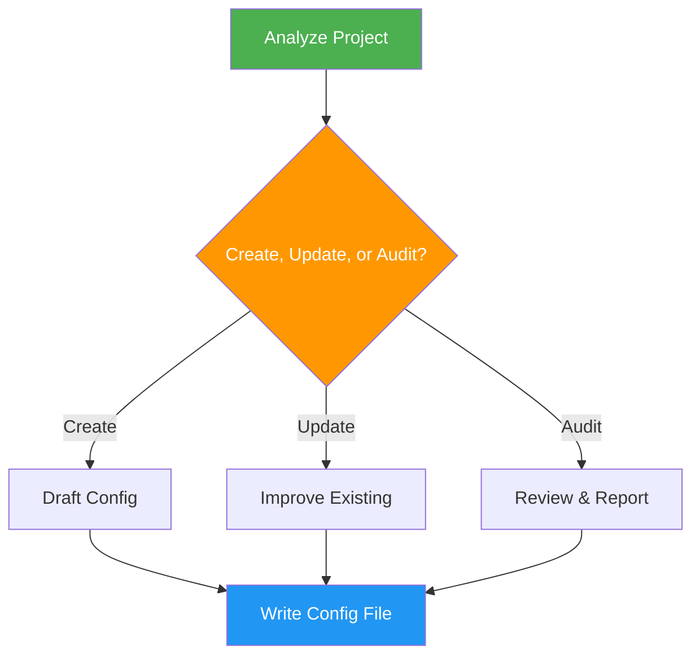

# Agent Config

> Create, update, or audit CLAUDE.md and AGENTS.md configuration files following official best practices.

## Highlights

- Generate project-aware CLAUDE.md with code style, workflows, and architecture context
- Create AGENTS.md custom subagent definitions for specialized tasks
- Audit existing configs against official guidelines and suggest improvements
- Support directory-specific instructions at multiple levels (home, project, child)
- Include token efficiency rules to minimize unnecessary tool calls and verbose output

## When to Use

| Say this... | Skill will... |
|---|---|
| "Create a CLAUDE.md for this project" | Analyze project and generate config |
| "Audit my agent config" | Review existing files against best practices |
| "Update CLAUDE.md" | Improve existing configuration |
| "Setup AGENTS.md" | Create custom subagent definitions |

## How It Works



## Usage

```
/agent-config
```

## Token Efficiency

Generated configs automatically include a **Token Efficiency** section with rules to reduce wasteful agent behavior:

- No re-reading files just written or edited
- No re-running commands to "verify" unless outcome was uncertain
- Batch related edits into single operations
- Skip confirmations and summaries unless needed
- Plan before acting — minimize unnecessary tool calls

## Output

Production-ready `CLAUDE.md` or `AGENTS.md` files with clear sections for bash commands, code style, workflows, testing instructions, architectural decisions, and token efficiency rules.
