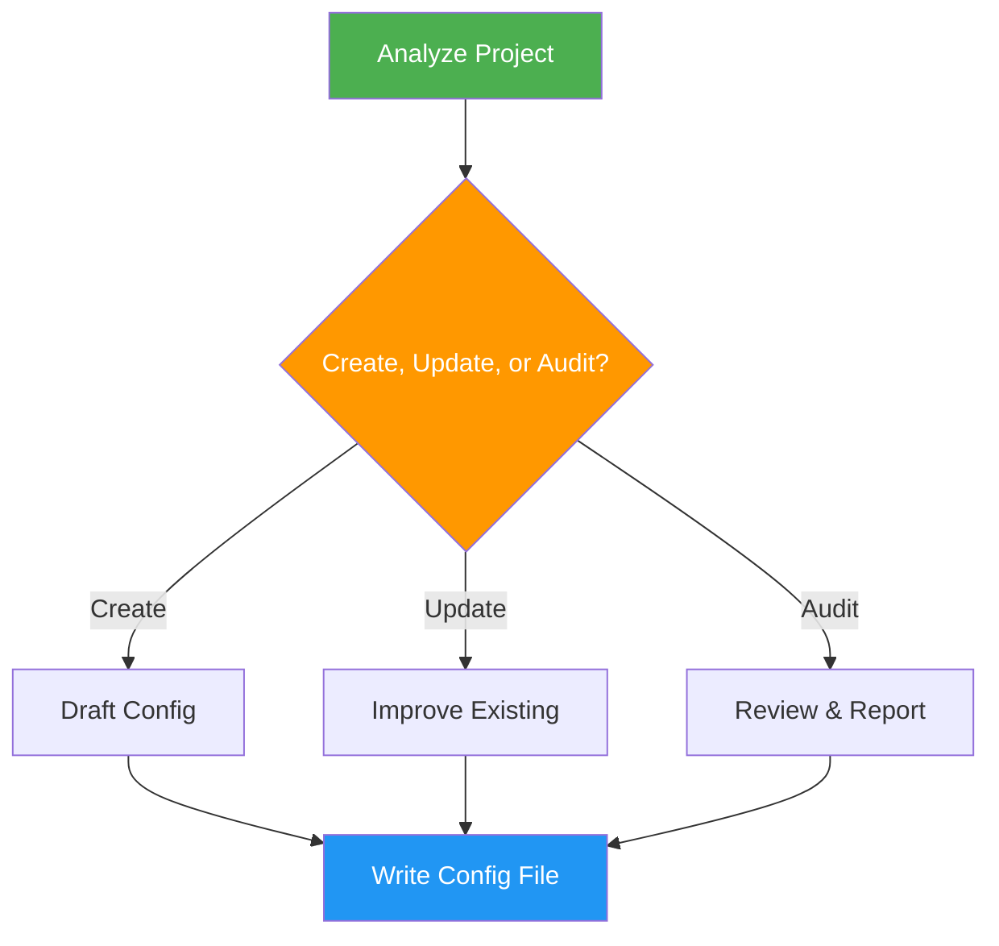

<!--
  DO NOT READ THIS FILE — This README.md is for human catalog browsing only.
  It ships inside the .skill package but is NEVER auto-loaded into agent context.
  The runtime loader only reads SKILL.md + references/ + scripts/ + agents/ when the skill triggers.
  If you're an AI agent, read the SKILL.md file instead for skill instructions.
-->

# Agent Config

> Create, update, or audit CLAUDE.md and AGENTS.md configuration files following official best practices.

## Highlights

- Generate a cross-agent `AGENTS.md` (the shared source of truth) plus a thin `CLAUDE.md` wrapper that imports it — no duplicated rules
- Enforce the official size budget: under 200 lines per file, 40–150 as the sweet spot
- Route every instruction to the layer that owns it — always-on facts in the root file, procedures in a skill, hard stops in a `PreToolUse` hook, verification in tests
- Audit existing configs against the official Anthropic and AGENTS.md guidance, flagging contradictions, cross-file drift, and machine-checkable rules that should be gates instead of prose
- Support directory-specific instructions at multiple levels (home, project, nested, `.claude/rules/*.md`)
- Include token efficiency rules to minimize unnecessary tool calls and verbose output

## When to Use

| Say this... | Skill will... |
|---|---|
| "Create a CLAUDE.md for this project" | Analyze project and generate config |
| "Audit my agent config" | Review existing files against best practices |
| "Update CLAUDE.md" | Improve existing configuration |
| "Set up AGENTS.md" | Create the cross-agent source-of-truth config |

## How It Works



## Installation

Install via [npx (Vercel)](https://www.npmjs.com/package/skills):

```bash
npx skills add https://github.com/luongnv89/skills --skill agent-config
```

Or via [agent-skill-manager (asm)](https://www.npmjs.com/package/agent-skill-manager):

```bash
asm install github:luongnv89/skills:skills/agent-config
```

## Usage

```
/agent-config
```

## Token Efficiency

The source-of-truth file (`AGENTS.md` when both exist) includes a **Token Efficiency** section with rules to reduce wasteful agent behavior. The `CLAUDE.md` wrapper inherits it via `@AGENTS.md` and does not copy it:

- No re-reading files just written or edited
- No re-running commands to "verify" unless outcome was uncertain
- Batch related edits into single operations
- Skip confirmations and summaries unless needed
- Plan before acting — minimize unnecessary tool calls

## Output

Production-ready `AGENTS.md` / `CLAUDE.md` files following the official section order — Project, Commands, Layout, Conventions, Constraints, Done when, Read when needed — plus token efficiency rules. Audits report each finding with the layer it should move to.

## Resources

| File | Purpose |
|---|---|
| `references/official-standards.md` | The Anthropic and AGENTS.md rules this skill enforces, with size budgets |
| `references/knowledge-routing.md` | Which layer owns each instruction, section templates, maintenance loop |
| `references/claude-md-checklist.md` | The 7-section audit checklist |
| `references/anti-patterns.md` | Content and structural failure modes |
| `references/token-efficiency-block.md` | The always-injected block |
| `references/optional-blocks.md` | Opt-in orchestration / coding-discipline blocks |
