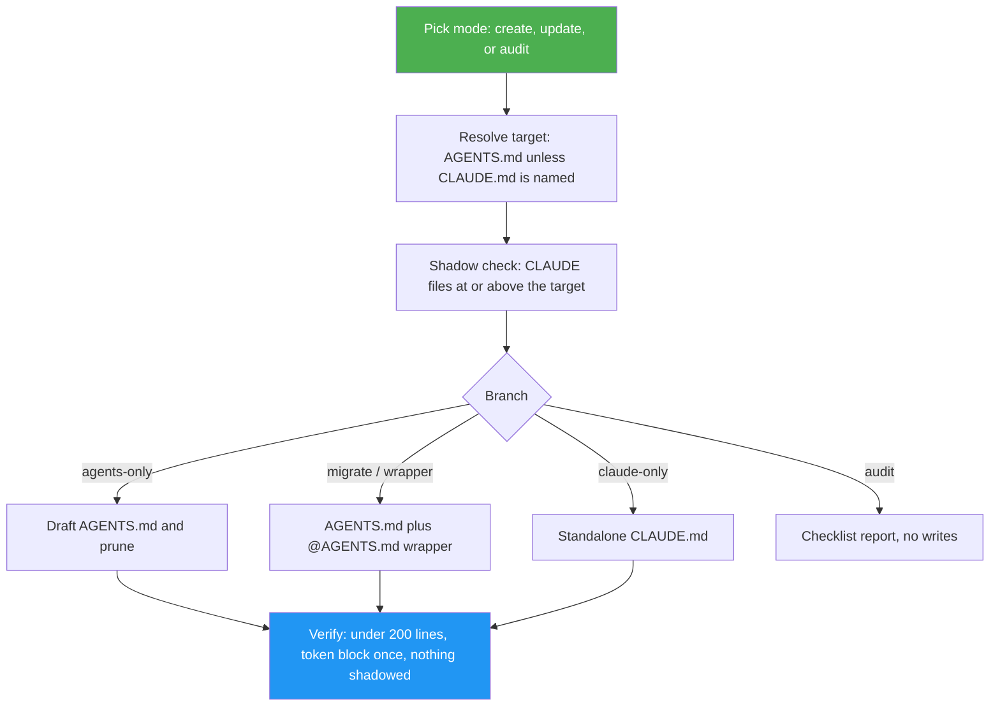

<!--
  DO NOT READ THIS FILE — This README.md is for human catalog browsing only.
  It ships inside the .skill package but is NEVER auto-loaded into agent context.
  The runtime loader only reads SKILL.md + references/ + scripts/ + agents/ when the skill triggers.
  If you're an AI agent, read the SKILL.md file instead for skill instructions.
-->

# Agent Config

> Create, update, or audit `AGENTS.md` (the default) or `CLAUDE.md` agent instruction files, using the official docs and published research on what helps agents.

## Highlights

- **AGENTS.md by default.** Claude Code reads `AGENTS.md` natively from v2.1.277, as do Codex, Cursor, Copilot, and others, so one file serves every agent. `CLAUDE.md` is written only when you ask for it by name.
- **Shadow check.** A `CLAUDE.md`, `.claude/CLAUDE.md`, or `CLAUDE.local.md` in the working directory or above it stops Claude Code from reading `AGENTS.md`. The skill finds these files and fixes the problem: it moves shared rules into `AGENTS.md` and turns the `CLAUDE.md` into an `@AGENTS.md` import.
- **Minimal by design.** It writes only what an agent can't infer (exact commands, pins, *Never* / *Ask first* boundaries, and the checks that define "done"), then prunes overviews and directory trees. Research shows bloated generated files cost about 20% more without improving success.
- **Claude-only lines stay out of the shared file.** Plan mode, hooks, and skill notes go to `.claude/rules/`, which loads alongside `AGENTS.md` without shadowing it.
- **Audits flag load failures.** An audit reports a shadowed `AGENTS.md`, prose that says "read AGENTS.md" where an import belongs, duplicated rules, and prose standing in for hooks or tests. Each finding names the layer the rule should move to.
- The token-efficiency rules go into the source-of-truth file exactly once: never into wrappers, nested package files, or `.claude/rules/`.

## When to Use

| Say this... | Skill will... |
|---|---|
| "Set up agent instructions for this repo" | Write a lean `AGENTS.md`, with no `CLAUDE.md` |
| "Update our agent config" (repo has only `CLAUDE.md`) | Migrate the shared rules into `AGENTS.md` and turn `CLAUDE.md` into an `@AGENTS.md` import, after showing you the diff |
| "Create a CLAUDE.md for this project" | Write `CLAUDE.md`: a thin `@AGENTS.md` wrapper if `AGENTS.md` exists, otherwise a standalone file |
| "Audit my AGENTS.md" | Report pass/fail per checklist item, including whether Claude Code actually loads the file, without changing anything |

## How It Works


```mermaid
graph TD
    A["Pick mode: create, update, or audit"] --> B["Resolve target: AGENTS.md unless CLAUDE.md is named"]
    B --> C["Shadow check: CLAUDE files at or above the target"]
    C --> D{"Branch"}
    D -->|agents-only| E["Draft AGENTS.md and prune"]
    D -->|migrate / wrapper| F["AGENTS.md plus @AGENTS.md wrapper"]
    D -->|claude-only| G["Standalone CLAUDE.md"]
    D -->|audit| H["Checklist report, no writes"]
    E --> I["Verify: under 200 lines, token block once, nothing shadowed"]
    F --> I
    G --> I
    style A fill:#4CAF50,color:#fff
    style I fill:#2196F3,color:#fff
```

## Installation

Install with [npx (Vercel)](https://www.npmjs.com/package/skills):

```bash
npx skills add https://github.com/luongnv89/skills --skill agent-config
```

Or with [agent-skill-manager (asm)](https://www.npmjs.com/package/agent-skill-manager):

```bash
asm install github:luongnv89/skills:skills/agent-config
```

## Usage

```
/agent-config
/agent-config audit
/agent-config packages/api/AGENTS.md
```

## Output

- **agents-only** (the default): a production-ready `AGENTS.md` under 200 lines, with Commands, Constraints (*Never* / *Ask first*), Done when, optional sections only where they hold non-inferable facts, and the token-efficiency block.
- **migrate / wrapper**: the same `AGENTS.md`, plus a `CLAUDE.md` that opens with `@AGENTS.md` and holds only Claude-only lines.
- **claude-only**: a standalone `CLAUDE.md`, written only when you ask for one and no `AGENTS.md` exists.
- **audit**: a checklist report with routing recommendations. No files are changed.

## Resources

| File | Purpose |
|---|---|
| `references/agents-md-writing.md` | How to write the best AGENTS.md: evidence table, 10 rules, template, bad-to-better lines |
| `references/official-standards.md` | AGENTS.md standard, Claude Code loading rules (shadowing, settings, versions), Codex discovery, size budget, verification |
| `references/agents-md-checklist.md` | The 7-section audit checklist and a sample report |
| `references/knowledge-routing.md` | Which layer owns each instruction, file scopes, the `CLAUDE.md` wrapper, the maintenance loop |
| `references/anti-patterns.md` | Content and structural failure modes |
| `references/token-efficiency-block.md` | The block injected into every file |
| `references/optional-blocks.md` | Opt-in orchestration and coding-discipline blocks |
