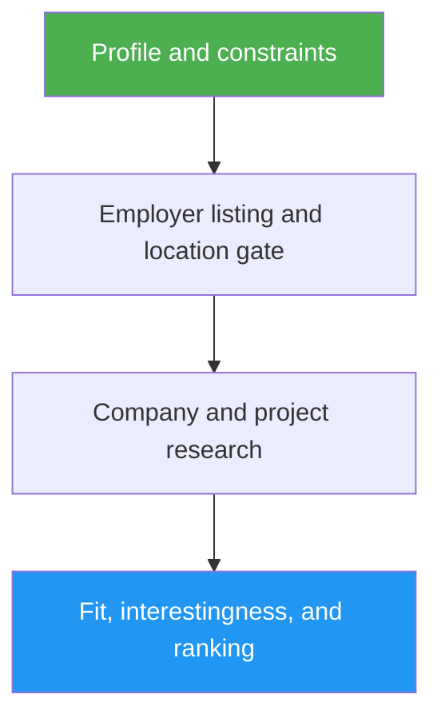

<!--
  DO NOT READ THIS FILE — This README.md is for human catalog browsing only.
  It ships inside the .skill package but is NEVER auto-loaded into agent context.
  The runtime loader only reads SKILL.md + references/ + scripts/ + agents/ when the skill triggers.
  If you're an AI agent, read the SKILL.md file instead for skill instructions.
-->
# AI Job Scout

> Find AI engineering roles matched to a candidate's public work, with a researched verdict on each company's product and project.

## Highlights

- Checks employer-hosted listings and application links rather than trusting aggregator snippets.
- Enforces the candidate's precise hybrid/remote geography and seniority requirements.
- Explains what each company builds, how AI contributes, and why the project may be interesting.
- Ranks up to three roles with cited fit, gaps, salary where stated, and direct application links.
- Reports fewer results when eligibility cannot be verified; never applies automatically.

## When to Use

| Say this... | Skill will... |
| --- | --- |
| “Find AI roles for my GitHub profile” | Build a sourced candidate brief and search current roles |
| “Send a daily AI job alert” | Avoid recently reported roles and rank new open positions |
| “Is this company's AI project worth joining?” | Research the product and link the project to the role |

## How It Works

## Usage

`/ai-job-scout` with your GitHub/profile URL and location or remote-work preference. For a recurring alert, pass prior reports as context and schedule the invocation in your agent's task scheduler.

## Output

A cited report of up to three verified roles, each covering the company, product/project, AI work, geography, direct application, fit, and uncertainties. No applications are sent.
