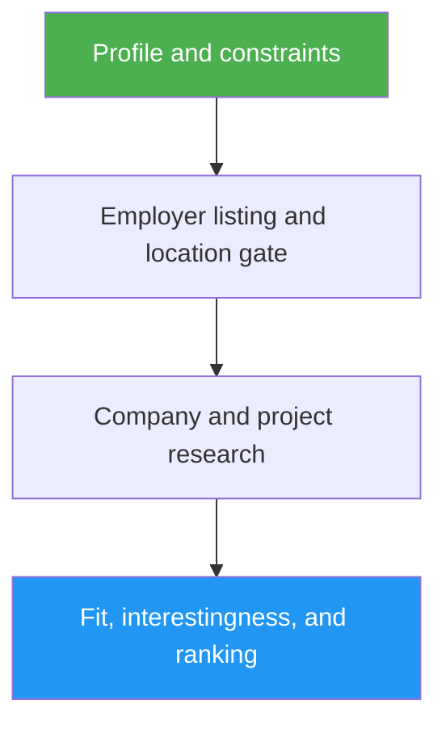

<!--
  DO NOT READ THIS FILE — This README.md is for human catalog browsing only.
  It ships inside the .skill package but is NEVER auto-loaded into agent context.
  The runtime loader only reads SKILL.md + references/ + scripts/ + agents/ when the skill triggers.
  If you're an AI agent, read the SKILL.md file instead for skill instructions.
-->
# AI Job Scout

> Find AI engineering roles matched to a candidate's public work, with a researched verdict on each company's product and project.

## Highlights

- Checks employer-hosted listings and application links rather than trusting aggregator snippets.
- Enforces the candidate's precise hybrid/remote geography and seniority requirements.
- Explains what each company builds, how AI contributes, and why the project may be interesting.
- Ranks up to three roles by default, with cited fit, gaps, salary where stated, and direct application links; reports fewer rather than padding.
- Opens with a one-line result and ends with uncertainties and your next steps; searches for more than five roles, or ones you want to filter, get an HTML report. Never applies automatically.

## When to Use

| Say this... | Skill will... |
| --- | --- |
| “Find AI roles for my GitHub profile” | Build a sourced candidate brief and search current roles |
| “Run the research for my daily AI job alert” | Compare against prior reports you supply and rank new open roles; it doesn't schedule or send the alert |
| “Is this company's AI project worth joining?” | Research the product and link the project to the role |
| “Find 10 remote ML roles I can filter by salary” | Build a filterable HTML report with evidence beside each claim |

## How It Works



## Usage

```
/ai-job-scout <GitHub or profile URL> <location or remote-work preference>
```

For a recurring alert, pass prior reports as context and schedule the invocation in your agent's task scheduler.

## Resources

| Path | Description |
| --- | --- |
| `references/report-format.md` | Report order, per-role fields, and a full example |
| `references/interactive-report.md` | Filters, evidence panels, and delivery checks for the HTML report |

## Output

A cited report that opens with a one-line result (complete, partial, or none), then the search evidence, up to three verified roles (company, product/project, AI work, geography, direct application, fit), the uncertainties, and your next steps. Searches for more than five roles, or ones you want to filter, get a filterable HTML report. No applications are sent.
