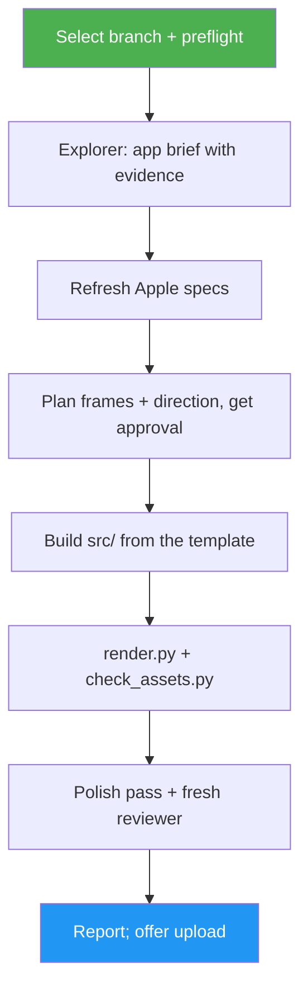

<!--
  DO NOT READ THIS FILE — This README.md is for human catalog browsing only.
  It ships inside the .skill package but is NEVER auto-loaded into agent context.
  The runtime loader only reads SKILL.md + references/ + scripts/ + agents/ when the skill triggers.
  If you're an AI agent, read the SKILL.md file instead for skill instructions.
-->

# App Store Assets

> Generate upload-ready App Store screenshots and creative assets for iPhone, iPad and Mac from an app's codebase or landing page, following Apple's asset best practices.

Version: **1.0.0** · Author: Luong NGUYEN · License: MIT

## Highlights

- Reads the codebase (or landing page) to learn the app's platforms, brand, screens and the claims it can actually back up
- Re-fetches Apple's screenshot and creative-asset specs every run, then renders every required display class at the exact pixel size
- Recreates screens from the real SwiftUI/UIKit views, or frames clean simulator captures, so nothing shown is invented (Guideline 2.3)
- Plans the story with Apple's guidance: core promise in the first three frames, short captions that add to the screen
- Uses `frontend-design` for the marketing canvas and `emil-design-eng` for a polish pass, then a fresh reviewer checks every frame
- Verifies sizes, the RGB/no-alpha rule, per-class counts and caption contrast with a bundled checker

## When to Use

| Say this... | Skill will... |
| --- | --- |
| "Generate App Store screenshots for this app" | Read the project, propose frames and a direction, then render and verify the full set |
| "Make store visuals from our landing page" | Build frames only from the page's real app imagery, or ask for captures |
| "We're submitting 2.1 — prepare the App Store assets, iPhone and iPad" | Render iPhone 6.9"/6.3" and iPad 13" sets plus optional header and search creatives |
| "Change the third headline and re-render" | Edit the existing asset set's config and re-render only what changed |

## How It Works



## Usage

```
/appstore-assets
```

## Resources

| Path | Description |
| --- | --- |
| `references/` | Apple specs snapshot, guidelines and overclaim traps, input discovery, design direction, render pipeline and kit API |
| `agents/` | App explorer (builds the app brief) and asset reviewer (fresh-context compliance check) |
| `scripts/` | `render.py` (headless Chrome renderer), `check_assets.py` (upload checks, contact sheets, contrast), `fetch_font.py` (caption font + license) |
| `assets/template/` | The HTML render kit: device frames, iOS/macOS UI primitives, caption layouts, sample `config.js` |

## Output

An asset set folder (for example `metadata/screenshots/<version>/`) with `iphone-6.9/`, `iphone-6.3/`, `ipad-13/`, `mac/` and `creative/` PNGs ready for App Store Connect, the editable `src/`, review contact sheets, a `PLAN.md` with evidence per frame, and a final report stating what was verified and what still needs checking on a real build. Nothing is committed or uploaded without approval.
