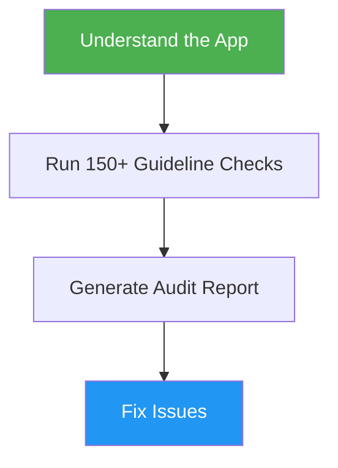

# App Store Review Checker

> Pre-submission audit against 150+ Apple App Store Review Guidelines — catch rejections before they happen.

## Highlights

- Checks your app against all 5 sections of Apple's Review Guidelines (Safety, Performance, Business, Design, Legal)
- Prioritizes the Top 20 most common rejection triggers first
- Provides per-guideline verdicts: PASS, FAIL, WARNING, or N/A
- Gives specific fix suggestions with file paths and code references
- Generates an actionable pre-submission checklist

## When to Use

| Say this... | Skill will... |
|---|---|
| "Check if my app will pass App Store review" | Full audit of your Xcode project against 150+ guidelines |
| "Why might Apple reject my app?" | Identify rejection risks with specific evidence and fixes |
| "Pre-submission compliance check" | Scan code, config, metadata, and entitlements for violations |
| "My app got rejected, what else might fail?" | Deep audit to catch all remaining issues before resubmission |

## How It Works



## Usage

```
/appstore-review-checker
```

## Resources

| Path | Description |
|---|---|
| `references/guidelines.md` | Complete checklist of 150+ guidelines with what to check for each |

## Output

A structured audit report with:
- Overall verdict (LIKELY PASS / AT RISK / LIKELY REJECT)
- Critical issues (FAIL) with evidence, explanation, and fix steps
- Warnings needing manual verification
- Summary of passed checks
- Pre-submission checklist of action items
