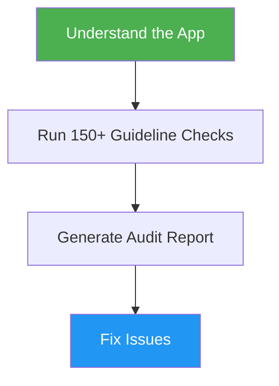

# App Store Review Checker

> Pre-submission audit against 150+ Apple App Store Review Guidelines — catch rejections before they happen.

## Highlights

- Checks your app against all 5 sections of Apple's Review Guidelines (Safety, Performance, Business, Design, Legal)
- Prioritizes the Top 20 most common rejection triggers first
- Provides per-guideline verdicts: PASS, FAIL, WARNING, or N/A
- Gives specific fix suggestions with file paths and code references
- Generates an actionable pre-submission checklist
- **Subagent-powered for large codebases**: Uses a 4-phase workflow (Explorer → Auditor → Report Writer → Fixer) with structured intermediate artifacts for maximum accuracy and scalability

## When to Use

| Say this... | Skill will... |
|---|---|
| "Check if my app will pass App Store review" | Full audit of your Xcode project against 150+ guidelines |
| "Why might Apple reject my app?" | Identify rejection risks with specific evidence and fixes |
| "Pre-submission compliance check" | Scan code, config, metadata, and entitlements for violations |
| "My app got rejected, what else might fail?" | Deep audit to catch all remaining issues before resubmission |

## How It Works

### Single-Agent Mode (Fallback)


### Subagent Mode (Recommended for Large Projects)

When the Agent tool is available, the audit runs as a pipeline:

```mermaid
graph LR
    A["Project Explorer<br/>(Read configs & code)"] --> B["app-profile.json"]
    B --> C["Guideline Auditor<br/>(Apply 150+ rules)"]
    C --> D["audit-results.json"]
    D --> E["Report Writer<br/>(Format output)"]
    E --> F["APPSTORE_AUDIT.md"]
    F --> G["Fixer Agent<br/>(Apply approved fixes)"]
    style A fill:#4CAF50,color:#fff
    style B fill:#f0f0f0,color:#000
    style C fill:#2196F3,color:#fff
    style D fill:#f0f0f0,color:#000
    style E fill:#FF9800,color:#fff
    style F fill:#f0f0f0,color:#000
    style G fill:#9C27B0,color:#fff
```



**Benefits of Subagent Mode:**
- Parallelizable: Each agent can run independently
- Testable: Review intermediate artifacts (app-profile.json, audit-results.json)
- Scalable: Handles large codebases with deep code analysis
- Transparent: See exactly what was found before guidelines are applied
- Debuggable: If an issue is missed, pinpoint which agent to investigate

## Usage

```
/appstore-review-checker
```

## Resources

| Path | Description |
|---|---|
| `references/guidelines.md` | Complete checklist of 150+ guidelines with what to check for each |
| `agents/project-explorer.md` | Subagent that reads project files and builds app-profile.json |
| `agents/guideline-auditor.md` | Subagent that applies 150+ guidelines and produces audit-results.json |
| `agents/report-writer.md` | Subagent that formats audit results into human-readable markdown report |
| `agents/fixer.md` | Subagent that implements code-level fixes for user-approved failures |

## Output

A structured audit report with:
- Overall verdict (LIKELY PASS / AT RISK / LIKELY REJECT)
- Critical issues (FAIL) with evidence, explanation, and fix steps
- Warnings needing manual verification
- Summary of passed checks
- Pre-submission checklist of action items
