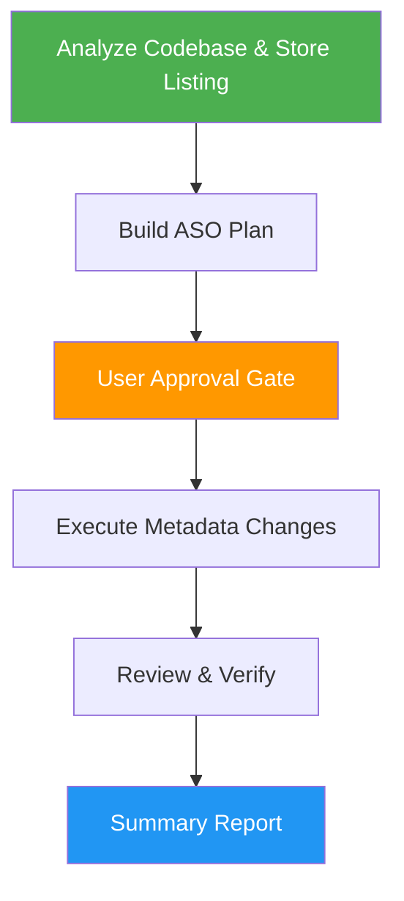

# ASO Marketing

> Full-lifecycle App Store Optimization for mobile apps — from analysis through planning, execution, verification, and reporting on both Apple App Store and Google Play.

## Highlights

- Analyzes your codebase and existing metadata to understand your app's value proposition
- Builds a prioritized ASO plan with keyword strategy, metadata optimization, and visual asset guidance
- Iterates on the plan with user approval before executing any changes
- Covers both Apple App Store and Google Play Store with platform-specific techniques
- Includes localization strategy, conversion rate optimization, and A/B testing recommendations

## When to Use

| Say this... | Skill will... |
|---|---|
| "Optimize my app store listing" | Analyze current metadata and create a full ASO plan |
| "ASO plan for my app" | Build a keyword strategy with metadata optimization recommendations |
| "Increase app downloads organically" | Identify keyword gaps, conversion issues, and visibility improvements |
| "Help me rank higher in the App Store / Google Play" | Audit metadata, research competitors, and optimize all store fields |
| "App marketing plan" | Create a comprehensive ASO strategy covering search, conversion, and localization |

## How It Works



## Usage

```
/aso-marketing
```

## Resources

| Path | Description |
|---|---|
| `references/aso_best_practices.md` | Comprehensive ASO knowledge base covering keyword strategy, metadata rules, conversion optimization, localization, and platform-specific techniques for 2025-2026 |

## Output

- **ASO Analysis Report** — Current state assessment with competitive landscape
- **ASO Marketing Plan** — Prioritized recommendations with keyword tables, metadata changes, and visual asset guidance
- **Updated Metadata Files** — Optimized metadata written to the project's canonical metadata directory
- **ASO Summary Report** — Before/after comparison with expected outcomes and next steps
