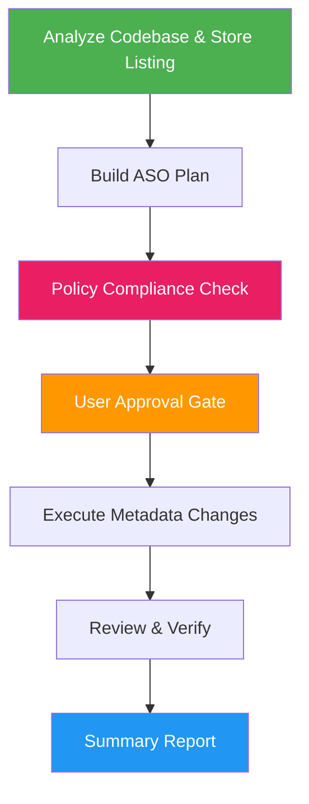

<!--
  DO NOT READ THIS FILE — This README.md is for human catalog browsing only.
  It ships inside the .skill package but is NEVER auto-loaded into agent context.
  The runtime loader only reads SKILL.md + references/ + scripts/ + agents/ when the skill triggers.
  If you're an AI agent, read the SKILL.md file instead for skill instructions.
-->

# ASO Marketing

> Full-lifecycle App Store Optimization for mobile apps — from analysis through planning, execution, verification, and reporting on both Apple App Store and Google Play.

## Highlights

- Analyzes your codebase and existing metadata to understand your app's value proposition
- Builds a prioritized ASO plan with keyword strategy, metadata optimization, and visual asset guidance
- **Validates all metadata against App Store and Google Play listing policies** — catches prohibited keywords, trademark violations, and policy-breaking content before submission
- Iterates on the plan with user approval before executing any changes
- Covers both Apple App Store and Google Play Store with platform-specific techniques
- Includes localization strategy, conversion rate optimization, and A/B testing recommendations

## When to Use

| Say this... | Skill will... |
|---|---|
| "Optimize my app store listing" | Analyze current metadata and create a full ASO plan with policy compliance checks |
| "ASO plan for my app" | Build a keyword strategy with metadata optimization recommendations, validated against store policies |
| "Increase app downloads organically" | Identify keyword gaps, conversion issues, and visibility improvements |
| "Help me rank higher in the App Store / Google Play" | Audit metadata, research competitors, and optimize all store fields while avoiding policy violations |
| "Check my listing for policy violations" | Scan metadata for prohibited keywords, trademark issues, and listing policy violations |
| "App marketing plan" | Create a comprehensive ASO strategy covering search, conversion, localization, and store policy compliance |

## How It Works



## Installation

Install via [npx (Vercel)](https://www.npmjs.com/package/skills):

```bash
npx skills add https://github.com/luongnv89/skills --skill aso-marketing
```

Or via [agent-skill-manager (asm)](https://www.npmjs.com/package/agent-skill-manager):

```bash
asm install github:luongnv89/skills:skills/aso-marketing
```

## Usage

```
/aso-marketing
```

## Resources

| Path | Description |
|---|---|
| `agents/analyzer.md` | Read codebase and metadata files, produce Phase 1 analysis report |
| `agents/plan-writer.md` | Generate ASO plan covering keywords, metadata, visuals, and localization |
| `agents/compliance-checker.md` | Verify all proposed metadata against prohibited keyword and trademark rules |
| `agents/executor.md` | Implement approved metadata changes into project files |
| `agents/reviewer.md` | Run Phase 5 review checklist and Phase 6 best-practices verification |
| `references/aso_best_practices.md` | Comprehensive ASO knowledge base covering keyword strategy, metadata rules, **store policy compliance (prohibited keywords, trademark rules, listing restrictions)**, conversion optimization, localization, and platform-specific techniques for 2025-2026 |

## Output

- **ASO Analysis Report** — Current state assessment with competitive landscape
- **ASO Marketing Plan** — Prioritized recommendations with keyword tables, metadata changes, and visual asset guidance
- **Store Policy Compliance Report** — Validation of all proposed metadata against Apple and Google Play listing policies, trademark checks, and prohibited keyword scans
- **Updated Metadata Files** — Optimized, policy-compliant metadata written to the project's canonical metadata directory
- **ASO Summary Report** — Before/after comparison with compliance status, expected outcomes, and next steps
