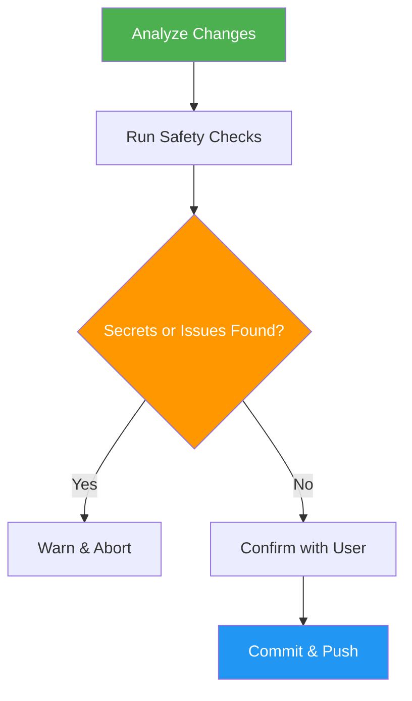

# Auto Push

> Stage all changes, create a conventional commit, and push to remote with comprehensive safety checks.

## Highlights

- Detect secrets, API keys, large files, and build artifacts before pushing
- Generate conventional commit messages (feat, fix, docs, etc.) automatically
- Pre-push confirmation with detailed change summary
- Handle non-fast-forward pushes with fallback strategies

## When to Use

| Say this... | Skill will... |
|---|---|
| "Push everything" | Stage, commit, and push all changes |
| "Commit and push all" | Bulk push with safety checks |
| "Push all my changes" | Analyze, confirm, then push |

## How It Works



## Usage

```
/auto-push
```

## Output

Committed and pushed changes with a confirmation report showing commit hash, branch info, files changed, and insertions/deletions.
