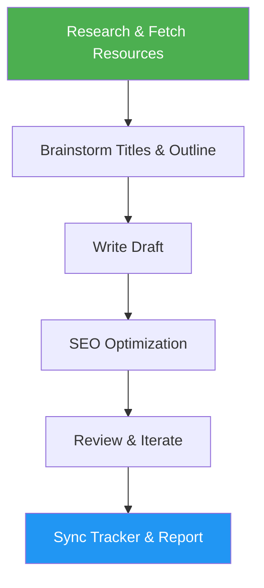

# Blog Draft

> Draft SEO-optimized blog posts from ideas and resources with automatic tracker sync.

## Highlights

- Research phase with automatic resource fetching and summarization
- Generate 5 SEO-optimized title options with keyword planning
- Apply a 10-point SEO content optimization checklist
- Sync blog tracker README and report GitHub links to all files

## When to Use

| Say this... | Skill will... |
|---|---|
| "Draft a blog post about X" | Research, outline, and write a full post |
| "Write a blog about Y" | Create SEO-optimized content with citations |
| "Create blog content" | Generate structured draft with outline |

## How It Works



## Usage

```
/blog-draft <topic or idea>
```

## Resources

| Path | Description |
|---|---|
| `assets/` | Blog post assets and media |
| `references/` | Reference materials and guides |

## Output

- Blog folder: `blog-posts/YYYY-MM-DD-topic/` with `OUTLINE.md` and `draft-v*.md`
- Updated `status.json` with draft metadata
- Updated blog tracker README with GitHub links
