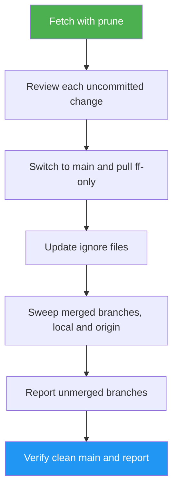

<!--
  DO NOT READ THIS FILE — This README.md is for human catalog browsing only.
  It ships inside the .skill package but is NEVER auto-loaded into agent context.
  The runtime loader only reads SKILL.md + references/ + scripts/ + agents/ when the skill triggers.
  If you're an AI agent, read the SKILL.md file instead for skill instructions.
-->

# Cleanup Project

> Get a repo to a clean foundation before the next feature: every uncommitted change decided, ignore files updated, merged branches gone locally and on the remote, and you back on an up-to-date `main`.

Version: **1.0.0** · Author: Luong NGUYEN · License: MIT

## Highlights

- Reviews each uncommitted change with its diff and asks commit, keep on disk and ignore, stash, leave, or discard. Nothing runs before you approve one consolidated plan, and secret-like files are shown by name and size only.
- Proposes `.gitignore` patterns from artifacts actually present, never hiding a path you chose to keep.
- Detects merged branches three ways: ancestry, patch equivalence (including multi-commit squash merges), and a merged PR whose head matches the branch tip.
- Deletes merged branches locally and on `origin` after one confirmation of the full table. Protected branches are never touched.
- Runs the whole flow, one phase, a read-only report, or a single-branch drill-down (Delete / Archive / Open PR / Keep).

## When to Use

| Say this... | Skill will... |
|---|---|
| "Clean up this repo before I start the next feature." | Run the full review → ignore → sweep → verify flow |
| "Delete the branches that are already merged, local and remote." | Build the evidence table, confirm once, delete |
| "My working tree is a mess, help me get back to main." | Walk each change with you (commit, keep on disk + ignore, stash, leave, or discard), then switch and pull |
| "Is `spike/llm-cache` worth keeping?" | Drill into that one branch and offer Delete / Archive / Open PR / Keep |
| "Which branches are merged? Don't touch anything." | Show the evidence table and the unmerged list, change nothing |

## When not to use

- Remove dead code or unused imports: use `slop-cleanup`.
- Commit and push everything as-is: use `auto-push`.
- Add LICENSE, CONTRIBUTING, or other open-source files: use `oss-ready`.
- Bump a version, tag, or publish a release: use `release-manager`.
- Ask a general git question ("`branch -d` vs `-D`?"): no skill needed.

## Usage

```text
/cleanup-project
/cleanup-project -- base is develop
/cleanup-project -- only the merged branches
/cleanup-project -- which branches are merged? don't touch anything
```

These are prompt examples, not CLI flags.

## How It Works



The skill fetches first but does not stash, because a stash would hide the very changes you are
reviewing.

## Requirements

- A git repository with a `main` (or confirmed) base branch.
- `gh` is optional. Without it, squash merges are detected by patch equivalence only, and the
  report says so.

## Migrating from branch-inspector

`branch-inspector` was a separately installed skill. Its single-branch inspect flow is now the
Step 6 drill-down here. Installed copies are not removed automatically. Delete both install
paths yourself so the two skills don't both trigger:

- `~/.claude/skills/branch-inspector` (usually a symlink; remove the link)
- `~/.agents/skills/branch-inspector` (the directory it points to)

## Resources

| Path | Description |
|---|---|
| `references/scopes-and-results.md` | Scope table details, PASS / PARTIAL / BLOCKED per scope, report fields |
| `references/uncommitted-review.md` | Per-change review, answers, secret-like and large-tree handling, commands by status code |
| `references/ignore-patterns.md` | Candidate patterns, tracked-but-ignored check, secrets warning |
| `references/merged-detection.md` | The three merge signals, no-`gh` fallback, `-d` vs `-D` |
| `references/action-plans.md` | Confirm-then-execute plans and protected-branch rules |
| `references/overview-fields.md` | Fields for the per-branch drill-down |
| `references/example-output.md` | A full worked run |
| `evals/` | Trigger and behaviour cases |

## Output

Terminal output only; the skill writes no report file. After each step it prints a short check
block, and the run ends with a `◆ Cleanup Report` whose first line is
`Result: PASS | PARTIAL — <reason> | BLOCKED — <stop point>`, followed by `Verified:` (the checks
that ran and what they printed), `Unverified:` (what could not be checked, such as the merged-PR
signal without `gh`), and `Next:` (your remaining action, or "No approval needed"). It then lists
each deleted ref with its merge signal and sha or PR number. The repository side effects are the
ones you approved: a `wip/cleanup-<date>` branch for kept work, a `.gitignore` commit, and deleted
merged branches.
