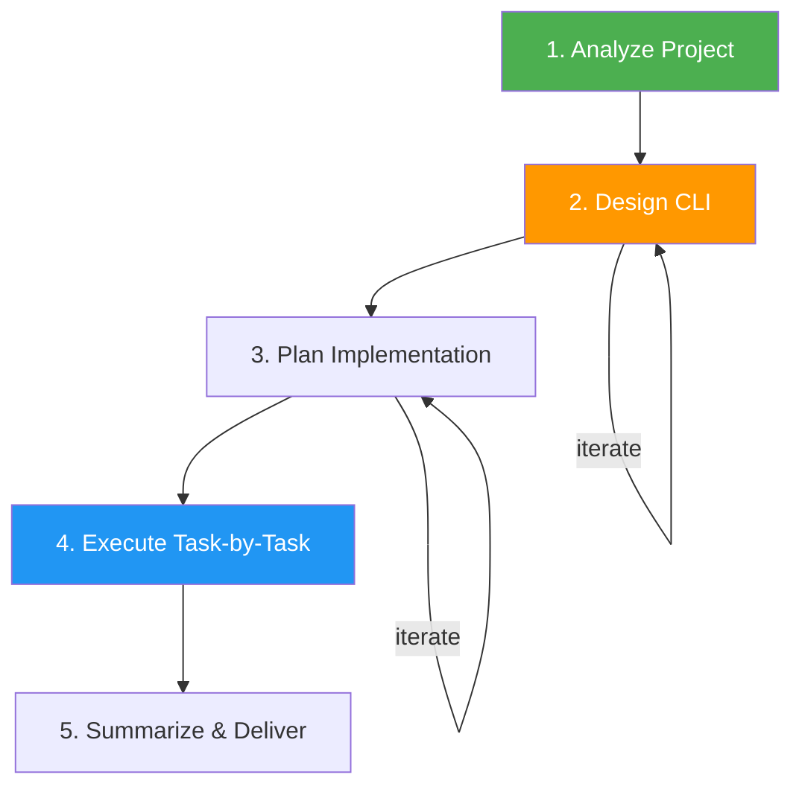

# CLI Builder

> Build production-quality CLI tools for any module or application, in any language.

## Highlights

- Language-agnostic — auto-detects project language from manifest files
- Strict 5-step approval-gated workflow: Analyze → Design → Plan → Execute → Summarize
- Recommends best CLI library per language (click, commander, cobra, clap, picocli, thor)
- Includes starter scaffolds, testing patterns, and quality guardrails
- Supports Python, JavaScript/TypeScript, Go, Rust, Java/Kotlin, and Ruby

## When to Use

| Say this... | Skill will... |
|---|---|
| "Build a CLI for this module" | Analyze the module and design a CLI interface |
| "Create a command-line tool" | Guide through the full 5-step workflow |
| "Add CLI interface to this project" | Detect language, recommend library, implement |
| "Make this scriptable" | Design CLI with pipeable I/O and output formats |
| "Wrap this in a CLI" | Build CLI wrapper around existing functions |

## How It Works



Each step requires user approval before proceeding to the next.

## Installation

Install via [npx (Vercel)](https://www.npmjs.com/package/skills):

```bash
npx skills add https://github.com/luongnv89/skills --skill cli-builder
```

Or via [agent-skill-manager (asm)](https://www.npmjs.com/package/agent-skill-manager):

```bash
asm install github:luongnv89/skills:skills/cli-builder
```

## Usage

```
/cli-builder
```

## Resources

| Path | Description |
|---|---|
| `references/cli-libraries.md` | Per-language library recommendations + starter scaffolds |
| `references/testing-patterns.md` | CLI testing patterns (unit, integration, stdin, JSON) |

## Output

A production-quality CLI tool with entry point, subcommand handlers, unit/integration tests, and proper packaging. Every CLI includes `--help` at every level, `--version`, proper exit codes (0/1/2), stderr for errors, `NO_COLOR` support, and POSIX flag conventions.
