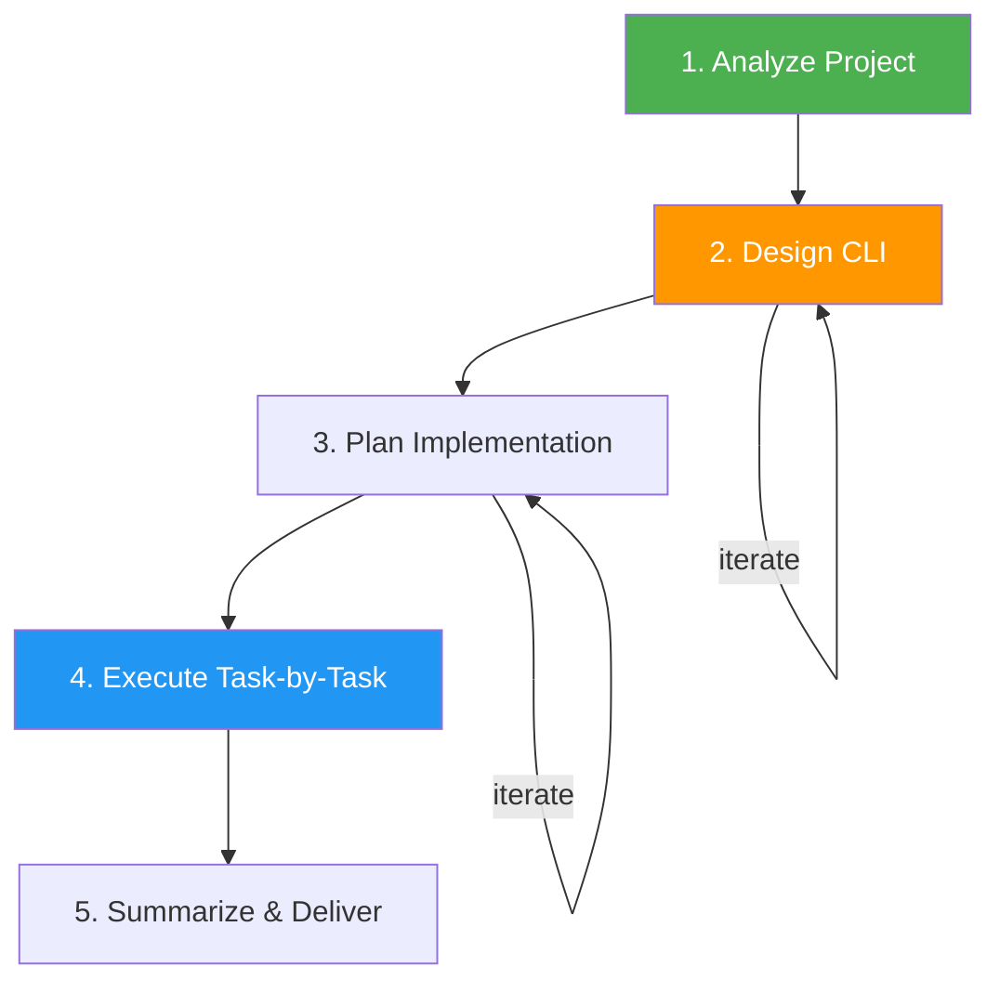

<!--
  DO NOT READ THIS FILE — This README.md is for human catalog browsing only.
  It ships inside the .skill package but is NEVER auto-loaded into agent context.
  The runtime loader only reads SKILL.md + references/ + scripts/ + agents/ when the skill triggers.
  If you're an AI agent, read the SKILL.md file instead for skill instructions.
-->

# CLI Builder

> Build production-quality CLI tools for any module or application, in any language.

## Highlights

- Language-agnostic — auto-detects project language from manifest files
- Strict 5-step approval-gated workflow: Analyze → Design → Plan → Execute → Summarize
- Recommends best CLI library per language (click, commander, cobra, clap, picocli, thor)
- Includes starter scaffolds, testing patterns, and quality guardrails
- Styles every CLI after [btop](https://github.com/aristocratos/btop): rounded boxes with titles in the border, gradient meters, braille sparklines, and one role-based theme, with plain output for pipes, JSON, and `NO_COLOR`
- Ends with a final report: status (`COMPLETE`, `PARTIAL` or `BLOCKED`), evidence, uncertainty, and the next decision
- Supports Python, JavaScript/TypeScript, Go, Rust, Java/Kotlin, and Ruby

## When to Use

| Say this... | Skill will... |
|---|---|
| "Build a CLI for this module" | Analyze the module and design a CLI interface |
| "Create a command-line tool" | Guide through the full 5-step workflow |
| "Add CLI interface to this project" | Detect language, recommend library, implement |
| "Make this scriptable" | Design CLI with pipeable I/O and output formats |
| "Wrap this in a CLI" | Build CLI wrapper around existing functions |

## How It Works



Steps 1-3 each require explicit user approval before the next step, and they write no files. Step 4 runs the tests after every task and commits once per phase (in a git repository). Step 5 prints the final report.

## Installation

Install via [npx (Vercel)](https://www.npmjs.com/package/skills):

```bash
npx skills add https://github.com/luongnv89/skills --skill cli-builder
```

Or via [agent-skill-manager (asm)](https://www.npmjs.com/package/agent-skill-manager):

```bash
asm install github:luongnv89/skills:skills/cli-builder
```

## Usage

```
/cli-builder
```

## Resources

| Path | Description |
|---|---|
| `references/cli-libraries.md` | Per-language library recommendations + starter scaffolds |
| `references/btop-style.md` | btop-inspired visual style: output-mode rules, theme roles, components, example, styling libraries, and tests |
| `references/testing-patterns.md` | CLI testing patterns (unit, integration, stdin, JSON) and the canonical exit-code table |
| `references/final-report.md` | Final report parts, status rules, two examples, and reader checks |
| `evals/evals.json` | Eight eval cases (happy path, edge cases, negative trigger) |

## Output

A production-quality CLI tool with entry point, subcommand handlers, unit/integration tests, and proper packaging. Every CLI includes `--help` at every level, `--version`, exit codes from the canonical table in `references/testing-patterns.md` (0 success, 1 runtime error, 2 usage error, 3 input error, 130 interrupted), stderr for errors, `NO_COLOR` support, and POSIX flag conventions. Terminal output follows a btop-inspired style approved in the design; piped output, `--format json`, and `NO_COLOR` output carry no escape codes.

The run ends with a plain-text final report in the chat: `Result:` (`COMPLETE`, `PARTIAL` or `BLOCKED`), `Evidence:` (files, test counts, demo commands), `Uncertainty:` (untested platforms, skipped items), and `Decision:` (the approval needed, or `No approval needed.`), followed by a usage quick-start.
