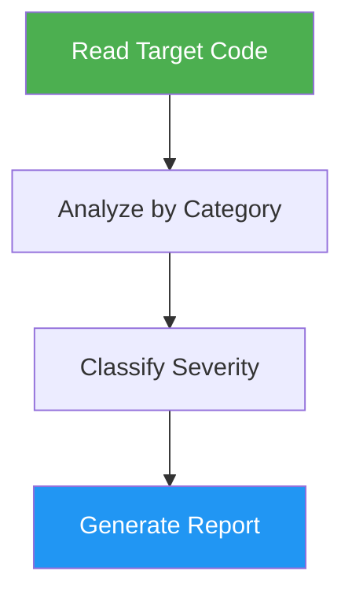

# Code Optimizer

> Analyze code for performance bottlenecks, memory leaks, and optimization opportunities.

## Highlights

- Prioritized analysis: performance > memory > algorithms > caching > concurrency
- Language-specific checks for JS/TS, Python, Go, Rust, and Java
- Four severity levels (Critical, High, Medium, Low) with before/after examples
- Create feature branch automatically before applying changes

## When to Use

| Say this... | Skill will... |
|---|---|
| "Optimize this code" | Analyze and report performance issues |
| "Find performance issues" | Identify bottlenecks with severity levels |
| "Check for memory leaks" | Scan for memory-related problems |
| "Improve performance" | Suggest optimizations with code examples |

## How It Works



## Installation

Install via [npx (Vercel)](https://www.npmjs.com/package/skills):

```bash
npx skills add https://github.com/luongnv89/skills --skill code-optimizer
```

Or via [agent-skill-manager (asm)](https://www.npmjs.com/package/agent-skill-manager):

```bash
asm install github:luongnv89/skills:skills/code-optimizer
```

## Usage

```
/code-optimizer <file or directory>
```

## Output

Structured markdown report per issue with severity level, file location, problem description, impact analysis, and before/after code fix examples.
