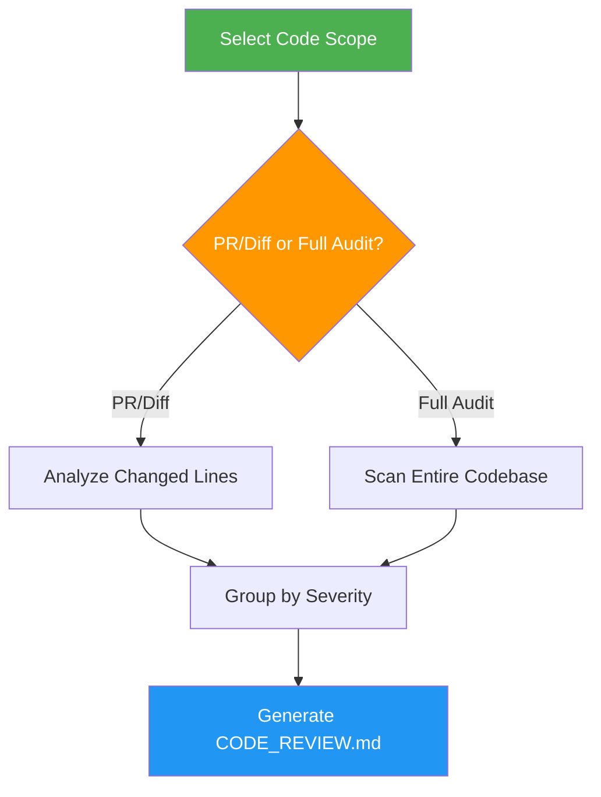

# Code Review

> Perform comprehensive code reviews for quality issues, code smells, and security vulnerabilities.

## Highlights

- Two modes: PR/Diff review (changed lines only) or Full Codebase Audit
- Check against Code Smells catalog and Pragmatic Programmer principles
- Security analysis for injection risks, XSS, hardcoded secrets
- Four severity levels with actionable fix recommendations

## When to Use

| Say this... | Skill will... |
|---|---|
| "Review this code" | Analyze for smells and quality issues |
| "Review my PR" | Focus review on changed lines only |
| "Audit the codebase" | Full project quality assessment |
| "Check for code smells" | Detect bloaters, couplers, dispensables |

## How It Works



## Usage

```
/code-review
```

## Resources

| Path | Description |
|---|---|
| `references/code-smells.md` | Complete catalog of code smells with examples |

## Output

`CODE_REVIEW.md` with summary table, issues grouped by severity (Critical, Major, Minor, Info), code examples, and prioritized refactoring recommendations.
