# Code Review

> Perform comprehensive code reviews for quality issues, code smells, and security vulnerabilities.

## Highlights

- **Two review modes**: PR/Diff (fast path, inline) or Full Codebase Audit (subagent architecture)
- **Subagent architecture** (v1.1.0): Parallel batch processing for large audits
  - Parallel file-reviewer agents process 5-10 files each
  - Report-assembler deduplicates and ranks findings
  - Reviewer validator ensures accuracy before final output
- Check against Code Smells catalog and Pragmatic Programmer principles
- Security analysis for injection risks, XSS, hardcoded secrets
- Four severity levels with actionable fix recommendations

## When to Use

| Say this... | Skill will... |
|---|---|
| "Review this code" | Analyze for smells and quality issues |
| "Review my PR" | Focus review on changed lines only |
| "Audit the codebase" | Full project quality assessment |
| "Check for code smells" | Detect bloaters, couplers, dispensables |

## How It Works

### Fast Path (PR/Diff)
```
Input (PR diff) → Analyze Changed Lines → Group by Severity → CODE_REVIEW.md (seconds)
```

### Subagent Architecture (Full Audit)

```mermaid
graph TD
    A["Select Code Scope"] --> B{"PR/Diff or Full Audit?"}
    B -->|PR/Diff| C["Inline Review<br/>Fast Path"]
    B -->|Full Audit| D["Batch Files<br/>5-10 per batch"]
    C --> F["Generate<br/>CODE_REVIEW.md"]
    D --> E1["Parallel<br/>file-reviewer<br/>Batch 1"]
    D --> E2["Parallel<br/>file-reviewer<br/>Batch N"]
    E1 --> G["report-assembler<br/>Deduplicate<br/>Rank Severity"]
    E2 --> G
    G --> H["reviewer<br/>Fresh-context<br/>Validation"]
    H --> F
    style A fill:#4CAF50,color:#fff
    style B fill:#FF9800,color:#fff
    style E1 fill:#9C27B0,color:#fff
    style E2 fill:#9C27B0,color:#fff
    style G fill:#FF5722,color:#fff
    style H fill:#2196F3,color:#fff
    style F fill:#00BCD4,color:#fff
```


## Subagent Architecture (v1.1.0)

Three agent files coordinate to handle large code audits efficiently:

| Agent | Purpose | Input | Output |
|-------|---------|-------|--------|
| `file-reviewer` | Review 5-10 files against full checklist | File batch + checklist config | JSON findings with severity |
| `report-assembler` | Merge batches, deduplicate, rank | All file-reviewer JSON outputs | CODE_REVIEW.md + validation JSON |
| `reviewer` | Fresh-context validation | CODE_REVIEW.md + source files | Validation report + corrections |

**Parallel Processing**: Multiple file-reviewer agents run simultaneously on different file batches, reducing total review time for large audits.

**Graceful Degradation**: All agents can run inline if the Agent tool is unavailable. Review quality is preserved, execution is sequential.

## Installation

Install via [npx (Vercel)](https://www.npmjs.com/package/skills):

```bash
npx skills add https://github.com/luongnv89/skills --skill code-review
```

Or via [agent-skill-manager (asm)](https://www.npmjs.com/package/agent-skill-manager):

```bash
asm install github:luongnv89/skills:skills/code-review
```

## Usage

```
/code-review
```

## Resources

| Path | Description |
|---|---|
| `references/code-smells.md` | Complete catalog of code smells with examples |
| `agents/file-reviewer.md` | Batch file review against full checklist |
| `agents/report-assembler.md` | Consolidate findings, deduplicate, generate report |
| `agents/reviewer.md` | Fresh-context validation of findings accuracy |

## Output

`CODE_REVIEW.md` with summary table, issues grouped by severity (Critical, Major, Minor, Info), code examples, and prioritized refactoring recommendations.
