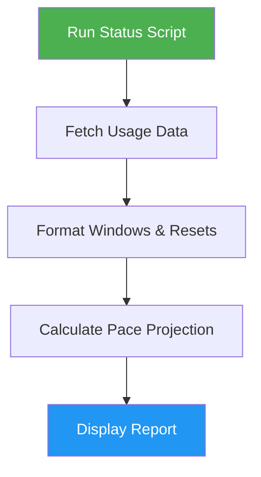

# Codex Usage Status

> Check OpenAI Codex account usage, quota windows, and compute end-of-week pace projections.

## Highlights

- Report multiple usage windows (5h, Day, Week) with reset times in UTC
- Compute linear pace projection for end-of-week usage
- Read credentials via local OpenClaw configuration (no API keys needed)
- JSON output option for programmatic consumption

## When to Use

| Say this... | Skill will... |
|---|---|
| "Check Codex usage" | Display current quota and usage stats |
| "Show quota limits" | Report all usage windows with reset times |
| "Codex pace projection" | Calculate projected end-of-week usage |

## How It Works



## Usage

```
/codex-usage-status
```

## Resources

| Path | Description |
|---|---|
| `scripts/` | Python script for fetching usage via OpenClaw CLI |

## Output

Clean stats showing provider plan, usage windows with percentages, reset times with countdown, and pace projection to end of week.
