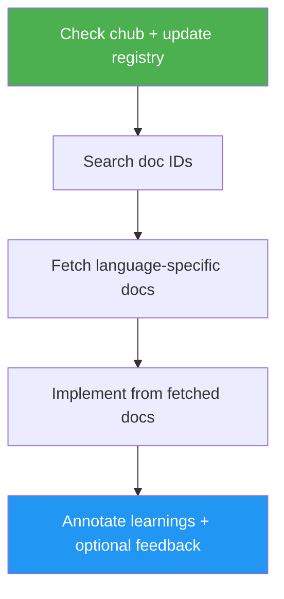

# Context Hub

> Fetch current API/SDK documentation with `chub` before coding integrations.

## Highlights

- Pulls curated, version-aware docs instead of relying on memory
- Supports language-specific retrieval (`--lang py|js|ts`)
- Encourages incremental fetches (`--file`) to save tokens
- Stores local learnings via annotations for future sessions
- Requires user approval before sending upstream doc feedback

## When to Use

| Say this... | Skill will... |
|---|---|
| "Integrate Stripe webhook verification" | Fetch Stripe docs and use exact webhook requirements |
| "Use OpenAI Responses API in Python" | Fetch language-specific OpenAI docs before implementation |
| "Add Anthropic SDK streaming support" | Retrieve current SDK docs and apply accurate method signatures |
| "Connect Pinecone query API" | Find/fetch Pinecone docs and avoid hallucinated parameters |

## How It Works



## Installation

Install via [npx (Vercel)](https://www.npmjs.com/package/skills):

```bash
npx skills add https://github.com/luongnv89/skills --skill context-hub
```

Or via [agent-skill-manager (asm)](https://www.npmjs.com/package/agent-skill-manager):

```bash
asm install github:luongnv89/skills --skill context-hub
```

## Usage

```bash
/context-hub
```

## Output

Accurate integration guidance and code based on current fetched docs, with optional local annotations for future tasks.