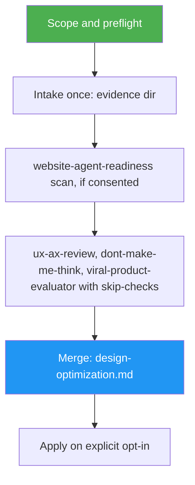

<!--
  DO NOT READ THIS FILE — This README.md is for human catalog browsing only.
  It ships inside the .skill package but is NEVER auto-loaded into agent context.
  The runtime loader only reads SKILL.md + references/ + scripts/ + agents/ when the skill triggers.
  If you're an AI agent, read the SKILL.md file instead for skill instructions.
-->

# Design Optimizer

> One run to optimize a website or app design: capture once, audit with every lens, get one prioritized report.

Version: **1.0.0** · Author: Luong NGUYEN · License: MIT

## Highlights

- Captures the page, head tags, screenshots and robots/sitemap/llms.txt **once**; every member reads the same evidence.
- Runs `dont-make-me-think`, `ux-ax-review`, `website-agent-readiness` and `viral-product-evaluator` with a check-ownership matrix, so no check runs twice.
- Merges all findings into one deduplicated `design-optimization.md`, one row per finding, owner cited.
- Audit by default; fixes only on explicit opt-in, through `frontend-design` or Redesign Mode and their own confirmation gates.
- Third-party scans, issue filing and repo writes stay behind each member's gate.

## When to Use

| Say this... | Skill will... |
|---|---|
| "Optimize my website design." | Capture once, run all design audits, write one merged report |
| "Review this app for users and AI agents in one pass." | Same, with agent-readiness owning AX checks if you allow the scan |
| "Apply D-01 and D-04 from the report." | Route each finding to one fixing skill behind its own gate |

Use a single member instead for one lens: `dont-make-me-think` (Krug review), `ux-ax-review` (UX/AX audit), `website-agent-readiness` (scan), `viral-product-evaluator` (virality).

## How It Works



## Usage

```text
/design-optimizer https://example.com
/design-optimizer /path/to/repo mode:apply
```

## Output

- `evidence/` with `manifest.json` (captured files + check owners)
- `reports/<member>/` — each member's own report
- `design-optimization.md` — the single merged, prioritized report

## Requirements

Required: `dont-make-me-think`, `ux-ax-review`. Optional: `website-agent-readiness`, `viral-product-evaluator`, `/browse`. `frontend-design` is needed only for apply.

```bash
asm install github:luongnv89/skills:skills/design-optimizer -p claude --yes
```
