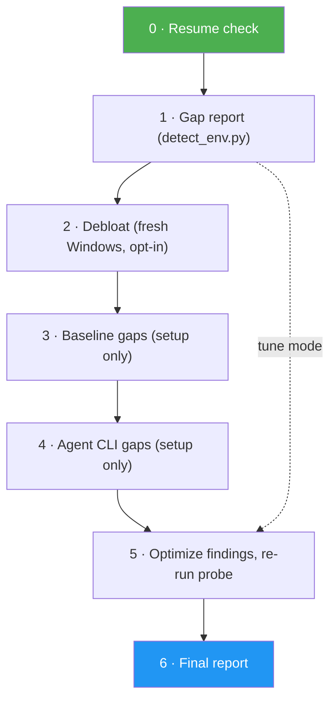

<!--
  DO NOT READ THIS FILE - This README.md is for human catalog browsing only.
  It ships inside the .skill package but is NEVER auto-loaded into agent context.
  The runtime loader only reads SKILL.md + references/ + scripts/ + agents/ when the skill triggers.
  If you're an AI agent, read the SKILL.md file instead for skill instructions.
-->

# Dev Machine Setup

Set up **or tune** any machine (macOS, Linux, Windows) — a factory laptop, a half-configured work box, or a
daily driver that has drifted.

Inspired by [XFreeze on new Windows boxes](https://x.com/xfreeze/status/2090189407659999603) (inventory OEM
junk before installing anything). Self-contained: no external scripts repo is cloned — the shell config it
deploys ships in the skill's own `assets/`.

## Highlights

- Reports what is present, missing and misconfigured before it changes anything
- Installs only what is missing; never reinstalls or upgrades a working tool as a side effect
- Every change that touches a working install gets its own yes, with rc files backed up first
- Pauses and resumes from a session file, re-probing the machine before trusting what was recorded

## When to Use

| Say this... | Skill will... |
|-------------|---------------|
| "Set up this new laptop for development" | Run `setup` mode: gap report, fill every missing baseline tool and requested agent CLI, then optimize |
| "My dev setup is a mess, verify what's missing and optimize it" | Run `setup` mode (the request mentions missing pieces), then fix findings |
| "Don't install anything, just fix what's there" | Run `tune` mode: findings only, nothing new installed |
| "I installed Claude Code but `claude` isn't found" | Diagnose the PATH finding and propose the fix instead of reinstalling |
| "Fresh Windows laptop, remove the OEM junk first" | Inventory OEM bloat and remove it one confirmed package at a time |

Not for Dockerfiles, CI images, or installing one named package.

## How It Works

It runs **gap-driven**. A read-only probe (`scripts/detect_env.py`) reports three things:

- **Present** — what's already installed, with versions
- **Missing** — baseline tools (git, Node, Python, uv, zsh) and agent CLIs (Claude Code, Codex, Pi, OpenCode)
- **Findings** — what's misconfigured: npm global bin off PATH, two Node version managers fighting, Homebrew
  without its shellenv line, PEP 668 Python with no uv, duplicate PATH entries, missing git identity

Every phase then acts *only* on that report and self-skips when its slice is empty — so re-running on an
already-good machine installs nothing and simply verifies. Optional first phase on factory Windows: inventory
OEM bloat and remove it one confirmed package at a time.

## Two modes

| Mode | Ask for it with | Does |
|------|-----------------|------|
| `setup` | "set up this machine", "install my dev environment" | Fills every gap, then optimizes |
| `tune` | "optimize my dev setup", "why is `claude` not found" | Optimizes only — installs nothing you didn't ask for |

## Copy-paste, not narration

Every command it proposes arrives as its own fenced block you can copy whole and run — never a command
wedged into a table cell, never a `<placeholder>` you have to fill in, never a snippet that only works if
you happen to be in the right directory. Blocks that need *your* terminal (a `chsh` password prompt, a GUI
dialog, a browser login) are labelled as such, so it's always clear who runs what.

## Pause anywhere, resume by asking again

Long setups get interrupted. Progress — mode, what you approved, what you declined, which rc files were
backed up and where — is written to `~/.dev-machine-setup/session.json` after every step. Say "stop here"
and you get the file path, what's left, and one paste-once block of the remaining approved commands in case
you'd rather finish by hand.

To resume, just trigger the skill again. It re-probes the machine first and reconciles against what you
already did — including anything you ran yourself while it wasn't watching — so nothing is re-asked and
nothing is run twice.

## Usage

Ask an agent that has this skill:

> Set up this new machine for development.

> My dev setup is a mess — verify what's missing and optimize it.

> Fresh Windows ARM laptop — debloat then install Node, Python, and Claude Code.

## Safety

**Additive** work (installing something absent) is approved per phase. **Mutating** work — upgrading a
runtime, `chsh`, editing your `~/.zshrc`, uninstalling anything, piping a remote script to a shell — needs an
explicit yes per item, names its risk first, and backs up any rc file it touches. The skill never
mass-uninstalls OEM tools and never replaces a working install as a side effect of filling a gap.

## Resources

| Path | Description |
|------|-------------|
| `scripts/detect_env.py` | Read-only probe: prints the gap report JSON (inventory, `missing`, `findings`); exits 1 with a stderr message when it cannot |
| `references/approvals.md` | Additive vs mutating, the five-step approval loop, run-block format, pausing and resuming |
| `references/procedure.md` | What each phase does, step by step, and when it is done |
| `references/detect.md` | How to run the probe, its exit codes, fallbacks without `python3`, and every JSON key |
| `references/windows.md` | Windows inventory, conservative debloat, winget install stack |
| `references/macos.md` | macOS: Homebrew, Node, Python with uv, zsh, starship |
| `references/linux.md` | Linux: apt/dnf/pacman, NodeSource LTS, python3-pip, zsh, starship |
| `references/agent-clis.md` | Claude Code, Codex, Pi and OpenCode install and verify commands |
| `references/optimize.md` | One section per finding id, each tagged additive or mutating |
| `references/session.md` | Session file schema, write command, resume reconciliation, pause output |
| `references/report-template.md` | FINAL REPORT block, status rules, outcome map, examples, reader checks |
| `references/edge-cases.md` | No `python3`, Windows ARM64, WSL, containers, interrupted runs, unlisted distros |
| `assets/zshrc-config` | The `~/.zshrc` the skill deploys (theme, plugins, starship init) |
| `assets/starship.toml` | The starship prompt config the skill deploys |
| `evals/evals.json` | Test prompts with expected behavior, including edge and negative-trigger cases |

## Output

- Changes on the machine: only the installs and fixes you approved, with backups of any rc file it edited.
- `~/.dev-machine-setup/session.json`: the running log of every decision, marked `complete` at the end.
- A FINAL REPORT in the chat. It opens with `Result:` (`READY`, `PARTIAL` or `BLOCKED`, with the reason),
  lists each phase, then `Evidence:` (checks that ran), `Uncertainty:` (what is still unconfirmed, such as a
  fix that needs a new shell) and `Decision:` (`No approval needed.` or what is pending, plus the actions
  left to you).
