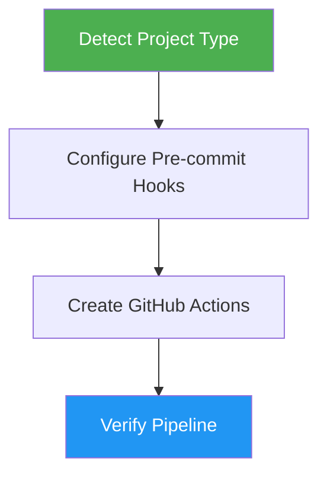

# DevOps Pipeline

> Set up pre-commit hooks and GitHub Actions for automated quality assurance and code quality gates.

## Highlights

- Detect project language and framework automatically
- Configure language-specific linters, formatters, and security checkers
- Create both local pre-commit hooks and GitHub Actions workflows
- Include dependency caching for CI performance

## When to Use

| Say this... | Skill will... |
|---|---|
| "Setup CI/CD" | Create full pipeline with hooks and Actions |
| "Add pre-commit hooks" | Install and configure local quality gates |
| "Create GitHub Actions" | Generate CI workflow for automated checks |
| "Add linting" | Configure language-appropriate linters |

## How It Works



## Usage

```
/devops-pipeline
```

## Resources

| Path | Description |
|---|---|
| `references/precommit-configs.md` | Language-specific pre-commit hook configurations |
| `references/github-actions.md` | GitHub Actions workflow templates |

## Output

- `.pre-commit-config.yaml` with language-specific hooks
- `.github/workflows/ci.yml` mirroring pre-commit checks
- Configured and verified local pre-commit environment
