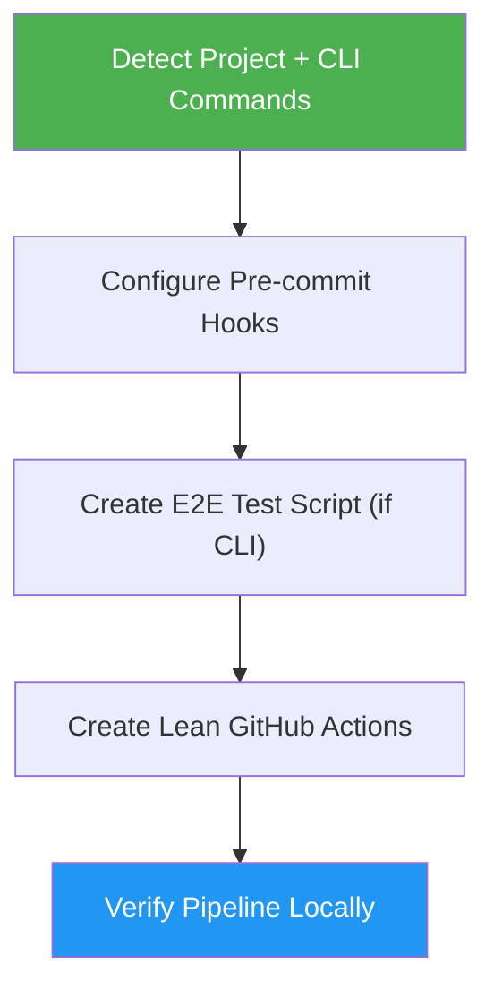

<!--
  DO NOT READ THIS FILE — This README.md is for human catalog browsing only.
  It ships inside the .skill package but is NEVER auto-loaded into agent context.
  The runtime loader only reads SKILL.md + references/ + scripts/ + agents/ when the skill triggers.
  If you're an AI agent, read the SKILL.md file instead for skill instructions.
-->

# DevOps Pipeline

> Set up pre-commit hooks and lean GitHub Actions — maximizing local test coverage to catch issues before they reach CI.

## Highlights

- Detect project language and framework automatically
- Configure language-specific linters, formatters, type checkers, and security scanners
- Run unit tests on every commit, full test suite + E2E tests on push
- Enumerate all CLI commands and generate end-to-end smoke tests (for CLI tools)
- Keep GitHub Actions lean — matrix version testing and coverage upload only

## When to Use

| Say this... | Skill will... |
|---|---|
| "Setup CI/CD" | Create full pipeline with pre-commit hooks and lean GitHub Actions |
| "Add pre-commit hooks" | Install and configure local quality gates with push-stage tests |
| "Reduce GitHub Actions dependency" | Shift tests left into pre-commit, slim down CI |
| "Add E2E tests for my CLI" | Enumerate commands and generate `scripts/e2e_test.sh` |

## How It Works



## What Runs Where

| Check | Pre-commit commit | Pre-commit push | GitHub Actions |
|-------|:-----------------:|:---------------:|:--------------:|
| Format / lint / type check | ✓ | — | — |
| Unit tests (fast) | ✓ | — | — |
| Full test suite | — | ✓ | ✓ (coverage upload) |
| CLI end-to-end tests | — | ✓ | — |
| Multi-version matrix | — | — | ✓ |
| Deploy | — | — | ✓ |

## Usage

```
/devops-pipeline
```

## Resources

| Path | Description |
|---|---|
| `references/precommit-configs.md` | Language-specific pre-commit configs with push-stage tests and E2E hooks |
| `references/github-actions.md` | Lean CI workflow templates (pre-commit-first approach) |

## Output

- `.pre-commit-config.yaml` with commit-stage and push-stage hooks
- `scripts/e2e_test.sh` or `tests/e2e/test_cli.py` (for CLI tools)
- `.github/workflows/ci.yml` — lean CI that focuses on matrix testing and coverage
- Configured and verified local pre-commit environment (both commit and push hooks)
