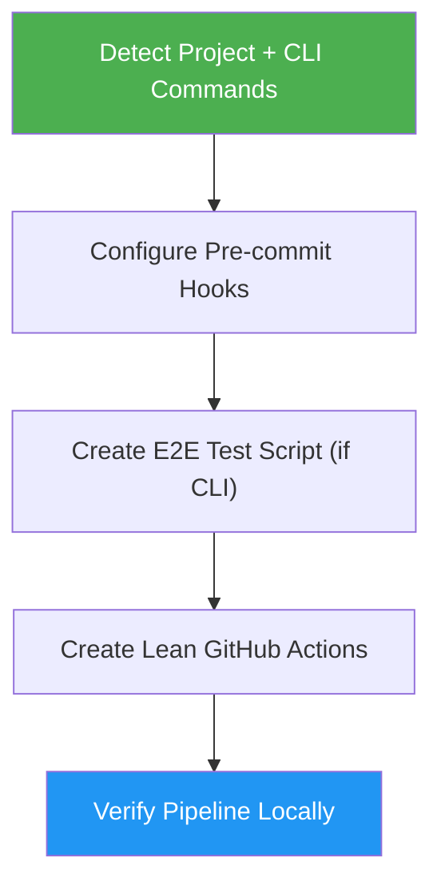

<!--
  DO NOT READ THIS FILE — This README.md is for human catalog browsing only.
  It ships inside the .skill package but is NEVER auto-loaded into agent context.
  The runtime loader only reads SKILL.md + references/ + scripts/ + agents/ when the skill triggers.
  If you're an AI agent, read the SKILL.md file instead for skill instructions.
-->

# DevOps Pipeline

> Set up pre-commit hooks and lean GitHub Actions — maximizing local test coverage to catch issues before they reach CI.

## Highlights

- Detect project language and framework automatically
- Configure language-specific linters, formatters, type checkers, and security scanners
- Run unit tests on every commit, full test suite + E2E tests on push
- Enumerate all CLI commands and generate end-to-end smoke tests (for CLI tools)
- Keep GitHub Actions lean — a diff-scoped bypass guard, matrix version testing, secrets-dependent work, and deploys only

## When to Use

| Say this... | Skill will... |
|---|---|
| "Setup CI/CD" | Create full pipeline with pre-commit hooks and lean GitHub Actions |
| "Add pre-commit hooks" | Install and configure local quality gates with push-stage tests |
| "Reduce GitHub Actions dependency" | Shift tests left into pre-commit, slim down CI |
| "Add E2E tests for my CLI" | Enumerate commands and generate `scripts/e2e_test.sh` |

## How It Works


```mermaid
graph TD
    A["Detect Project + CLI Commands"] --> B["Configure Pre-commit Hooks"]
    B --> C["Create E2E Test Script (if CLI)"]
    C --> D["Create Lean GitHub Actions"]
    D --> E["Verify Pipeline Locally"]
    style A fill:#4CAF50,color:#fff
    style E fill:#2196F3,color:#fff
```

## What Runs Where

| Check | Pre-commit commit | Pre-commit push | GitHub Actions |
|-------|:-----------------:|:---------------:|:--------------:|
| Format / lint / type check | ✓ | — | — |
| Unit tests (fast) | ✓ | — | — |
| Full test suite | — | ✓ | ✓ (coverage upload) |
| CLI end-to-end tests | — | ✓ | — |
| Bypass guard (both hook stages, PR diff only) | — | — | ✓ |
| Multi-version matrix | — | — | ✓ |
| Deploy | — | — | ✓ |

## Usage

```
/devops-pipeline
```

## Resources

| Path | Description |
|---|---|
| `references/precommit-configs.md` | Language-specific pre-commit configs with push-stage tests and E2E hooks |
| `references/github-actions.md` | Lean CI workflow templates (pre-commit-first approach) |
| `references/cli-e2e.md` | CLI command discovery, the E2E script template, and its `pre-push` hook |
| `references/final-report.md` | Final report parts, status rules (`COMPLETE`, `PARTIAL`, `BLOCKED`), examples, and reader checks |
| `evals/evals.json` | Trigger and behavior test prompts with expectations |

## Output

- `.pre-commit-config.yaml` with `pre-commit`-stage and `pre-push`-stage hooks
- `scripts/e2e_test.sh` or `tests/e2e/test_cli.py` (for CLI tools)
- `.github/workflows/ci.yml` — lean CI: a diff-scoped bypass guard, matrix testing, secrets-dependent work, and deploys
- Configured and verified local pre-commit environment (both commit and push hooks)
- A final report: `Result:` (`COMPLETE`, `PARTIAL` or `BLOCKED`), `Evidence:` with the commands that ran and their exit codes, `Uncertainty:` (always the CI workflow that has not run yet), and `Decision:` (the approval needed, or `No approval needed.`)
