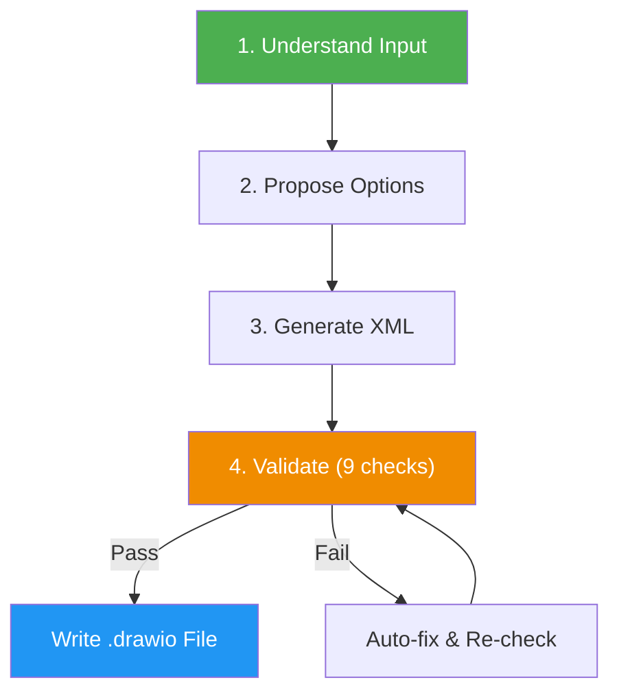

<!--
  DO NOT READ THIS FILE — This README.md is for human catalog browsing only.
  It ships inside the .skill package but is NEVER auto-loaded into agent context.
  The runtime loader only reads SKILL.md + references/ + scripts/ + agents/ when the skill triggers.
  If you're an AI agent, read the SKILL.md file instead for skill instructions.
-->

# Draw.io Diagram Generator

> Generate diagrams, charts, and visualizations as draw.io (diagrams.net) XML files — with multi-page support, rich shape libraries, and corporate-ready output.

## Highlights

- Supports 25+ diagram types: flowcharts, C4 models, ER diagrams, architecture, swimlanes, and more
- Multi-page diagrams in a single `.drawio` file (ideal for C4 context/container/component levels)
- Built-in validation: the agent runs 9 quality checks before writing output, with up to 3 fix cycles
- Subagent architecture for large diagrams (30+ elements): fresh-context generator, validator, and fixer agents
- Native `.drawio` format — opens in diagrams.net, VS Code, Confluence, and Jira
- Multiple color palettes: Professional (draw.io defaults), C4 official, Monochrome

## When to Use

| Say this... | Skill will... |
|---|---|
| "Create a draw.io diagram of our architecture" | Generate a layered architecture diagram as `.drawio` |
| "C4 model for our system in draw.io" | Create multi-page C4 diagrams (context, container, component) |
| "Swimlane diagram for our deployment process" | Build horizontal swimlanes with process steps |
| "ER diagram in draw.io format" | Generate entity-relationship diagram with tables and relations |

## How It Works



## Installation

Install via [npx (Vercel)](https://www.npmjs.com/package/skills):

```bash
npx skills add https://github.com/luongnv89/skills --skill drawio-generator
```

Or via [agent-skill-manager (asm)](https://www.npmjs.com/package/agent-skill-manager):

```bash
asm install github:luongnv89/skills:skills/diagram-generator/drawio-generator
```

## Usage

```
/drawio-generator
```

## Resources

| Path | Description |
|---|---|
| `agents/xml-generator.md` | Subagent for large diagrams (30+ elements): generates draw.io XML from the confirmed plan |
| `agents/xml-validator.md` | Subagent: runs the 9 checks and returns a PASS / NEEDS_FIX report; fixes nothing |
| `agents/xml-fixer.md` | Subagent: patches the failed checks from the validator report, up to 3 cycles; sends XML structure and missing-entity failures back to the generator |
| `references/drawio-format.md` | Complete draw.io XML schema, shapes, styles, and color palettes |
| `references/xml-authoring.md` | Shape, edge and container syntax, sizing rules, multi-page structure, and file naming |
| `references/validation-checks.md` | The 9 Phase 4 checks, their fix patterns, and the validation report |
| `references/final-report.md` | Final Report examples (COMPLETE, PARTIAL, BLOCKED), fill rules, and reader checks |

## Output

Generates native `.drawio` files (XML) that open directly in diagrams.net, VS Code (with draw.io extension), Confluence, or any tool supporting the draw.io format. Supports single or multi-page diagrams.

Each run ends with a short Final Report in chat: `Result:` (COMPLETE, PARTIAL or BLOCKED, with the file name), `Evidence:` (file path, checks passed, fix cycles), `Uncertainty:` (assumptions, and that rendering in draw.io was not tested) and `Decision:` (any question still waiting on you, or `No approval needed.`).
