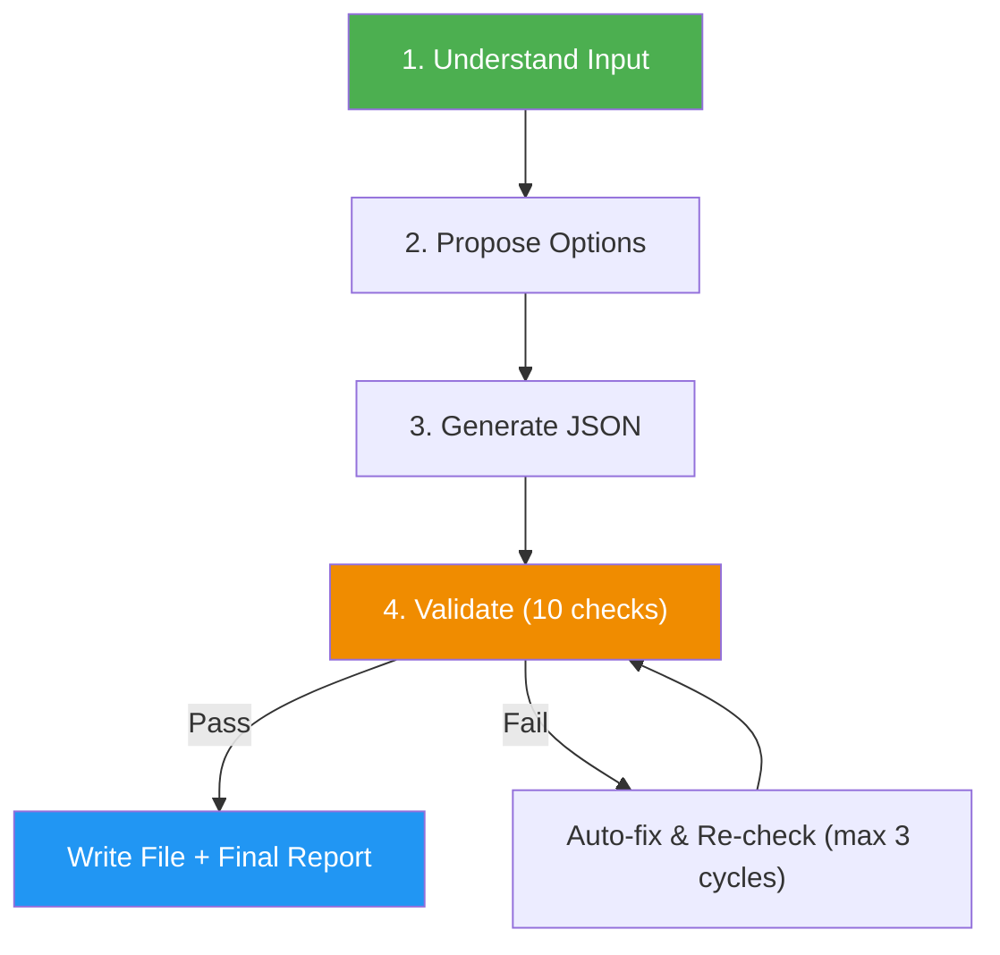

<!--
  DO NOT READ THIS FILE — This README.md is for human catalog browsing only.
  It ships inside the .skill package but is NEVER auto-loaded into agent context.
  The runtime loader only reads SKILL.md + references/ + scripts/ + agents/ when the skill triggers.
  If you're an AI agent, read the SKILL.md file instead for skill instructions.
-->

# Excalidraw Diagram Generator

> Generate any type of diagram, chart, or visualization as Excalidraw JSON — from flowcharts to architecture diagrams to mind maps.

## Highlights

- Supports 25+ diagram types across 8 categories (flow, architecture, data, planning, comparison, charts, UX, custom)
- Interactive workflow: analyzes input, proposes visualization type with selectable options, iterates until clear
- Built-in validation: 10 quality checks with auto-fix (at most 3 cycles) before writing output; structural failures never write a broken file
- Subagent architecture for large diagrams (more than 30 elements): fresh-context generator, validator, and fixer agents
- Outputs native `.excalidraw` files by default (can embed in `.md` on request)
- Automatically extracts structure from code, SQL, config files, or plain descriptions
- Hand-drawn by default, with sketchy, clean/geometric, code/technical, and monochrome variants; colors chosen to fit the diagram

## When to Use

| Say this... | Skill will... |
|---|---|
| "Draw a flowchart of user authentication" | Create a flowchart with process steps, decisions, and error paths |
| "Visualize my database schema" | Generate an ER diagram from your SQL or schema description |
| "Sketch the system architecture" | Build a layered architecture diagram with services and connections |
| "Create a mind map about project planning" | Produce a radial mind map with branches and sub-topics |
| "Make a sequence diagram for the API flow" | Generate actor lanes with chronological message arrows |
| "I need a Kanban board layout" | Create columns with cards for workflow visualization |

## How It Works



## Installation

Install via [npx (Vercel)](https://www.npmjs.com/package/skills):

```bash
npx skills add https://github.com/luongnv89/skills --skill excalidraw-generator
```

Or via [agent-skill-manager (asm)](https://www.npmjs.com/package/agent-skill-manager):

```bash
asm install github:luongnv89/skills:skills/diagram-generator/excalidraw-generator
```

## Usage

```
/excalidraw-generator
```

## Supported Diagram Types

| Category | Types |
|---|---|
| Flow & Process | Flowchart, sequence diagram, swimlane, state machine, activity diagram |
| Architecture | System architecture, microservices, network topology, cloud, C4 model, deployment |
| Data & Relationships | ER diagram, class diagram, dependency graph, mind map, tree, org chart |
| Planning | Gantt chart, roadmap, timeline, Kanban board |
| Comparison | Quadrant chart, SWOT analysis, comparison matrix, Venn diagram |
| Data Visualization | Bar chart, pie chart, line chart, table/grid |
| UX/Design | Wireframe, user flow, sitemap |
| Custom | Any freeform diagram from description |

## Resources

| Path | Description |
|---|---|
| `agents/json-generator.md` | Subagent for large diagrams (more than 30 elements): generates Excalidraw JSON from the confirmed plan |
| `agents/json-validator.md` | Subagent: runs the 10 checks and returns a PASS / NEEDS_FIX report; fixes nothing |
| `agents/json-fixer.md` | Subagent: patches the failed checks from the validator report, up to 3 cycles; sends JSON structure and missing-entity failures back to the generator |
| `references/excalidraw-format.md` | Complete Excalidraw JSON schema, element types, and field defaults |
| `references/diagram-types.md` | All supported diagram types with layout guidance |
| `references/validation-checks.md` | The 10 Phase 4 checks, the shape-to-text sizing formula, fix recipes, and the validation report |
| `references/style-and-iteration.md` | Style variants, iteration requests, the subagent review loop, and extended edge cases |
| `references/final-report.md` | Final Report examples (COMPLETE, PARTIAL, BLOCKED), fill rules, and reader checks |
| `references/step-reports.md` | Per-phase step completion report template and the checks each phase reports |

## Output

Generates native `.excalidraw` files (raw JSON) by default; on request, also a companion `.md` with the same JSON in an `excalidraw` fenced block. Every run ends with a four-line Final Report (`Result:`, `Evidence:`, `Uncertainty:`, `Decision:`) whose status is COMPLETE (all 10 checks pass), PARTIAL (file written, a layout or readability check failed and is listed), or BLOCKED (no file written).
