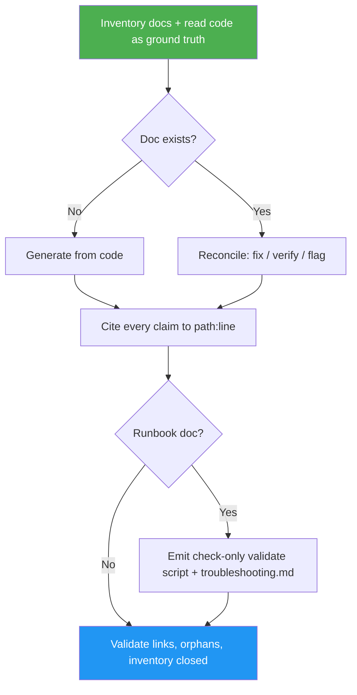

<!--
  DO NOT READ THIS FILE — This README.md is for human catalog browsing only.
  It ships inside the .skill package but is NEVER auto-loaded into agent context.
  The runtime loader only reads SKILL.md + references/ + scripts/ + agents/ when the skill triggers.
  If you're an AI agent, read the SKILL.md file instead for skill instructions.
-->

# Doc Manager

> Generate missing docs or update existing ones so every page matches the code — with each claim cited to `path:line`, ambiguities resolved by asking, and never invented.

## Highlights

- Inventories every Markdown doc and reconciles it against the actual implementation
- Cites each non-obvious claim to a `path:line` source; flags anything it can't verify
- Asks on ambiguity and logs each decision to `docs/DECISIONS.md`
- For deploy/setup/process runbooks: emits a **check-only** validation script (`scripts/validate-<name>.sh`) and keeps `docs/troubleshooting.md` current

## When to Use

| Say this... | Skill will... |
|---|---|
| "Update the docs" | Reconcile every doc against the current code |
| "Generate the missing docs" | Create docs the code justifies, fully cited |
| "Make sure the docs match the code" | Flag or fix every claim that drifted from implementation |
| "Validate the deployment runbook" | Emit a check-only validation script + troubleshooting log |

## How It Works



## Installation

Install via [npx (Vercel)](https://www.npmjs.com/package/skills):

```bash
npx skills add https://github.com/luongnv89/skills --skill doc-manager
```

Or via [agent-skill-manager (asm)](https://www.npmjs.com/package/agent-skill-manager):

```bash
asm install github:luongnv89/skills:skills/doc-manager
```

## Usage

```
/doc-manager
```

## Output

- Root `README.md` and `docs/*.md` reconciled to the code, each non-obvious claim cited to `path:line`
- `docs/DECISIONS.md` — append-only log of ambiguities resolved with you
- For runbook sections: a check-only validation script (`scripts/validate-<name>.sh`) linked from the section, plus `docs/troubleshooting.md` updated with any fix found during validation
- A change summary listing per-doc status and any open flags
