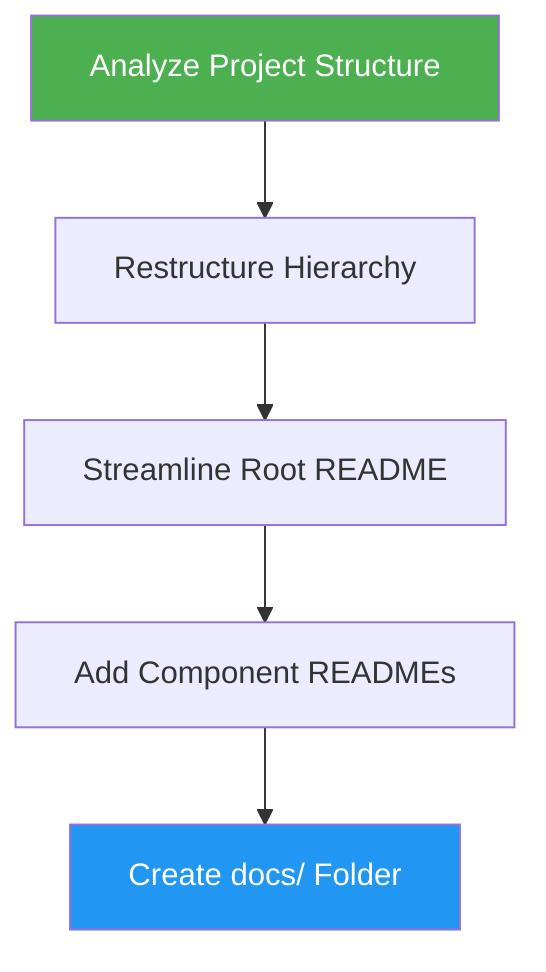

# Docs Generator

> Reorganize scattered documentation into a coherent, accessible structure with proper hierarchy.

## Highlights

- Analyze project type and create appropriate documentation structure
- Streamline root README as a quickstart entry point
- Generate component-specific READMEs per module or service
- Add Mermaid architecture diagrams and cross-references

## When to Use

| Say this... | Skill will... |
|---|---|
| "Organize docs" | Restructure documentation hierarchy |
| "Generate documentation" | Create docs from project analysis |
| "Improve doc structure" | Reorganize into clear categories |
| "Fix documentation" | Consolidate and cross-reference docs |

## How It Works



## Usage

```
/docs-generator
```

## Output

- Streamlined root `README.md` with overview and quickstart
- Component `README.md` files per module/service
- `docs/` folder with architecture, API reference, deployment, development, and troubleshooting guides
