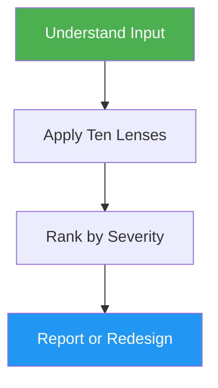

<!--
  DO NOT READ THIS FILE — This README.md is for human catalog browsing only.
  It ships inside the .skill package but is NEVER auto-loaded into agent context.
  The runtime loader only reads SKILL.md + references/ + scripts/ + agents/ when the skill triggers.
  If you're an AI agent, read the SKILL.md file instead for skill instructions.
-->

# Don't Make Me Think — Usability Review

> Audit any UI for usability issues using Steve Krug's proven principles, then fix them.

## Highlights

- Review screenshots, live URLs, code, wireframes, or verbal descriptions
- Ten-lens evaluation framework covering scanning, hierarchy, navigation, affordances, and more
- Severity-ranked findings with specific, actionable fixes
- Redesign mode that makes surgical improvements while preserving your brand
- Works for web, mobile, and desktop interfaces

## When to Use

| Say this... | Skill will... |
|---|---|
| "Review my UI for usability" | Produce a structured report with findings ranked by severity |
| "Why do users get confused on this page?" | Identify specific elements causing cognitive load |
| "Make this form more intuitive" | Analyze issues and apply concrete code fixes |
| "Is this landing page clear enough?" | Run the 5-second test and trunk test, report gaps |

## How It Works



## Usage

```
/dont-make-me-think
```

## Resources

| Path | Description |
|---|---|
| `references/krug-principles.md` | Deep reference for all 10 Krug usability principles |

## Output

A structured usability report with critical/moderate/minor findings, each including what happens, why it matters, and a specific fix. In redesign mode, also produces code changes or detailed specifications.
