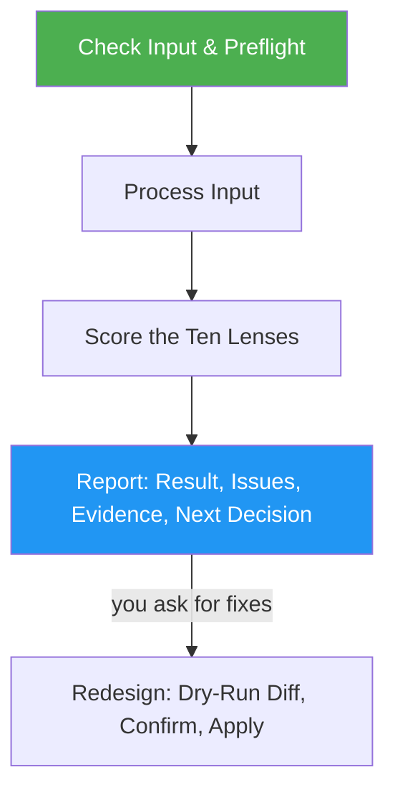

<!--
  DO NOT READ THIS FILE — This README.md is for human catalog browsing only.
  It ships inside the .skill package but is NEVER auto-loaded into agent context.
  The runtime loader only reads SKILL.md + references/ + scripts/ + agents/ when the skill triggers.
  If you're an AI agent, read the SKILL.md file instead for skill instructions.
-->

# Don't Make Me Think — Usability Review

> Audit any UI for usability issues using Steve Krug's proven principles, then fix them.

## Highlights

- Review screenshots, live URLs, code, wireframes, or verbal descriptions
- Ten-lens evaluation framework covering scanning, hierarchy, navigation, affordances, and more
- Severity-ranked findings with specific, actionable fixes
- Redesign mode that makes surgical improvements while preserving your brand
- Works for web, mobile, and desktop interfaces

## When to Use

| Say this... | Skill will... |
|---|---|
| "Review my UI for usability" | Produce a structured report with findings ranked by severity |
| "Why do users get confused on this page?" | Identify specific elements causing cognitive load |
| "Make this form more intuitive" | Analyze issues and apply concrete code fixes |
| "Is this landing page clear enough?" | Run the 5-second test and trunk test, report gaps |

## How It Works


```mermaid
graph TD
    A["Check Input & Preflight"] --> B["Process Input"]
    B --> C["Score the Ten Lenses"]
    C --> D["Report: Result, Issues, Evidence, Next Decision"]
    D -->|"you ask for fixes"| E["Redesign: Dry-Run Diff, Confirm, Apply"]
    style A fill:#4CAF50,color:#fff
    style D fill:#2196F3,color:#fff
```

## Installation

Install via [agent-skill-manager (asm)](https://www.npmjs.com/package/agent-skill-manager):

```bash
asm install github:luongnv89/skills:skills/dont-make-me-think
```

Live-URL reviews also need gstack's `/browse`. The skill checks for it before navigating and, when `asm deps` is available, leases it for the run and releases it at the end.

## Usage

```
/dont-make-me-think
```

## Resources

| Path | Description |
|---|---|
| `references/krug-principles.md` | Deep reference for all 10 Krug usability principles |
| `references/report-format.md` | Report template and rules, quick-check and no-issue variants, BLOCKED block, fill rules, and reader checks |
| `references/redesign-mode.md` | Redesign procedure, the seven Repo Sync steps, and the Redesign summary |
| `references/edge-cases.md` | Unusual inputs and requests, plus why the `/browse` install command uses its flags |
| `references/screenshot-processing.md` | Flags, extracted fields, and how to use the screenshot pre-processor output |
| `references/orchestrated-runs.md` | The `orchestrated-by`, `evidence-dir`, `output-dir` and `skip-checks` lines an orchestrator such as `design-optimizer` may pass |
| `references/step-completion-reports.md` | Step-completion report template and per-step checks |
| `scripts/process_screenshots.py` | Extracts palette, layout regions, density and quality from screenshots as JSON |
| `evals/evals.json` | Trigger and behavior evals: 3 happy-path, 3 edge, 2 negative-trigger |
| `evals/files/` | A checkout page fixture and a saved-evidence folder for the orchestrated-run eval |

## Output

A structured usability report. Under the title, a `Result:` line gives the status (COMPLETE, or PARTIAL when a lens could not be assessed), the issue counts per severity, and how many lenses were scored. Then come the Thinking Cost rating, a scorecard, critical/moderate/minor findings each with a specific fix and location, an issue map, and a fix-priority table. The report ends with what was reviewed, measured, not assessed and not tested, plus one line naming your next decision.

When the input cannot be reviewed, the skill prints a four-line `BLOCKED` block saying what it needs. In redesign mode it shows a dry-run diff, waits for your confirmation, applies the fixes, and ends with a short summary of what was written.
