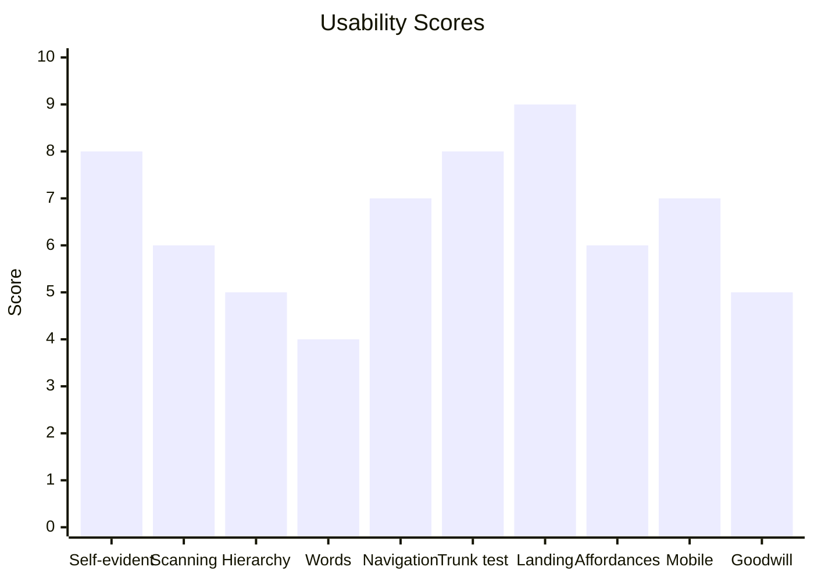
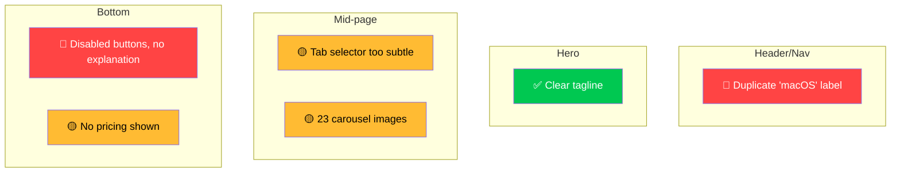
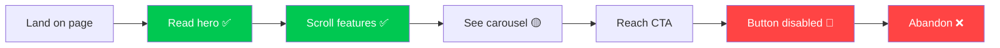

# Report Format

The usability review is the output of every run that had reviewable input. `SKILL.md` (*Report Format*) holds the status, severity and Thinking Cost rules; this file holds the full template, the report rules, the quick-check and no-issue variants, the `BLOCKED` block, the fill rules and the reader checks. The Redesign summary lives in `redesign-mode.md`.

## Template

Use this template. Replace every `[bracketed]` placeholder and every example value in the charts and tables with the reviewed page's own data. In an orchestrated run, the `> Orchestrated by: <name>` line (`orchestrated-runs.md`) goes directly under the title, before the `**Result:**` line.

~~~markdown
# Usability Review: [Page/Screen Name]

**Result:** [COMPLETE | PARTIAL] — [N] issues ([a] 🔴 · [b] 🟡 · [c] 🟢); [k] of [n] applicable lenses scored

## Thinking Cost: [LOW | MODERATE | HIGH]

> [One sentence: what's the single biggest usability problem on this page]

## Scorecard

Rate each applicable lens 0-10. Use a mermaid chart to visualize.



| Lens | Score | Why |
|---|---|---|
| Self-evidence | 8/10 | Labels are clear, one ambiguous nav item |
| ... | ... | ... |

## Issues

Use severity icons: 🔴 Critical, 🟡 Moderate, 🟢 Minor

### 🔴 [Short issue title]
- **Problem:** [one line — what the user experiences]
- **Impact:** [one line — what happens because of this]
- **Fix:** [one line — specific, actionable, concrete]
- **Where:** [element/section/selector if applicable]

### 🟡 [Short issue title]
...

### 🟢 [Short issue title]
...

## Issue Map

Show where issues cluster on the page using a mermaid diagram.



## Page Flow Analysis

When relevant, show the user's journey and where friction occurs.



## What Works

Bullet list — protect these during redesign:
- ✅ [Good thing 1]
- ✅ [Good thing 2]

## Fix Priority

| Priority | Issue | Effort | Impact |
|---|---|---|---|
| 1 | [issue] | Low | High |
| 2 | [issue] | Medium | High |
| 3 | [issue] | Low | Medium |

## Evidence and Limits

- **Reviewed:** [input type and source: URL with the viewport widths loaded, screenshot file names, or code paths]
- **Measured:** [fields used from `process_screenshots.py` JSON, or `none — visual inspection only`]
- **Not assessed:** [each applicable lens not scored, with the reason; or `none`]
- **Not tested:** [interactions not exercised, for example hover, form submit, resize; or `none`]
- **Assumptions:** [each assumption, labeled `Assumption:`; or `none`]

## Next Decision

[One line. Name the user's choice, or say `No approval needed.` and name any remaining user action.]
~~~

## Report Rules

- **No paragraphs.** Use bullet points, tables, and mermaid diagrams.
- **One line per finding.** Problem, impact, fix — each one line max.
- **Be specific.** "Move price next to download button" not "improve transparency."
- **Include selectors/locations.** An AI agent reading this should know exactly where to look.
- **Diagrams over descriptions.** If you can show it in a mermaid chart or flowchart, do that instead of writing about it.
- **Severity is visual.** 🔴🟡🟢 — no walls of text explaining severity levels.
- **Scores are honest.** A 10/10 means flawless. Most things are 5-8. Don't grade inflate.

## Variants

| Case | What changes |
|---|---|
| Quick check (the user asks for a quick look) | Score every applicable lens in the Scorecard table; omit the chart, the Issue Map and the Page Flow Analysis; list only the top 3 issues in Fix Priority order, and keep the Fix Priority table with those 3 rows. The `**Result:**` line and Thinking Cost still count every issue found; end the Result line with `top 3 listed`. Keep Evidence and Limits and Next Decision. |
| No issues found | Keep the Result line (`0 issues`), Thinking Cost `LOW`, the Scorecard, What Works, Evidence and Limits, and Next Decision. Omit Issues, Issue Map and Fix Priority. Do not invent issues. |
| Several screenshots of one flow | One report. Name each screenshot in **Reviewed**, and put each issue's screenshot file name in its **Where** line. |

## BLOCKED block

When no input could be reviewed, write no report. Print this four-line block instead:

```text
Result: BLOCKED. No review written: https://app.example.com/pricing could not be loaded.
Evidence: /browse returned "net::ERR_NAME_NOT_RESOLVED" on the first navigation; no screenshot or HTML was supplied.
Uncertainty: No lens was scored, so nothing about the page's usability is known.
Decision: Share a screenshot or an HTML export of the page, or send a reachable URL.
```

Use the same four lines when no input was given, when a verbal description's clarifying questions got no answer, or when an image could not be loaded. Name the actual cause in `Result:` and `Evidence:`.

## Fill rules

- The `**Result:**` line comes first after the title (and after the orchestrated-by line, when present). Its first word is the status. Count issues per severity, and count only the lenses actually scored.
- The status is `PARTIAL` exactly when **Not assessed** names at least one applicable lens. Untested interactions alone do not make a run `PARTIAL`; list them under **Not tested**.
- **Measured** cites only numbers that came from the script's JSON. A visual estimate is labeled as an estimate, never written as a measurement.
- Each issue's **Where** names a selector, a section, or a screenshot region that a developer can find without guessing.
- Thinking Cost follows the issue counts (`SKILL.md` → *Report Format*), so the Result line and the Thinking Cost heading never disagree.
- Fix Priority sorts by impact, highest first; within one impact level, lower effort comes first.
- **Next Decision** names one choice. For a report with issues, offer Redesign Mode (it previews each diff before writing). For `PARTIAL`, name the evidence that would let the missing lens be scored, for example a 375 px mobile screenshot.

## Reader checks

Use these when reviewing a run's output, in addition to the correctness items in `SKILL.md` → *Acceptance Criteria*:

| Check | Pass when |
|---|---|
| Result is findable | The `**Result:**` line under the title states the status, the issue counts and the lenses scored, without scrolling to the Scorecard. |
| Facts and assumptions are separated | Measured numbers trace to the script JSON; estimates, untested interactions and assumptions sit under Evidence and Limits with their labels. |
| Claims are traceable | Every issue has a **Where** a developer can locate; every score below 5 has a **Why** naming the element that caused it. |
| Next decision is clear | The Next Decision line names one choice, or says `No approval needed.` |

A heading's presence alone does not pass a check. Ask a human reviewer the same four questions. If no reviewer answers, record human understanding as unconfirmed; agent inspection cannot confirm it. Negative-trigger cases in `evals/evals.json` are excluded from these checks.
