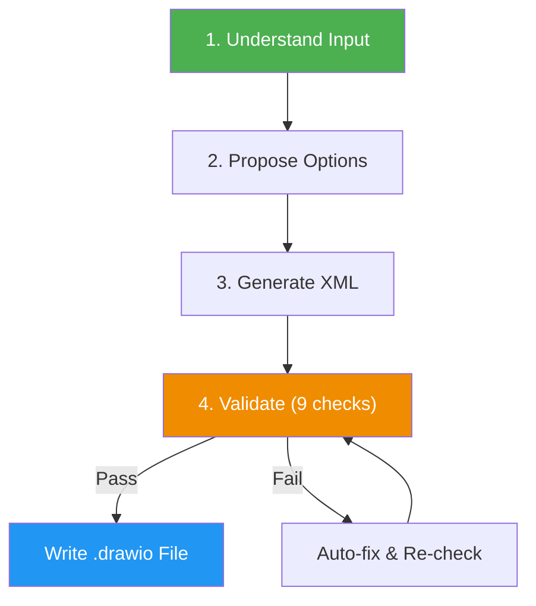

# Draw.io Diagram Generator

> Generate diagrams, charts, and visualizations as draw.io (diagrams.net) XML files — with multi-page support, rich shape libraries, and corporate-ready output.

## Highlights

- Supports 25+ diagram types: flowcharts, C4 models, ER diagrams, architecture, swimlanes, and more
- Multi-page diagrams in a single `.drawio` file (ideal for C4 context/container/component levels)
- Built-in validation: 9 automated quality checks before writing output
- Native `.drawio` format — opens in diagrams.net, VS Code, Confluence, and Jira
- Multiple color palettes: Professional (draw.io defaults), C4 official, Monochrome

## When to Use

| Say this... | Skill will... |
|---|---|
| "Create a draw.io diagram of our architecture" | Generate a layered architecture diagram as `.drawio` |
| "C4 model for our system in draw.io" | Create multi-page C4 diagrams (context, container, component) |
| "Swimlane diagram for our deployment process" | Build horizontal swimlanes with process steps |
| "ER diagram in draw.io format" | Generate entity-relationship diagram with tables and relations |

## How It Works



## Installation

Install via [npx (Vercel)](https://www.npmjs.com/package/skills):

```bash
npx skills add https://github.com/luongnv89/skills --skill drawio-generator
```

Or via [agent-skill-manager (asm)](https://www.npmjs.com/package/agent-skill-manager):

```bash
asm install github:luongnv89/skills --skill drawio-generator
```

## Usage

```
/drawio-generator
```

## Resources

| Path | Description |
|---|---|
| `references/drawio-format.md` | Complete draw.io XML schema, shapes, styles, and color palettes |

## Output

Generates native `.drawio` files (XML) that open directly in diagrams.net, VS Code (with draw.io extension), Confluence, or any tool supporting the draw.io format. Supports single or multi-page diagrams.
