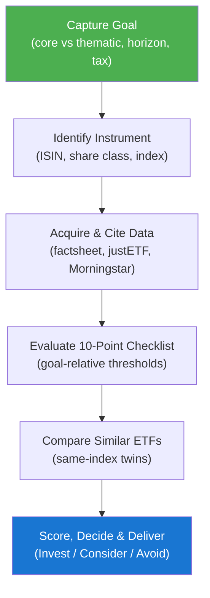

<!--
  DO NOT READ THIS FILE — This README.md is for human catalog browsing only.
  It ships inside the .skill package but is NEVER auto-loaded into agent context.
  The runtime loader only reads SKILL.md + references/ + scripts/ + agents/ when the skill triggers.
  If you're an AI agent, read the SKILL.md file instead for skill instructions.
-->

# ETF Evaluator

> Research, score, and decide on an index fund / ETF before you invest — with every figure cited and a clear Invest / Consider / Avoid verdict.

## Highlights

- **Data-integrity first** — every TER, AUM, tracking number, and domicile is fetched from a live source (factsheet/KIID, justETF, Morningstar) and cited. Anything it can't verify is marked `Unverified`, never guessed.
- **Goal-relative scoring** — a core MSCI World holding is judged on ultra-low cost and liquidity; a thematic/sector bet is held to peer-relevant thresholds and gets a position-size cap.
- **10-point checklist** — Tracking, TER, AUM/liquidity, replication/structure, index quality, performance/risk, dividend & tax efficiency, provider stability, portfolio fit, trading costs.
- **Same-index comparison** — surfaces 1–2 alternatives so a cheaper, larger, better-domiciled twin can flip the decision.
- **Auditable report** — scorecard with sources and as-of dates, rendered in chat and optionally saved to Markdown.

## When to Use

| Say this...                                          | Skill will...                                                       |
| ---------------------------------------------------- | ------------------------------------------------------------------- |
| "Is VWCE a good ETF to buy?"                          | Identify the ISIN, research and cite its figures, score it, give a verdict |
| "Evaluate the Amundi MSCI World Financials ETF"       | Confirm the exact share class, rate all 10 points, cap it as a satellite |
| "Compare IWDA vs SWDA for a core holding"             | Compare same-index twins on TER, AUM, replication, domicile         |
| "Should I add this S&P 500 ETF to my portfolio?"      | Check overlap/fit, score, and recommend Invest / Consider / Avoid   |

Not for: picking individual stocks, active mutual funds, crypto, single-bond analysis, or portfolio rebalancing.

## How It Works

## Output

A **single self-contained HTML file** (no external dependencies) saved to `~/etf-evaluations/<ISIN>_etf_evaluation.html`. The report features:

- Dark navy header with fund name, ISIN, and index tracked
- Color-coded verdict card (green = Invest, amber = Consider, red = Avoid)
- 10-row scorecard table with rating badges, source citations, and as-of dates
- Same-index comparison table (this fund vs 1–2 alternatives)
- Key risks section, bottom line, and source list
- Professional disclaimer footer

The HTML is responsive, print-friendly, and uses only embedded CSS — no CDN links, no JavaScript, no external fonts.

## Notes

- **Educational, not advice.** The report is a structured due-diligence aid, not a recommendation to buy or sell.
- **Needs web access** to research live figures. If research tools are unavailable, it asks you to paste the factsheet/KIID rather than inventing numbers.
- **Verify before you trade.** Figures drift; always confirm the final numbers on the official factsheet.
