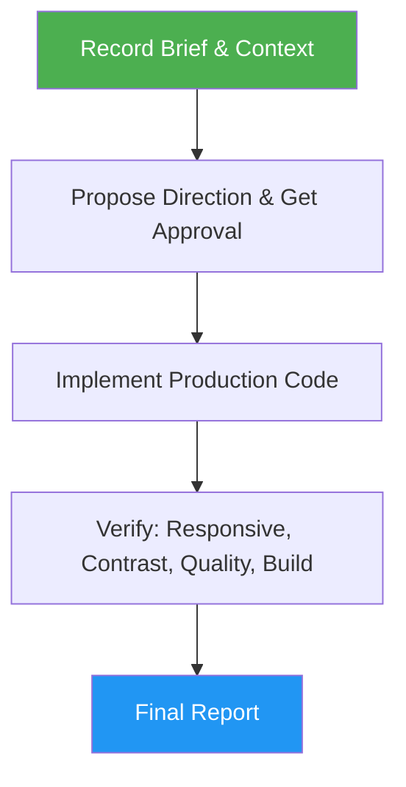

<!--
  DO NOT READ THIS FILE — This README.md is for human catalog browsing only.
  It ships inside the .skill package but is NEVER auto-loaded into agent context.
  The runtime loader only reads SKILL.md + references/ + scripts/ + agents/ when the skill triggers.
  If you're an AI agent, read the SKILL.md file instead for skill instructions.
-->

# Frontend Design

> Create distinctive, production-grade frontend interfaces with high design quality and a consistent default style guide.

## Highlights

- Bold aesthetic direction with intentional design choices, not generic AI output
- Built-in usability principles from "Don't Make Me Think" (scan-friendly, self-evident, low cognitive load)
- Default style guide (Black/White/Gray/Bright Green) when no preference is provided
- Default quality bar: every final design is professional, production-ready, elegant, and premium without being asked
- Supports HTML/CSS/JS, React, Vue, and any modern frontend framework

## When to Use

| Say this... | Skill will... |
|---|---|
| "Build a landing page" | Design and implement a distinctive landing page |
| "Create a dashboard" | Build a polished dashboard with depth and hierarchy |
| "Design a form component" | Generate a styled, accessible form with visual flair |
| "Make a portfolio page" | Create a memorable portfolio with bold aesthetics |

## How It Works



## Installation

Install via [npx (Vercel)](https://www.npmjs.com/package/skills):

```bash
npx skills add https://github.com/luongnv89/skills --skill frontend-design
```

Or via [agent-skill-manager (asm)](https://www.npmjs.com/package/agent-skill-manager):

```bash
asm install github:luongnv89/skills:skills/frontend-design
```

## Usage

```
/frontend-design
```

## Resources

| Path | Description |
|---|---|
| `references/aesthetics-guide.md` | Typography, color, motion, composition and background guidance, plus the generated-look defaults to avoid |
| `references/usability-guide.md` | Six "Don't Make Me Think" Quick rules applied to every design, then the full step-by-step guideline |
| `references/step-reports.md` | Step-completion report template, symbol legend, and per-phase checks |
| `references/final-report.md` | Final Report status rules, PARTIAL and BLOCKED examples, fill rules, and reader checks |
| `evals/evals.json` | Trigger and behavior evals: 3 happy-path, 3 edge, 2 negative-trigger |
| `evals/files/vue-repo/` | Small Vue fixture for the framework-mismatch eval |

## Output

Production-ready frontend code (HTML/CSS/JS or framework components) with distinctive typography, cohesive color theming, animations, and visual depth. No code is written until you approve the aesthetic direction (or say "just build it").

Every run ends with a four-line Final Report: `Result:` (COMPLETE, PARTIAL or BLOCKED, and the files written), `Evidence:` (the responsive, contrast, quality and build checks that ran), `Uncertainty:` (checks that could not run and assumptions), and `Decision:` (what you need to do next, or "No approval needed").

## Acknowledgement

Inspired by Anthropic's official [frontend-design](https://github.com/anthropics/claude-code/tree/main/plugins/frontend-design) skill. This skill is an independent implementation with a default style guide, usability principles from "Don't Make Me Think", and adaptations for this skill collection.
