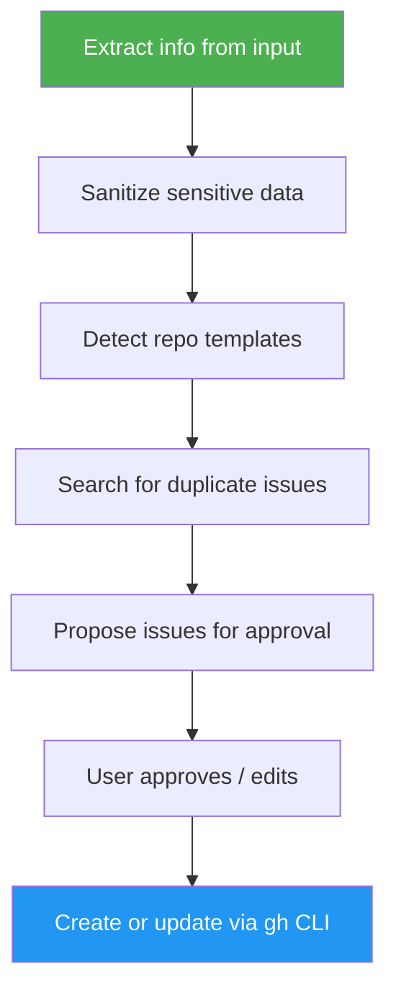

# GitHub Issue Creator

> Extract bug reports from screenshots, emails, and messages, then create or update GitHub issues with repo-aware templates.

## Highlights

- **Multimodal input**: Reads screenshots, error dialogs, email forwards, Slack messages, and plain text descriptions
- **Privacy-first**: Automatically redacts PII, credentials, API keys, and sensitive data before creating public issues
- **Template-aware**: Auto-detects the repo's `.github/ISSUE_TEMPLATE/` and formats issues accordingly, falls back to a clean default
- **Duplicate detection**: Searches existing open issues before creating new ones, proposes updates instead of duplicates
- **Approval-gated**: Always shows a preview and waits for your explicit go-ahead before touching GitHub
- **Batch capable**: A single screenshot with multiple bugs becomes multiple separate issues

## When to Use

| Say this... | Skill will... |
|---|---|
| "Create issues from this screenshot" | Extract bugs from the image and propose GitHub issues |
| "Turn this bug report email into issues" | Parse the email text and create structured issues |
| "File a bug for this error" | Create a single issue from the described error |
| "Update issue #42 with this new info" | Add a comment or edit labels on the existing issue |

## How It Works



## Installation

Install via [npx (Vercel)](https://www.npmjs.com/package/skills):

```bash
npx skills add https://github.com/luongnv89/skills --skill github-issue-creator
```

Or via [agent-skill-manager (asm)](https://www.npmjs.com/package/agent-skill-manager):

```bash
asm install github:luongnv89/skills:skills/github-issue-creator
```

## Usage

```
/github-issue-creator
```

Or just share a screenshot/text and say "create an issue from this".

## Output

- New GitHub issues created with proper templates, labels, and descriptions
- Comments added to existing issues when updates are proposed
- Summary of all created/updated issue URLs
