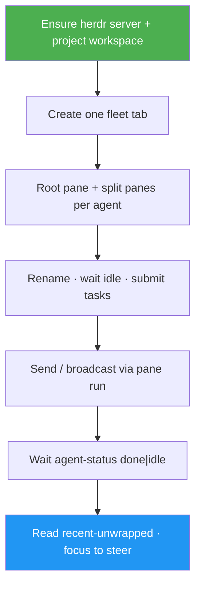

<!--
  DO NOT READ THIS FILE — This README.md is for human catalog browsing only.
  It ships inside the .skill package but is NEVER auto-loaded into agent context.
  The runtime loader only reads SKILL.md + references/ + scripts/ + agents/ when the skill triggers.
  If you're an AI agent, read the SKILL.md file instead for skill instructions.
-->

# Herdr Agent Comms

> Spawn, manage, and talk to AI agents as **split panes in one fleet view** — one project workspace, tiled agents you can see at once, messaging via the `herdr` CLI with status-aware waits.

## Highlights

- **Project workspace** — all agents for a repo share one Herdr workspace (sidebar rollup).
- **Split-pane fleet** — one fleet tab; each agent is a visible pane (side-by-side / tiled).
- **Fleet spawn** — agent CLI + model + thinking + optional skills, then assign tasks in parallel.
- **Message & steer** — `pane run` / `agent send`, wait on `working` → `done`/`idle`, read transcripts.
- **Broadcast** — fan one instruction to many agents; concurrent waits.
- **Safe teardown** — close panes or the fleet tab only after confirmation; never surprise `server stop`.

## When to Use

| Say this... | Skill will... |
|---|---|
| "Spin up 3 Herdr agents for this repo: reviewer, tests, docs" | Create/reuse project workspace, one fleet tab, split panes, launch agents |
| "Ask the reviewer agent what it found" | Resolve target, send, wait on status, relay reply |
| "Broadcast 'pull main' to all fleet agents" | Fan-out send + concurrent collect |
| "Show me all agents / focus the tests pane so I can steer" | `herdr tab focus` fleet · `herdr agent focus tests` |

## How It Works



## Usage

```
/herdr-agent-comms
```

Or describe the goal in natural language — "launch a Herdr fleet side by side", "message my Herdr reviewer pane".

## Popular Use Cases

### 1. Fleet with model/thinking/skill knobs (all visible)

```
/herdr-agent-comms spin up 2 pi agents in this project as split panes:
- reviewer: model sonnet, thinking medium, skill code-review — review the last commit
- tests: thinking low — propose a minimal test plan
```

### 2. Message a running agent

```
/herdr-agent-comms ask reviewer to summarize open risks; show me the reply
```

### 3. Steer live

```
/herdr-agent-comms focus the tests agent so I can type into it
```

## Requirements

- Herdr installed (`herdr --version`) and server running (`herdr status`)
- Agent CLIs on PATH (`pi`, `claude`, `codex`, …) as needed
- Optional: `herdr integration install <agent>` for better status

## Related

- Sibling skill: `tmux-agent-comms` (same workflow for plain tmux)
- Cheatsheet: https://luongnv.com/awesome-cheatsheets/cheatsheets/herdr/
- Docs: https://herdr.dev/docs/
