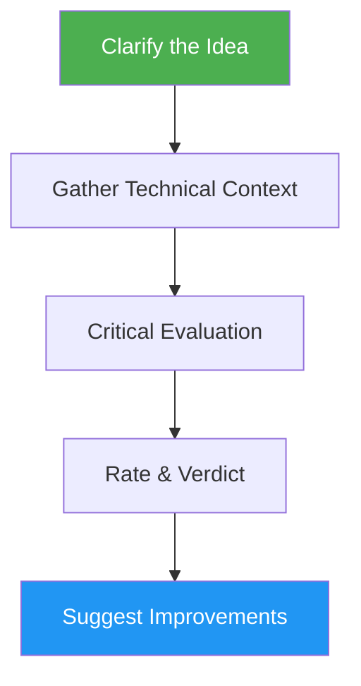

# Idea Validator

> Critically evaluate app ideas, startup concepts, and product proposals with market viability analysis.

## Highlights

- Multi-phase evaluation: clarify idea, gather context, critical analysis, improvements
- Rate creativity, feasibility, impact, and technical execution
- Deliver a clear verdict: Build it, Maybe, or Skip it
- Generate improvement suggestions and enhanced roadmap

## When to Use

| Say this... | Skill will... |
|---|---|
| "Evaluate my idea" | Run full validation with ratings |
| "Is this a good idea?" | Assess market viability and feasibility |
| "Validate my startup idea" | Analyze demand, competition, and risks |
| "Review this concept" | Provide verdict with improvements |

## How It Works



## Usage

```
/idea-validator <idea description>
```

## Output

- `idea.md` with concept, clarifications, and technical context
- `validate.md` with verdict, ratings, market analysis, and improvement roadmap
- Updated README index with GitHub links
