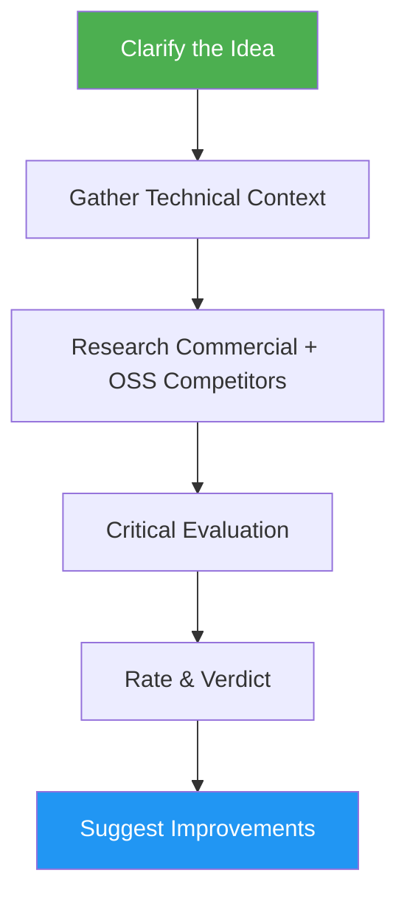

<!--
  DO NOT READ THIS FILE — This README.md is for human catalog browsing only.
  It ships inside the .skill package but is NEVER auto-loaded into agent context.
  The runtime loader only reads SKILL.md + references/ + scripts/ + agents/ when the skill triggers.
  If you're an AI agent, read the SKILL.md file instead for skill instructions.
-->

# Idea Validator

> Critically evaluate app ideas, startup concepts, and product proposals with market viability analysis.

## Highlights

- Multi-phase evaluation: clarify idea, gather context, research competitors, critical analysis, improvements
- Live web search for commercial competitors, open-source alternatives, and failed predecessors to avoid reinventing the wheel
- Rate creativity, feasibility, impact, technical execution, and whether to build from scratch or base on existing OSS
- Deliver a clear verdict: Build it, Maybe, or Skip it, chosen by three stated rules
- Generate improvement suggestions and enhanced roadmap
- End with a short summary: status (COMPLETE, PARTIAL or BLOCKED), evidence links, open uncertainties, and the next step

## When to Use

| Say this... | Skill will... |
|---|---|
| "Evaluate my idea" | Run full validation with ratings |
| "Is this a good idea?" | Assess market viability and feasibility |
| "Validate my startup idea" | Analyze demand, competition, and risks |
| "Review this concept" | Provide verdict with improvements |

## How It Works



## Installation

Install via [npx (Vercel)](https://www.npmjs.com/package/skills):

```bash
npx skills add https://github.com/luongnv89/skills --skill idea-validator
```

Or via [agent-skill-manager (asm)](https://www.npmjs.com/package/agent-skill-manager):

```bash
asm install github:luongnv89/skills:skills/idea-validator
```

## Usage

```
/idea-validator <idea description>
```

## Resources

| Path | Description |
|---|---|
| `references/file-templates.md` | Header structure for `idea.md` and `validate.md` |
| `references/step-completion-reports.md` | Per-step status blocks for Setup and Phases 1-5 |
| `references/final-report.md` | Example final summary, fill rules for each line, and reader checks |
| `evals/evals.json` | Scenario evals: happy paths, edge cases, and negative triggers |

## Output

- `idea.md` with concept, clarifications, and technical context
- `validate.md` with commercial/OSS competitive landscape, verdict, ratings, market analysis, reuse recommendation, and improvement roadmap
- Updated README ideas index table, when run inside an ideas repo
- A commit of only the files the run wrote, pushed to the current branch (skipped when the ideas folder is not a git repository)
- A final summary with `Result:`, `Evidence:` (GitHub links and commit hash), `Uncertainty:`, `Decision:` and `Next step:` lines
