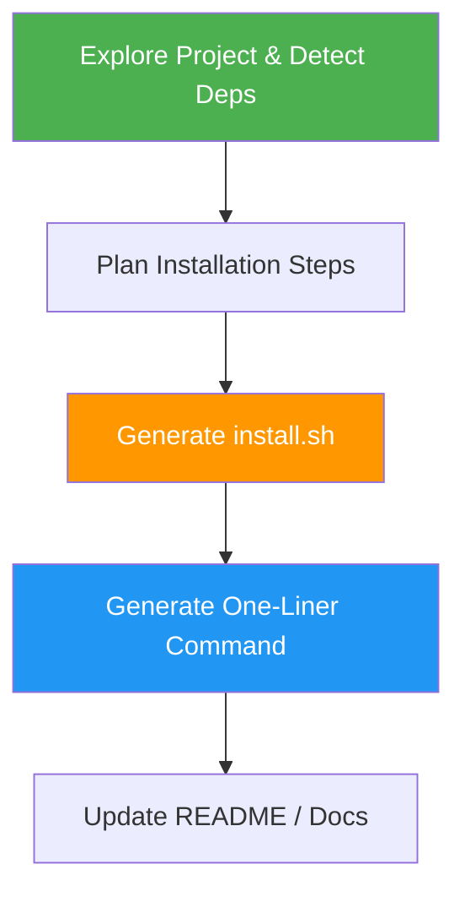

# Install Script Generator

> Generate a self-contained `install.sh` that users can run with a single `curl | bash` command via GitHub raw URLs.

## Highlights

- Generate a **one-liner install command**: `curl -sSL https://raw.githubusercontent.com/<owner>/<repo>/main/install.sh | bash`
- Auto-detect OS (Linux, macOS, Windows/MSYS), CPU architecture, and package manager inside the script
- Handle dependencies, sudo, verification, and colored output automatically
- Support both `curl` and `wget` one-liners
- Optional Windows PowerShell `install.ps1` with `irm | iex` one-liner
- Produce README install sections and usage documentation

## When to Use

| Say this... | Skill will... |
|---|---|
| "Create an install script for this project" | Generate `install.sh` with one-liner command |
| "Make this installable with a single command" | Build self-contained installer with GitHub raw URL |
| "Generate a curl install command for my tool" | Create `curl \| bash` one-liner with full script |
| "Setup script for this module" | Detect project type and generate installer |

## How It Works



## Installation

Install via [npx (Vercel)](https://www.npmjs.com/package/skills):

```bash
npx skills add https://github.com/luongnv89/skills --skill install-script-generator
```

Or via [agent-skill-manager (asm)](https://www.npmjs.com/package/agent-skill-manager):

```bash
asm install github:luongnv89/skills:skills/install-script-generator
```

## Usage

```
/install-script-generator <software or tool>
```

## Example One-Liner Output

```bash
# Install via curl
curl -sSL https://raw.githubusercontent.com/user/repo/main/install.sh | bash

# Install via wget
wget -qO- https://raw.githubusercontent.com/user/repo/main/install.sh | bash

# Custom install prefix
INSTALL_PREFIX=~/.local curl -sSL https://raw.githubusercontent.com/user/repo/main/install.sh | bash
```

## Resources

| Path | Description |
|---|---|
| `scripts/env_explorer.py` | Environment detection for local testing |
| `scripts/plan_generator.py` | Installation step planner |
| `scripts/executor.py` | Plan executor with rollback |
| `scripts/doc_generator.py` | Usage documentation generator |

## Output

| File | Description |
|---|---|
| `install.sh` | **Primary** — standalone installer for `curl \| bash` |
| `install.ps1` | *(Optional)* Windows PowerShell installer |
| `env_info.json` | System environment analysis |
| `installation_plan.yaml` | Ordered installation steps |
| `USAGE_GUIDE.md` | Quick start, examples, and troubleshooting |
