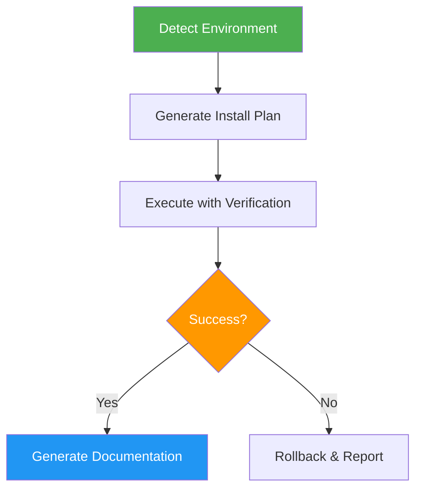

# Install Script Generator

> Generate cross-platform installation scripts with automatic environment detection and verification.

## Highlights

- Detect OS, CPU architecture, package managers, and permissions automatically
- Generate installation plans with dependency ordering and rollback capability
- Support Windows (winget/choco), Linux (distro-specific), and macOS (Homebrew)
- Produce usage documentation with quick start and troubleshooting

## When to Use

| Say this... | Skill will... |
|---|---|
| "Create an installer for X" | Generate cross-platform install script |
| "Automate installation" | Build verified install plan with rollback |
| "Setup script for this tool" | Detect environment and install dependencies |

## How It Works



## Usage

```
/install-script-generator <software or tool>
```

## Resources

| Path | Description |
|---|---|
| `scripts/` | Environment detection script (env_explorer.py) |

## Output

- `env_info.json` with system analysis
- `installation_plan.yaml` with ordered steps
- `install_report.md` with execution log
- `USAGE_GUIDE.md` with quick start, examples, and troubleshooting
