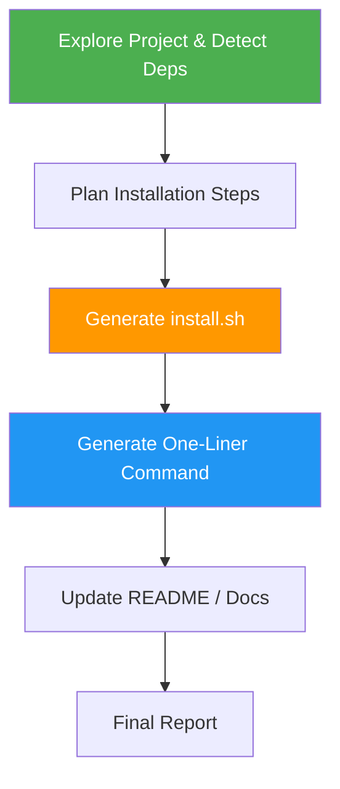

<!--
  DO NOT READ THIS FILE — This README.md is for human catalog browsing only.
  It ships inside the .skill package but is NEVER auto-loaded into agent context.
  The runtime loader only reads SKILL.md + references/ + scripts/ + agents/ when the skill triggers.
  If you're an AI agent, read the SKILL.md file instead for skill instructions.
-->

# Install Script Generator

> Generate a self-contained `install.sh` that users can run with a single `curl | bash` command via GitHub raw URLs.

## Highlights

- Generate a **one-liner install command**: `curl -sSL https://raw.githubusercontent.com/<owner>/<repo>/main/install.sh | bash`
- Auto-detect OS (Linux, macOS, Windows/MSYS), CPU architecture, and package manager inside the script
- Handle dependencies, sudo, verification, and colored output automatically
- Support both `curl` and `wget` one-liners
- Optional Windows PowerShell `install.ps1` with `irm | iex` one-liner
- Produce README install sections and usage documentation
- Check the generated script with `bash -n`, a placeholder scan and `shellcheck` (when installed), without running it on your machine unless you ask
- End with a short final report: status (COMPLETE, PARTIAL or BLOCKED), the checks that ran, what is still untested, and what you need to do next

## When to Use

| Say this... | Skill will... |
|---|---|
| "Create an install script for this project" | Generate `install.sh` with one-liner command |
| "Make this installable with a single command" | Build self-contained installer with GitHub raw URL |
| "Generate a curl install command for my tool" | Create `curl \| bash` one-liner with full script |
| "Setup script for this module" | Detect project type and generate installer |

## How It Works



The plan is dry-run before generation, so its step order and rollback commands are checked without installing anything. The generated `install.sh` is checked statically; it runs only when you ask for a local run or approve a disposable container. A `COMPLETE` status therefore means "generated and checked", not "installed".

## Installation

Install via [npx (Vercel)](https://www.npmjs.com/package/skills):

```bash
npx skills add https://github.com/luongnv89/skills --skill install-script-generator
```

Or via [agent-skill-manager (asm)](https://www.npmjs.com/package/agent-skill-manager):

```bash
asm install github:luongnv89/skills:skills/install-script-generator
```

## Usage

```
/install-script-generator <software or tool>
```

## Example One-Liner Output

```bash
# Install via curl
curl -sSL https://raw.githubusercontent.com/user/repo/main/install.sh | bash

# Install via wget
wget -qO- https://raw.githubusercontent.com/user/repo/main/install.sh | bash

# Custom install prefix
curl -sSL https://raw.githubusercontent.com/user/repo/main/install.sh | INSTALL_PREFIX=~/.local bash
```

## Resources

| Path | Description |
|---|---|
| `references/install-template.md` | Bash template for `install.sh`: colour helpers, OS/arch/package-manager detection, dependency installer, `main` |
| `references/readme-snippet.md` | README install block (curl, wget, custom prefix, Windows) and raw URL format |
| `references/edge-cases.md` | Step report format and per-phase checks, edge cases, platform notes, error-handling guarantees |
| `references/final-report.md` | Final report parts, status rules, outcome table, examples, reader checks |
| `evals/evals.json` | Test prompts with expected behavior, including edge and negative-trigger cases |
| `scripts/env_explorer.py` | Environment detection for local testing |
| `scripts/plan_generator.py` | Installation step planner |
| `scripts/executor.py` | Plan executor with rollback |
| `scripts/doc_generator.py` | Usage documentation generator |

## Output

| File | Description |
|---|---|
| `install.sh` | **Primary** — standalone installer for `curl \| bash` |
| `install.ps1` | *(Optional)* Windows PowerShell installer |
| `USAGE_GUIDE.md` | Quick start, examples, and troubleshooting |
| `env_info.json` | System environment analysis (working file) |
| `installation_plan.yaml` | Ordered installation steps (working file) |
| `install_report.md` | Dry-run report of the plan (working file) |

The three working files contain your machine's home path and `PATH`, so they are not meant to be committed. The run ends with a final report in the chat that starts with `Result:` and a status, then lists `Evidence:`, `Uncertainty:` and `Decision:`.
